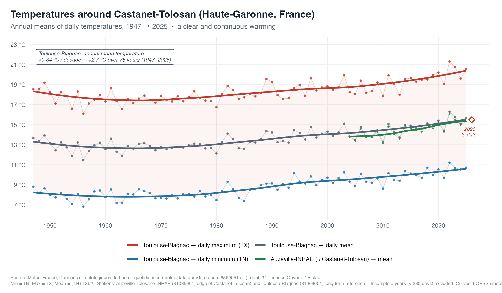
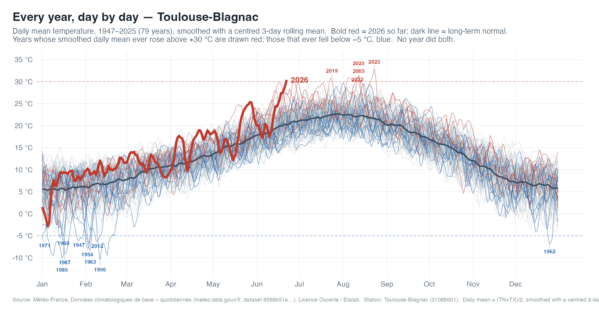

# Climatudes — temperatures around Castanet-Tolosan

A small, reproducible analytics project that turns Météo-France daily
climatological records into a readable report on local warming around
**Castanet-Tolosan** (Haute-Garonne, France).

It produces two figures and a self-contained HTML report:

1. **Annual means** of daily min / max / mean temperature, from the first
   available year to the present.
2. **Daily climatology ("spaghetti")** — every year's daily curve from January
   to December, with the current year drawn bold against the historical bundle
   and the long-term daily normal.




## Data source

Météo-France — **Données climatologiques de base – quotidiennes**, published
under the *Licence Ouverte / Open Licence (Etalab)* on the Météo-France open
data portal:

- Dataset: <https://meteo.data.gouv.fr/datasets/6569b51ae64326786e4e8e1a>
- Portal: <https://meteo.data.gouv.fr> · also mirrored on <https://data.gouv.fr>
- Scope used here: department **31** (Haute-Garonne), the `RR-T-Vent`
  (rainfall / temperature / wind) daily files, split into three eras
  (`avant-1949`, `previous-1950-2024`, `latest-2025-2026`).

Field definitions are in `data/raw/Q_descriptif_champs_*.txt`.

### Stations

| Code | Name | Record | Role |
|------|------|--------|------|
| `31035001` | Auzeville-Tolosane-INRAE | 2002→ | Local station, on the edge of Castanet-Tolosan (INRAE/ENSAT campus) |
| `31069001` | Toulouse-Blagnac | 1947→ | Long regional reference; used for the trend and the daily climatology |

> There is no Météo-France station named literally "Castanet-Tolosan".
> Auzeville-Tolosane-INRAE sits on its boundary and is the most representative
> local record.

## Project layout

```
climatudes/
├── README.md                  this file
├── Makefile                   reproducible pipeline (make all)
├── R/
│   ├── config.R               shared paths, station codes, constants, palette
│   ├── 00_prepare_data.R      slice raw .csv.gz -> small gzipped station extract
│   ├── 01_plot.R              build the two figures + annual table + stats
│   └── 02_report.R            assemble the self-contained HTML report
├── data/
│   ├── raw/                   source of truth: original .csv.gz (kept compressed) + field docs
│   └── processed/             small gzipped station extract + intermediates (regenerable)
└── outputs/
    ├── figures/               temperature_series.png, temperature_climatology.png
    ├── annual_temperatures.csv
    └── temperature_report.html   ← the shareable deliverable (fully self-contained)
```

`data/processed/` and `outputs/` are regenerable and git-ignored; `data/raw/`
is the source of truth.

**Everything stays compressed.** The raw `.csv.gz` files are never decompressed
to disk — they are read directly via a streaming `gzip -dc` pipe. Stage 00
slices them down to just the two stations we use and caches that as a single
small gzipped extract (`data/processed/stations_daily.csv.gz`, ~0.35 MB vs
~140 MB if the raw files were fully unzipped).

## How to run

Requirements: **R ≥ 4** with `data.table`, `ggplot2`, `scales`, `ragg`,
`base64enc`. No pandoc needed — the HTML is built directly.

```sh
make all      # prepare -> plots -> report
make open     # open the report (macOS)
```

Or run the stages directly from the project root:

```sh
Rscript R/00_prepare_data.R
Rscript R/01_plot.R
Rscript R/02_report.R
```

`make clean` removes everything regenerable (processed data + outputs).

## The result

At Toulouse-Blagnac the annual mean temperature rises ~**+0.34 °C/decade**
(~**+2.7 °C** since 1947); the local Auzeville series shows the same signal over
its shorter record. The `outputs/temperature_report.html` file embeds both
figures as base64 and needs no other files to display — email it, copy it to a
USB stick, or open it offline.

## Licence

Source data © Météo-France, *Licence Ouverte / Open Licence (Etalab 2.0)*.
Please retain the attribution above when reusing the figures or data.
