# Climatudes — local warming, city by city

A small, reproducible analytics pipeline that turns national weather-service
daily records into a readable report on local warming. It currently covers
three sites, each from its own national open-data source:

| Site | Country | Source |
|---|---|---|
| [Castanet-Tolosan](#a-warming-climate-seen-from-castanet-tolosan) | France | Météo-France |
| [Zurich](#a-warming-climate-seen-from-zurich) | Switzerland | MeteoSwiss |
| [Karlsruhe](#a-warming-climate-seen-from-karlsruhe) | Germany | DWD (Deutscher Wetterdienst) |

Each site's report below is generated. `make all SITE=<site>` (a few seconds,
including the download) refreshes that site's data, rebuilds its five
figures, regenerates its section here from them, and writes a self-contained
`<outputs>/temperature_report.html` you can email or read offline. `make
all-sites` does this for every site. See [How to run](#how-to-run).

<!-- BEGIN REPORT:castanet -->

## A warming climate, seen from Castanet-Tolosan

*Météo-France daily temperature records, 1947 to 2025 — plus 2026 so far.*

Météo-France daily records for the Castanet-Tolosan area tell an unambiguous story:
since the mid-20th century, minimum, maximum and mean temperatures have all risen —
steadily and continuously.

| Headline number | Value |
|---|---:|
| Warming rate, mean temperature (Toulouse-Blagnac) | **+0.34 °C / decade** |
| Total rise over 78 years (1947 → 2025) | **+2.6 °C** |
| Mean of the last decade (vs 12.9 °C in 1947–1956) | **15.2 °C** |
| Frost days per year, 1947–1956 → 2016–2025 | **46 → 18** |
| Hot days (≥ 30 °C) per year, 1947–1956 → 2016–2025 | **24 → 47** |
| Complete station-years analysed | **101** |
| 2026 year-to-date (Jan 1 – Aug 11), against 79 prior years | **#1 of 80 — record** |

### The long view: annual means

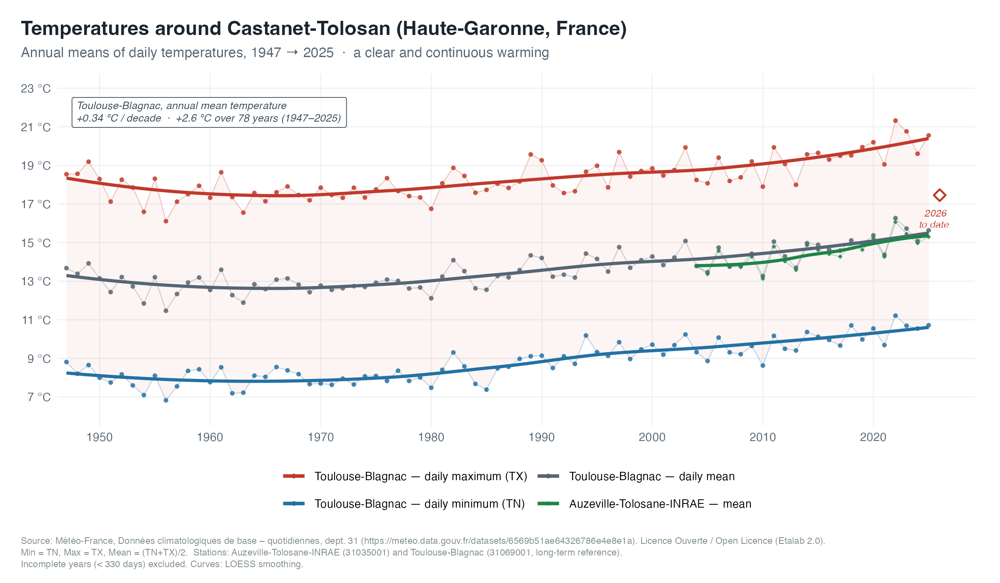

<sub>Annual means of daily temperatures. The thick curves are LOESS smoothings that
highlight the climate trend; the points are annual means. The green series (Auzeville-Tolosane-INRAE) is the station on the edge of Castanet-Tolosan; it tracks the long Toulouse-Blagnac reference mean almost exactly.</sub>

At Toulouse-Blagnac — the station with the longest record (1947→2025) — the annual
mean temperature rises by **+0.34 °C per decade**, about **+2.6 °C** over the
whole period. The local Auzeville-Tolosane-INRAE station, which is the station on the edge of Castanet-Tolosan, only covers 2004→2025. Its slope over that shorter, more recent window is steeper (+0.83 °C/decade) — but so is Toulouse-Blagnac’s over the same years (+0.91 °C/decade): recent decades warm faster, and the local station sits almost exactly on the regional mean. The local and regional signals are the same.

### This year, against every year before it

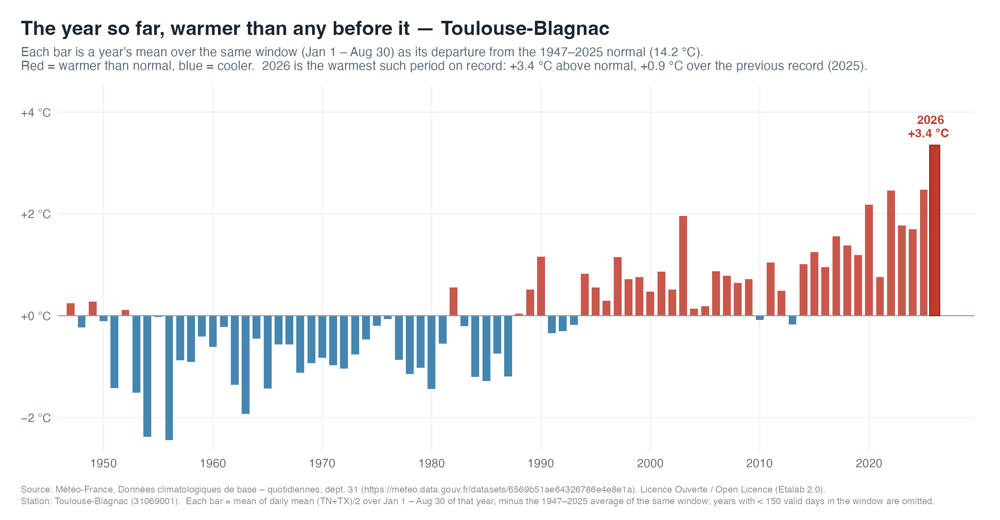

<sub>Each bar is a year’s mean over the <em>same window</em> — <strong>Jan 1 – Aug 11</strong> —
shown as its departure from the long-term normal (13.5 °C): red above, blue
below. Comparing each year over the identical part-of-year is the only fair way to place
a year that is still in progress against history. The bars swing from blue to red over
the decades — the warming.</sub>

Measured like-for-like, **2026 is the warmest Jan 1 – Aug 11 in 80 years** at Toulouse-Blagnac: **16.8 °C** — +0.8 °C above the previous record (2025, 16.0 °C) and **+3.3 °C above the long-term normal** (13.5 °C). This is exactly the point of the chart: a year still in progress can already stand out against the whole record.

> [!NOTE]
> A partial year cannot be compared to other years’ *full-year* means — it is still
> missing the warm late-summer and autumn tail. That is why 2026 appears on the
> long-view chart above only as a marked, hollow “to date” point (seasonally incomplete,
> so lower than its eventual annual figure), while its real, like-for-like standing is
> the chart here.

### Every year, day by day

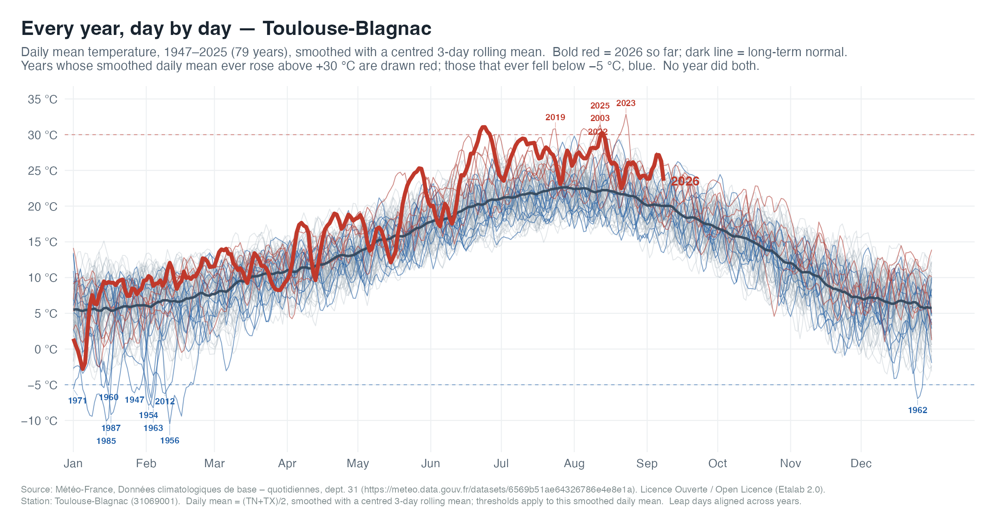

<sub>Each thin line is a single year’s daily mean temperature from January to December
(1947–2025, 79 years), smoothed with a centred
<strong>3-day rolling mean</strong> (each day = the average of itself
±1 day(s)) to tame day-to-day jitter while keeping the shape. The dark line
is the long-term daily normal; the bold red line is <strong>2026 so far</strong>.
Years whose smoothed daily mean ever rose above <strong>+30 °C</strong> are
highlighted in red and labelled; years that ever fell below
<strong>-5 °C</strong> in blue.</sub>

> [!NOTE]
> **Hottest and coldest years.** Measured on the smoothed daily-mean curve,
> **5** years pushed above +30 °C (2003, 2019, 2022, 2023, 2025) — all of them recent —
> while **10** years dropped below -5 °C (1947, 1954, 1956, 1960, 1962, 1963, 1971, 1985, 1987, 2012), all but one before 2000.
> No single year managed to hit both extremes. The hot extremes and the cold extremes fall in different
> eras, which is itself a fingerprint of the warming trend. <sub>(If the threshold is applied instead to the raw, unsmoothed daily mean, 1947 and 1987 each touch both extremes.)</sub>

### The record days

The single most extreme days in each station’s record. “Hottest” is the highest daily
maximum (TX), “coldest” the lowest daily minimum (TN).

| Station (record span) | Extreme | Date | Min (TN) | Max (TX) |
|---|---|---|---:|---:|
| Auzeville-Tolosane-INRAE <sub>2002–2026</sub> | Hottest 🔥 | 2023-08-23 | 21.9 | **42.1** |
| Auzeville-Tolosane-INRAE <sub>2002–2026</sub> | Coldest ❄️ | 2012-02-09 | **-12.1** | -1.4 |
| Toulouse-Blagnac <sub>1947–2026</sub> | Hottest 🔥 | 2023-08-23 | 24.1 | **42.4** |
| Toulouse-Blagnac <sub>1947–2026</sub> | Coldest ❄️ | 1956-02-15 | **-19.2** | -4.1 |

At Toulouse-Blagnac, the all-time heat (2023-08-23) is far more recent than the all-time cold (1956-02-15) — the same warming signature seen throughout this report.

> [!NOTE]
> **Why Auzeville-Tolosane-INRAE?** The Météo-France dataset for department 31 contains no station literally named “Castanet-Tolosan”. The Auzeville-Tolosane-INRAE station (no. 31035001), on the INRAE/ENSAT campus, sits right on the Castanet-Tolosan boundary — the most representative local record. Toulouse-Blagnac (no. 31069001) provides the historical depth needed to see the underlying trend and to draw the day-by-day climatology.

### The last decade (Toulouse-Blagnac)

| Year | Min (TN) | Max (TX) | Mean |
|---|---:|---:|---:|
| 2016 | 10.0 | 19.3 | **14.6** |
| 2017 | 9.7 | 19.5 | **14.6** |
| 2018 | 10.7 | 19.5 | **15.1** |
| 2019 | 10.0 | 19.9 | **15.0** |
| 2020 | 10.6 | 20.2 | **15.4** |
| 2021 | 9.7 | 19.1 | **14.4** |
| 2022 | 11.2 | 21.3 | **16.3** |
| 2023 | 10.7 | 20.8 | **15.7** |
| 2024 | 10.5 | 19.6 | **15.1** |
| 2025 | 10.7 | 20.6 | **15.6** |
| 2026 *(to date)* | 11.5 | 22.1 | **16.8** |

### Frost days halved, hot days doubled

A degree of warming is abstract; the count of extreme days is not. Comparing
Toulouse-Blagnac’s first complete decade (1947–1956) with its last (2016–2025),
the everyday texture of the year has changed sharply:

| Threshold days per year | 1947–1956 | 2016–2025 |
|---|---:|---:|
| Frost days (min < 0 °C) | 46 | **18** |
| Hot days (max ≥ 30 °C) | 24 | **47** |
| Very hot days (max ≥ 35 °C) | 2 | **10** |
| Tropical nights (min ≥ 20 °C) | 4 | **21** |

<sub>Counts of days per year crossing each threshold, averaged over the first and last
complete decades. Frost is retreating just as heat advances — the same warming, read
off the calendar instead of the thermometer.</sub>

### What about the rain?

Temperature is only half of a climate. Rainfall tells a very different — and much
quieter — story: over the same 79 years, annual precipitation at
Toulouse-Blagnac shows **no statistically significant trend**.

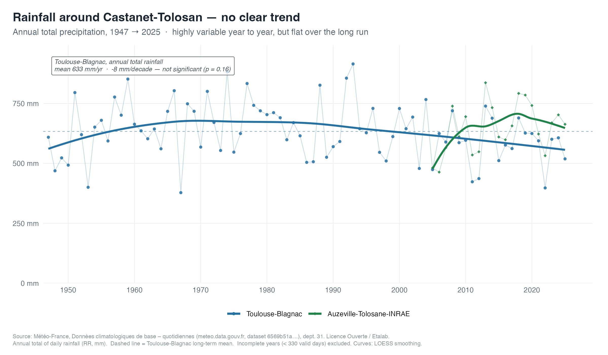

<sub>Annual total precipitation. The dashed line is Toulouse-Blagnac’s long-term mean
(633 mm/yr); the thick curves are LOESS smoothings. The year-to-year swings are
large — from 378 mm (1967) to 915 mm (1993) —
but the long-run slope (-8 mm/decade) is flat and not significant (p = 0.16).</sub>

That contrast is the point. The very same daily records that show an unmistakable, statistically strong warming signal show *no* comparable signal in how much it rains. A dataset that manufactured trends would have produced one here too; this one does not.

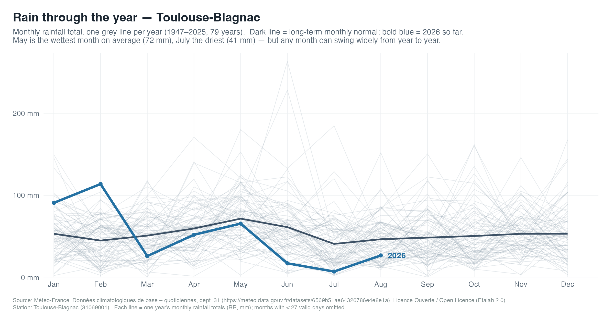

<sub>Rain through the year: each grey line is one year’s monthly totals, the dark line the
long-term monthly normal, the bold blue line 2026 so far. May is the
wettest month on average (72 mm), July the driest
(41 mm) — but the spread between years dwarfs the seasonal cycle, which is
exactly why no annual trend emerges.</sub>

### Methodology

- **Source.** Météo-France — Données climatologiques de base – quotidiennes, Haute-Garonne, France. Full citation
  below.
- **Variables.** Minimum = `TN`, maximum = `TX`, mean = `(TN+TX)/2`, in °C;
  rainfall = `RR` (daily precipitation, in mm).
- **Annual aggregation.** Arithmetic mean of daily values over each calendar year. The
  long-term trend uses only complete years (≥ 330 valid days). The in-progress
  year is shown separately — as a hollow “to date” marker on the trend chart, and (for a
  fair record comparison) against the same calendar window (Jan 1 → cutoff) of every
  prior year, keeping only years with ≥ 150 valid days in that window.
- **Daily climatology.** Each year’s daily mean is smoothed with a centred
  3-day rolling mean (unweighted moving average, computed per year so
  December never bleeds into January; the first/last 1 day(s) keep their raw
  value) for legibility; leap days are aligned across years. The normal is the per-day
  average over all prior years.
- **Threshold days.** Frost = `TN < 0`, hot day = `TX ≥ 30`, very hot =
  `TX ≥ 35`, tropical night = `TN ≥ 20`, counted per complete year and
  averaged over the first/last complete decade.
- **Rainfall.** Annual total of daily `RR` over complete years; the trend is a
  least-squares slope with its two-sided p-value. Monthly climatology keeps only months
  with ≥ 27 valid days.
- **Trend.** Slope estimated by linear regression (least squares); the line-chart curves
  use LOESS smoothing (span = 0.7).
- **Reproducibility.** A 4-stage R pipeline (`R/00_prepare_data.R` → `R/01_plot.R` →
  `R/02_report.R` → `R/03_readme.R`), driven by `SITE=castanet make all`. The figures
  above and the numbers in this section are regenerated from the source data on every
  run — see [Data source](#data-source--citation) below for the full citation.

<sub>Figures and numbers above are generated — edit `R/03_readme.R`, not this block.</sub>

<!-- END REPORT:castanet -->

<!-- BEGIN REPORT:zurich -->

## A warming climate, seen from Zurich

*MeteoSwiss daily temperature records, 1882 to 2025 — plus 2026 so far.*

MeteoSwiss daily records for the Zurich area tell an unambiguous story:
since the late 19th century, minimum, maximum and mean temperatures have all risen —
steadily and continuously.

| Headline number | Value |
|---|---:|
| Warming rate, mean temperature (Zürich-Fluntern) | **+0.18 °C / decade** |
| Total rise over 143 years (1882 → 2025) | **+2.6 °C** |
| Mean of the last decade (vs 7.9 °C in 1882–1891) | **11.0 °C** |
| Frost days per year, 1882–1891 → 2016–2025 | **111 → 61** |
| Hot days (≥ 30 °C) per year, 1882–1891 → 2016–2025 | **4 → 12** |
| Complete station-years analysed | **190** |
| 2026 year-to-date (Jan 1 – Aug 12), against 143 prior years | **#1 of 144 — record** |

### The long view: annual means

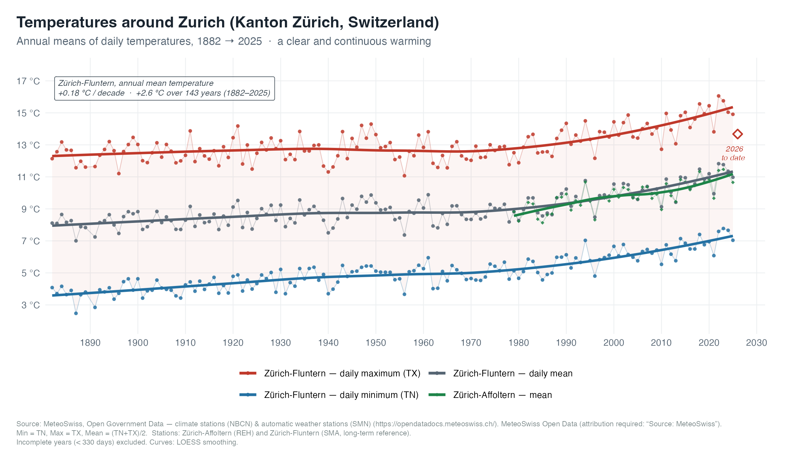

<sub>Annual means of daily temperatures. The thick curves are LOESS smoothings that
highlight the climate trend; the points are annual means. The green series (Zürich-Affoltern) is MeteoSwiss’s automatic station in Zurich’s Affoltern district; it tracks the long Zürich-Fluntern reference mean almost exactly.</sub>

At Zürich-Fluntern — the station with the longest record (1882→2025) — the annual
mean temperature rises by **+0.18 °C per decade**, about **+2.6 °C** over the
whole period. The local Zürich-Affoltern station, which is MeteoSwiss’s automatic station in Zurich’s Affoltern district, only covers 1979→2025. Its slope over that shorter, more recent window is steeper (+0.49 °C/decade) — but so is Zürich-Fluntern’s over the same years (+0.50 °C/decade): recent decades warm faster, and the local station sits almost exactly on the regional mean. The local and regional signals are the same.

### This year, against every year before it

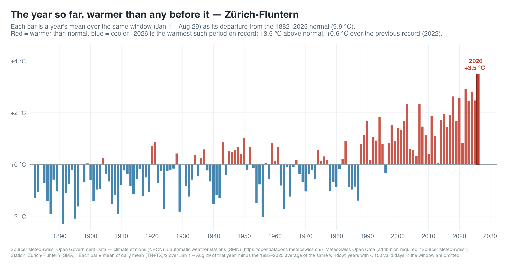

<sub>Each bar is a year’s mean over the <em>same window</em> — <strong>Jan 1 – Aug 12</strong> —
shown as its departure from the long-term normal (9.3 °C): red above, blue
below. Comparing each year over the identical part-of-year is the only fair way to place
a year that is still in progress against history. The bars swing from blue to red over
the decades — the warming.</sub>

Measured like-for-like, **2026 is the warmest Jan 1 – Aug 12 in 144 years** at Zürich-Fluntern: **12.8 °C** — +0.6 °C above the previous record (2022, 12.2 °C) and **+3.5 °C above the long-term normal** (9.3 °C). This is exactly the point of the chart: a year still in progress can already stand out against the whole record.

> [!NOTE]
> A partial year cannot be compared to other years’ *full-year* means — it is still
> missing the warm late-summer and autumn tail. That is why 2026 appears on the
> long-view chart above only as a marked, hollow “to date” point (seasonally incomplete,
> so lower than its eventual annual figure), while its real, like-for-like standing is
> the chart here.

### Every year, day by day

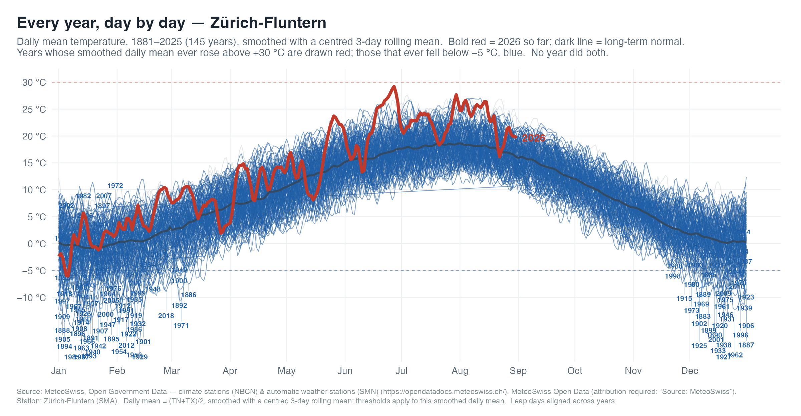

<sub>Each thin line is a single year’s daily mean temperature from January to December
(1881–2025, 145 years), smoothed with a centred
<strong>3-day rolling mean</strong> (each day = the average of itself
±1 day(s)) to tame day-to-day jitter while keeping the shape. The dark line
is the long-term daily normal; the bold red line is <strong>2026 so far</strong>.
Years whose smoothed daily mean ever rose above <strong>+30 °C</strong> are
highlighted in red and labelled; years that ever fell below
<strong>-5 °C</strong> in blue.</sub>

> [!NOTE]
> **Hottest and coldest years.** Measured on the smoothed daily-mean curve,
> **0** years pushed above +30 °C —
> while **118** years dropped below -5 °C (1882, 1883, 1885, 1886, 1887, 1888, 1889, 1890, 1891, 1892, 1893, 1894, 1895, 1896, 1897, 1898, 1899, 1900, 1901, 1902, 1903, 1904, 1905, 1906, 1907, 1908, 1909, 1911, 1912, 1914, 1915, 1917, 1918, 1919, 1920, 1921, 1922, 1923, 1924, 1925, 1926, 1927, 1929, 1930, 1931, 1932, 1933, 1934, 1935, 1936, 1937, 1938, 1939, 1940, 1941, 1942, 1944, 1945, 1946, 1947, 1948, 1949, 1950, 1952, 1953, 1954, 1956, 1957, 1958, 1960, 1961, 1962, 1963, 1964, 1966, 1967, 1968, 1969, 1970, 1971, 1972, 1973, 1975, 1976, 1979, 1980, 1981, 1982, 1983, 1984, 1985, 1986, 1987, 1988, 1991, 1992, 1993, 1995, 1996, 1997, 1998, 1999, 2000, 2001, 2002, 2003, 2005, 2006, 2007, 2009, 2010, 2012, 2013, 2014, 2017, 2018, 2021, 2022).
> No single year managed to hit both extremes. The hot extremes and the cold extremes fall in different
> eras, which is itself a fingerprint of the warming trend. <sub>(On the raw, unsmoothed daily mean, no year touches both extremes.)</sub>

### The record days

The single most extreme days in each station’s record. “Hottest” is the highest daily
maximum (TX), “coldest” the lowest daily minimum (TN).

| Station (record span) | Extreme | Date | Min (TN) | Max (TX) |
|---|---|---|---:|---:|
| Zürich-Fluntern <sub>1864–2026</sub> | Hottest 🔥 | 2026-06-27 | 21.6 | **37.1** |
| Zürich-Fluntern <sub>1864–2026</sub> | Coldest ❄️ | 1929-02-12 | **-24.7** | -16.3 |
| Zürich-Affoltern <sub>1961–2026</sub> | Hottest 🔥 | 2026-07-30 | 15.4 | **37.5** |
| Zürich-Affoltern <sub>1961–2026</sub> | Coldest ❄️ | 1985-01-09 | **-26.6** | -12.9 |

At Zürich-Fluntern, the all-time heat (2026-06-27) is far more recent than the all-time cold (1929-02-12) — the same warming signature seen throughout this report.

> [!NOTE]
> **Why Zürich-Affoltern?** MeteoSwiss’s homogeneous long-term series (Swiss NBCN) covers only about thirty stations nationwide; Affoltern — a district in the north of Zurich — isn’t one of them. REH, MeteoSwiss’s automatic station there, is the closest full station to that neighbourhood and has carried temperature since 1978. Zürich-Fluntern (station SMA), in the hills above the city centre, provides the historical depth — a homogeneous record back to 1881 — needed to see the underlying trend and to draw the day-by-day climatology.

### The last decade (Zürich-Fluntern)

| Year | Min (TN) | Max (TX) | Mean |
|---|---:|---:|---:|
| 2016 | 6.5 | 14.1 | **10.3** |
| 2017 | 6.5 | 14.6 | **10.6** |
| 2018 | 7.4 | 15.6 | **11.5** |
| 2019 | 6.8 | 14.9 | **10.9** |
| 2020 | 6.9 | 15.4 | **11.2** |
| 2021 | 6.1 | 13.8 | **9.9** |
| 2022 | 7.6 | 16.1 | **11.8** |
| 2023 | 7.8 | 15.8 | **11.8** |
| 2024 | 7.7 | 15.0 | **11.4** |
| 2025 | 7.0 | 14.9 | **11.0** |
| 2026 *(to date)* | 7.8 | 17.7 | **12.8** |

### Frost days halved, hot days doubled

A degree of warming is abstract; the count of extreme days is not. Comparing
Zürich-Fluntern’s first complete decade (1882–1891) with its last (2016–2025),
the everyday texture of the year has changed sharply:

| Threshold days per year | 1882–1891 | 2016–2025 |
|---|---:|---:|
| Frost days (min < 0 °C) | 111 | **61** |
| Hot days (max ≥ 30 °C) | 4 | **12** |
| Very hot days (max ≥ 35 °C) | 0 | **0** |
| Tropical nights (min ≥ 20 °C) | 0 | **2** |

<sub>Counts of days per year crossing each threshold, averaged over the first and last
complete decades. Frost is retreating just as heat advances — the same warming, read
off the calendar instead of the thermometer.</sub>

### What about the rain?

Temperature is only half of a climate. Rainfall tells a very different — and much
quieter — story: over the same 162 years, annual precipitation at
Zürich-Fluntern shows **no statistically significant trend**.

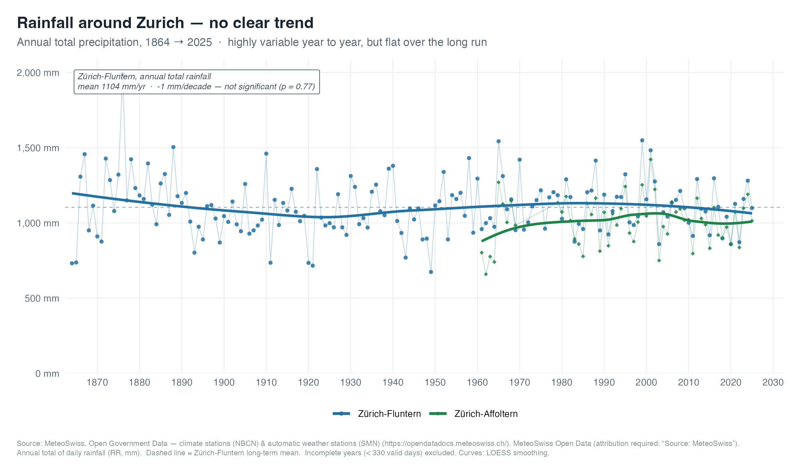

<sub>Annual total precipitation. The dashed line is Zürich-Fluntern’s long-term mean
(1104 mm/yr); the thick curves are LOESS smoothings. The year-to-year swings are
large — from 674 mm (1949) to 1988 mm (1876) —
but the long-run slope (-1 mm/decade) is flat and not significant (p = 0.77).</sub>

That contrast is the point. The very same daily records that show an unmistakable, statistically strong warming signal show *no* comparable signal in how much it rains. A dataset that manufactured trends would have produced one here too; this one does not.

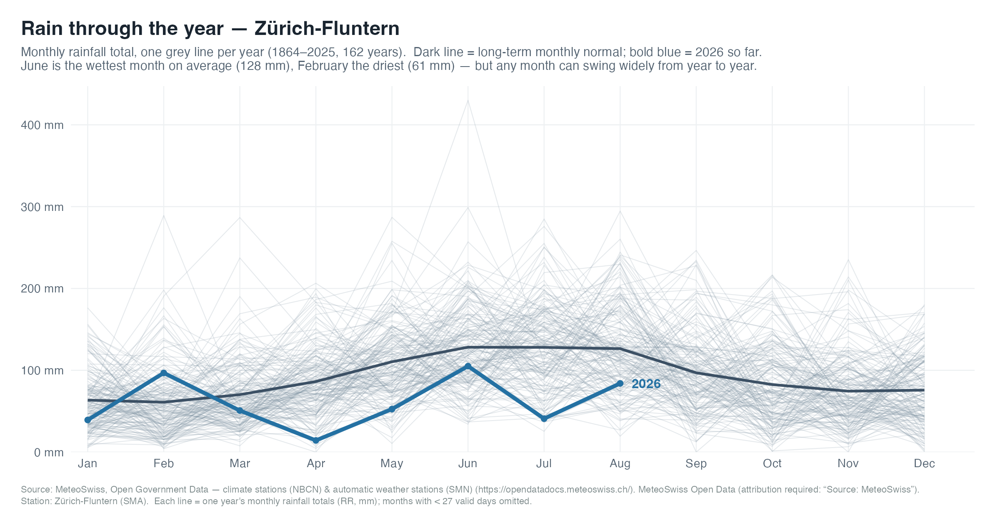

<sub>Rain through the year: each grey line is one year’s monthly totals, the dark line the
long-term monthly normal, the bold blue line 2026 so far. June is the
wettest month on average (128 mm), February the driest
(61 mm) — but the spread between years dwarfs the seasonal cycle, which is
exactly why no annual trend emerges.</sub>

### Methodology

- **Source.** MeteoSwiss — Open Government Data — climate stations (NBCN) & automatic weather stations (SMN), Kanton Zürich, Switzerland. Full citation
  below.
- **Variables.** Minimum = `TN`, maximum = `TX`, mean = `(TN+TX)/2`, in °C;
  rainfall = `RR` (daily precipitation, in mm).
- **Annual aggregation.** Arithmetic mean of daily values over each calendar year. The
  long-term trend uses only complete years (≥ 330 valid days). The in-progress
  year is shown separately — as a hollow “to date” marker on the trend chart, and (for a
  fair record comparison) against the same calendar window (Jan 1 → cutoff) of every
  prior year, keeping only years with ≥ 150 valid days in that window.
- **Daily climatology.** Each year’s daily mean is smoothed with a centred
  3-day rolling mean (unweighted moving average, computed per year so
  December never bleeds into January; the first/last 1 day(s) keep their raw
  value) for legibility; leap days are aligned across years. The normal is the per-day
  average over all prior years.
- **Threshold days.** Frost = `TN < 0`, hot day = `TX ≥ 30`, very hot =
  `TX ≥ 35`, tropical night = `TN ≥ 20`, counted per complete year and
  averaged over the first/last complete decade.
- **Rainfall.** Annual total of daily `RR` over complete years; the trend is a
  least-squares slope with its two-sided p-value. Monthly climatology keeps only months
  with ≥ 27 valid days.
- **Trend.** Slope estimated by linear regression (least squares); the line-chart curves
  use LOESS smoothing (span = 0.7).
- **Reproducibility.** A 4-stage R pipeline (`R/00_prepare_data.R` → `R/01_plot.R` →
  `R/02_report.R` → `R/03_readme.R`), driven by `SITE=zurich make all`. The figures
  above and the numbers in this section are regenerated from the source data on every
  run — see [Data source](#data-source--citation) below for the full citation.

<sub>Figures and numbers above are generated — edit `R/03_readme.R`, not this block.</sub>

<!-- END REPORT:zurich -->

<!-- BEGIN REPORT:karlsruhe -->

## A warming climate, seen from Karlsruhe

*DWD (Deutscher Wetterdienst) daily temperature records, 1876 to 2025 — plus 2026 so far.*

DWD (Deutscher Wetterdienst) daily records for the Karlsruhe area tell an unambiguous story:
since the late 19th century, minimum, maximum and mean temperatures have all risen —
steadily and continuously.

| Headline number | Value |
|---|---:|
| Warming rate, mean temperature (Rheinstetten) | **+0.14 °C / decade** |
| Total rise over 149 years (1876 → 2025) | **+2.1 °C** |
| Mean of the last decade (vs 9.8 °C in 1876–1885) | **11.9 °C** |
| Frost days per year, 1876–1885 → 2016–2025 | **67 → 59** |
| Hot days (≥ 30 °C) per year, 1876–1885 → 2016–2025 | **7 → 26** |
| Complete station-years analysed | **148** |
| 2026 year-to-date (Jan 1 – Aug 12), against 149 prior years | **#2 of 150** |

### The long view: annual means

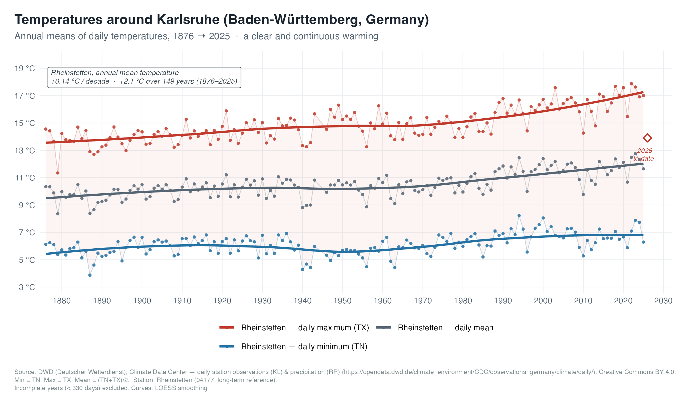

<sub>Annual means of daily temperatures. The thick curves are LOESS smoothings that
highlight the climate trend; the points are annual means.</sub>

At Rheinstetten — the station with the longest record (1876→2025) — the annual
mean temperature rises by **+0.14 °C per decade**, about **+2.1 °C** over the
whole period. Karlsruhe-Wolfartsweier carries no temperature record; Rheinstetten alone provides the temperature trend for this area. The local comparison here uses rainfall instead — see below.

### This year, against every year before it

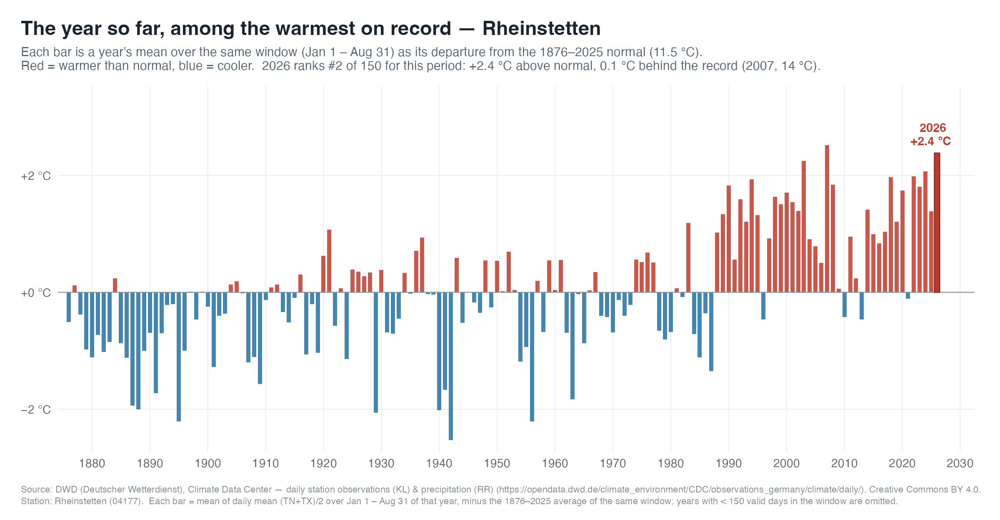

<sub>Each bar is a year’s mean over the <em>same window</em> — <strong>Jan 1 – Aug 12</strong> —
shown as its departure from the long-term normal (10.9 °C): red above, blue
below. Comparing each year over the identical part-of-year is the only fair way to place
a year that is still in progress against history. The bars swing from blue to red over
the decades — the warming.</sub>

Measured like-for-like over Jan 1 – Aug 12, 2026 currently ranks **#2 of 150** at Rheinstetten (13.3 °C). The warmest such window on record remains 2007 (13.6 °C).

> [!NOTE]
> A partial year cannot be compared to other years’ *full-year* means — it is still
> missing the warm late-summer and autumn tail. That is why 2026 appears on the
> long-view chart above only as a marked, hollow “to date” point (seasonally incomplete,
> so lower than its eventual annual figure), while its real, like-for-like standing is
> the chart here.

### Every year, day by day

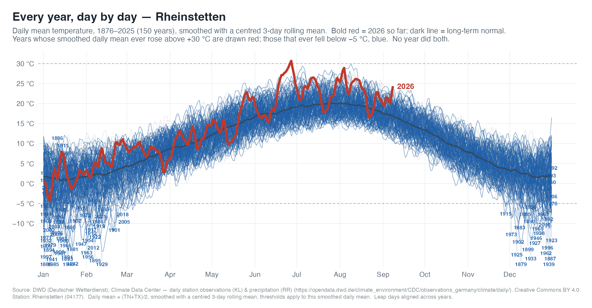

<sub>Each thin line is a single year’s daily mean temperature from January to December
(1876–2025, 150 years), smoothed with a centred
<strong>3-day rolling mean</strong> (each day = the average of itself
±1 day(s)) to tame day-to-day jitter while keeping the shape. The dark line
is the long-term daily normal; the bold red line is <strong>2026 so far</strong>.
Years whose smoothed daily mean ever rose above <strong>+30 °C</strong> are
highlighted in red and labelled; years that ever fell below
<strong>-5 °C</strong> in blue.</sub>

> [!NOTE]
> **Hottest and coldest years.** Measured on the smoothed daily-mean curve,
> **0** years pushed above +30 °C —
> while **107** years dropped below -5 °C (1876, 1878, 1879, 1880, 1881, 1882, 1883, 1885, 1886, 1887, 1888, 1889, 1890, 1891, 1892, 1893, 1894, 1895, 1896, 1899, 1901, 1902, 1903, 1904, 1905, 1906, 1907, 1908, 1909, 1911, 1912, 1914, 1915, 1917, 1918, 1919, 1920, 1921, 1922, 1923, 1924, 1925, 1926, 1927, 1929, 1931, 1932, 1933, 1934, 1935, 1938, 1939, 1940, 1941, 1942, 1943, 1945, 1946, 1947, 1948, 1950, 1952, 1953, 1954, 1956, 1957, 1959, 1960, 1961, 1962, 1963, 1964, 1966, 1967, 1968, 1969, 1970, 1971, 1972, 1973, 1976, 1978, 1979, 1980, 1981, 1982, 1985, 1986, 1987, 1991, 1992, 1993, 1995, 1996, 1997, 2002, 2003, 2005, 2006, 2009, 2010, 2011, 2012, 2017, 2018, 2021, 2022).
> No single year managed to hit both extremes. The hot extremes and the cold extremes fall in different
> eras, which is itself a fingerprint of the warming trend. <sub>(If the threshold is applied instead to the raw, unsmoothed daily mean, 1952 and 2003 each touch both extremes.)</sub>

### The record days

The single most extreme days in each station’s record. “Hottest” is the highest daily
maximum (TX), “coldest” the lowest daily minimum (TN).

| Station (record span) | Extreme | Date | Min (TN) | Max (TX) |
|---|---|---|---:|---:|
| Rheinstetten <sub>1876–2026</sub> | Hottest 🔥 | 2026-06-27 | 20.7 | **40.5** |
| Rheinstetten <sub>1876–2026</sub> | Coldest ❄️ | 1940-01-18 | **-25.4** | -12.5 |

At Rheinstetten, the all-time heat (2026-06-27) is far more recent than the all-time cold (1940-01-18) — the same warming signature seen throughout this report.

> [!NOTE]
> **Why Karlsruhe-Wolfartsweier?** No active DWD station near Grötzingen — a district on Karlsruhe’s eastern edge — carries a temperature record; the nearest that once did (Augustenberg, under 1 km away) closed in 1985. Karlsruhe-Wolfartsweier (station 02523), 5.4 km away and active since 1931, is the nearest active rain gauge and stands in for local rainfall. Rheinstetten (station 04177) provides the temperature trend, spliced with its in-city predecessor (02522, 1876–2008) for the historical depth needed to see the underlying trend.

### The last decade (Rheinstetten)

| Year | Min (TN) | Max (TX) | Mean |
|---|---:|---:|---:|
| 2016 | 6.6 | 15.8 | **11.2** |
| 2017 | 6.6 | 16.5 | **11.5** |
| 2018 | 7.1 | 17.7 | **12.4** |
| 2019 | 6.5 | 17.0 | **11.8** |
| 2020 | 6.7 | 17.6 | **12.1** |
| 2021 | 5.9 | 15.5 | **10.7** |
| 2022 | 7.1 | 17.9 | **12.5** |
| 2023 | 7.9 | 17.6 | **12.8** |
| 2024 | 7.7 | 16.9 | **12.3** |
| 2025 | 6.3 | 17.0 | **11.6** |
| 2026 *(to date)* | 7.1 | 19.4 | **13.3** |

### Frost days halved, hot days doubled

A degree of warming is abstract; the count of extreme days is not. Comparing
Rheinstetten’s first complete decade (1876–1885) with its last (2016–2025),
the everyday texture of the year has changed sharply:

| Threshold days per year | 1876–1885 | 2016–2025 |
|---|---:|---:|
| Frost days (min < 0 °C) | 67 | **59** |
| Hot days (max ≥ 30 °C) | 7 | **26** |
| Very hot days (max ≥ 35 °C) | 0 | **3** |
| Tropical nights (min ≥ 20 °C) | 1 | **1** |

<sub>Counts of days per year crossing each threshold, averaged over the first and last
complete decades. Frost is retreating just as heat advances — the same warming, read
off the calendar instead of the thermometer.</sub>

### What about the rain?

Temperature is only half of a climate. Rainfall tells a very different — and much
quieter — story: over the same 148 years, annual precipitation at
Rheinstetten shows **a statistically significant trend (-11 mm/decade, p = 0.00)**.

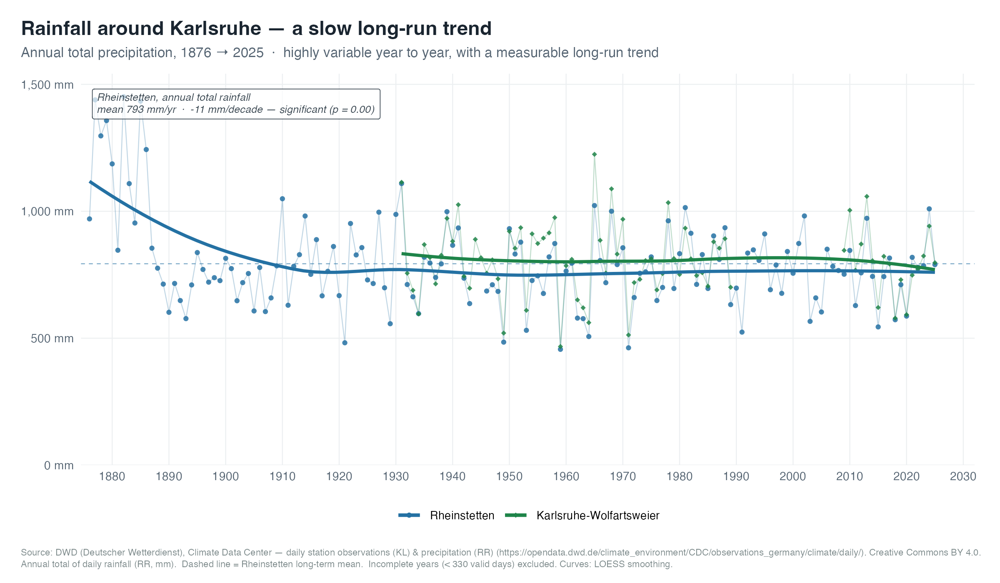

<sub>Annual total precipitation. The dashed line is Rheinstetten’s long-term mean
(793 mm/yr); the thick curves are LOESS smoothings. The year-to-year swings are
large — from 456 mm (1959) to 1452 mm (1882) —
but the long-run slope (-11 mm/decade) is measurable and statistically significant (p = 0.00).</sub>

Rainfall tells its own story here: unlike most of the sites in this series, Rheinstetten shows a real, if much smaller and slower, long-run trend toward drier conditions (-11 mm/decade, p = 0.00) — alongside the much larger and faster warming signal above.

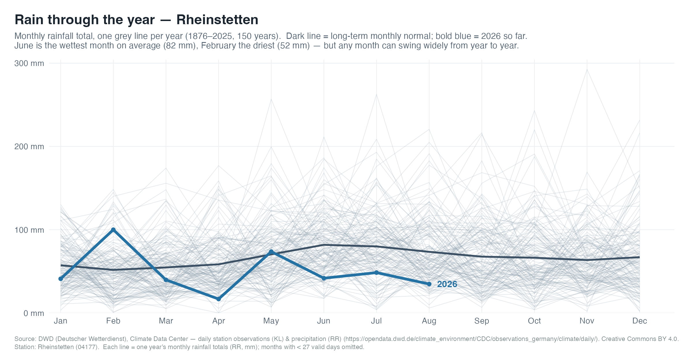

<sub>Rain through the year: each grey line is one year’s monthly totals, the dark line the
long-term monthly normal, the bold blue line 2026 so far. June is the
wettest month on average (82 mm), February the driest
(52 mm) — but the spread between years dwarfs the seasonal cycle, which is
exactly why no annual trend emerges.</sub>

### Methodology

- **Source.** DWD (Deutscher Wetterdienst) — Climate Data Center — daily station observations (KL) & precipitation (RR), Baden-Württemberg, Germany. Full citation
  below.
- **Variables.** Minimum = `TN`, maximum = `TX`, mean = `(TN+TX)/2`, in °C;
  rainfall = `RR` (daily precipitation, in mm).
- **Annual aggregation.** Arithmetic mean of daily values over each calendar year. The
  long-term trend uses only complete years (≥ 330 valid days). The in-progress
  year is shown separately — as a hollow “to date” marker on the trend chart, and (for a
  fair record comparison) against the same calendar window (Jan 1 → cutoff) of every
  prior year, keeping only years with ≥ 150 valid days in that window.
- **Daily climatology.** Each year’s daily mean is smoothed with a centred
  3-day rolling mean (unweighted moving average, computed per year so
  December never bleeds into January; the first/last 1 day(s) keep their raw
  value) for legibility; leap days are aligned across years. The normal is the per-day
  average over all prior years.
- **Threshold days.** Frost = `TN < 0`, hot day = `TX ≥ 30`, very hot =
  `TX ≥ 35`, tropical night = `TN ≥ 20`, counted per complete year and
  averaged over the first/last complete decade.
- **Rainfall.** Annual total of daily `RR` over complete years; the trend is a
  least-squares slope with its two-sided p-value. Monthly climatology keeps only months
  with ≥ 27 valid days.
- **Trend.** Slope estimated by linear regression (least squares); the line-chart curves
  use LOESS smoothing (span = 0.7).
- **Reproducibility.** A 4-stage R pipeline (`R/00_prepare_data.R` → `R/01_plot.R` →
  `R/02_report.R` → `R/03_readme.R`), driven by `SITE=karlsruhe make all`. The figures
  above and the numbers in this section are regenerated from the source data on every
  run — see [Data source](#data-source--citation) below for the full citation.

<sub>Figures and numbers above are generated — edit `R/03_readme.R`, not this block.</sub>

<!-- END REPORT:karlsruhe -->

## Data sources

Each site pulls from its own national weather service, all open data, all
attribution-only:

| Site | Source | Scope | Licence |
|---|---|---|---|
| Castanet-Tolosan | Météo-France — *Données climatologiques de base – quotidiennes* | dept. 31 (Haute-Garonne), `RR-T-Vent` daily files, three eras (`avant-1949`, `previous-1950-2024`, `latest-2025-2026`) | Licence Ouverte / Open Licence (Etalab 2.0) |
| Zurich | MeteoSwiss — Open Government Data | `ogd-nbcn` (homogeneous climate stations) + `ogd-smn` (automatic weather stations) | MeteoSwiss Open Data (attribution: "Source: MeteoSwiss") |
| Karlsruhe | DWD (Deutscher Wetterdienst) — Climate Data Center | `kl` (daily station observations) + `more_precip` (precipitation only) | Creative Commons BY 4.0 |

Full dataset URLs and citation text are in each site's report above and in
`R/sites/<site>.R`. Météo-France field definitions land in
`data/raw/Q_descriptif_champs_*.txt` after the first `make prepare`.

### Stations

| Site | Code | Name | Record | Role |
|---|------|------|--------|------|
| Castanet-Tolosan | `31035001` | Auzeville-Tolosane-INRAE | 2002→ | Local station, on the edge of Castanet-Tolosan (INRAE/ENSAT campus) |
| Castanet-Tolosan | `31069001` | Toulouse-Blagnac | 1947→ | Long regional reference; used for the trend and the daily climatology |
| Zurich | `REH` | Zürich-Affoltern | 1961→ (temp. 1978→) | Local station, in Zurich's Affoltern district (MeteoSwiss automatic network) |
| Zurich | `SMA` | Zürich-Fluntern | 1864→ (TN/TX 1881→) | Long regional reference; MeteoSwiss's homogeneous series for the trend and climatology |
| Karlsruhe | `02523` | Karlsruhe-Wolfartsweier | 1931→ | Local station — **rainfall only**, no temperature record near Grötzingen (see below) |
| Karlsruhe | `04177` | Rheinstetten | 1876→ | Long regional reference — spliced with predecessor 02522 (city-centre, 1876→2008) at its 2008-11-01 handoff to Rheinstetten, closing what would otherwise be a 1985–2008 gap in 04177's own record |

> The "Record" column is each station's raw first→last year; the trend prose and
> "last decade" tables instead start from each station's first *complete* year
> (≥ 330 valid days) — a station can legitimately appear with three different
> start years across the report depending on whether the completeness filter
> applies.

> **Why these local stations?** None of the three national datasets has a
> station literally named for its target town/district. Auzeville-Tolosane-INRAE
> sits on Castanet-Tolosan's boundary; Zürich-Affoltern is the closest full
> MeteoSwiss station to Zurich's Affoltern district; Karlsruhe-Wolfartsweier is
> the nearest *active* DWD station to Grötzingen, but the nearest one that once
> had a temperature record too (Augustenberg, under 1 km away) closed in 1985 —
> so Karlsruhe's local tier is rainfall-only. Each report's own "Why {{station}}?"
> note has the full explanation.

## Project layout

```
climatudes/
├── README.md                  this file — each site's report block is generated
├── Makefile                   reproducible pipeline (make all SITE=<site>)
├── R/
│   ├── lib/
│   │   ├── common.R           shared constants, palette, deg_label(), fetch/verify/write helpers
│   │   └── narrative.R        shared report prose/number logic (build_common_fills())
│   ├── sites/
│   │   ├── castanet.R         Castanet-Tolosan: stations, paths, citation, narrative facts
│   │   ├── zurich.R           Zurich: same, for MeteoSwiss
│   │   └── karlsruhe.R        Karlsruhe: same, for DWD
│   ├── sources/
│   │   ├── meteofrance.R      fetch + normalize Météo-France's format
│   │   ├── meteoswiss.R       fetch + normalize MeteoSwiss's format
│   │   └── dwd.R              fetch + normalize DWD's format
│   ├── 00_prepare_data.R      generic: dispatches to R/sources/<site's source>.R
│   ├── 01_plot.R              generic: build the five figures + annual tables + stats
│   ├── 02_report.R            generic: assemble the self-contained HTML report
│   └── 03_readme.R            generic: render the same report into this site's README block
├── data/                      (created on first run, git-ignored)
│   ├── raw/                   Castanet-Tolosan's raw files (legacy root location)
│   ├── raw/<site>/            zurich's / karlsruhe's raw files
│   └── processed/[<site>/]    small gzipped station extract + intermediates, per site
└── outputs/                   (created on first run, mostly git-ignored)
    ├── figures/               Castanet-Tolosan's five PNGs (legacy root location)  ← tracked
    ├── <site>/figures/        zurich's / karlsruhe's five PNGs                     ← tracked
    ├── [<site>/]annual_temperatures.csv
    ├── [<site>/]annual_rainfall.csv
    └── [<site>/]temperature_report.html   ← the shareable deliverable (fully self-contained)
```

Every source module normalizes its site's raw data to the same six columns
(`NUM_POSTE`, `AAAAMMJJ`, `TN`, `TX`, `TNTXM`, `RR`) before writing the gzipped
extract, so stages 01–03 never need to know which upstream provider a site
uses — they only read `R/sites/<site>.R` for names, roles, thresholds and
citation text.

**Version-controlled: the R scripts, the Makefile, this README and every
site's PNG figures.** The figures are the one generated artifact that is
committed — GitHub can only render them in the README if they are in the
repository. The base64 HTML reports (~3–4 MB each) are *not* committed.
Everything else — including `data/raw/` — is downloaded or regenerated by
`make all`, so a fresh clone rebuilds any site in a few seconds.

**Everything stays compressed.** Raw archives are never decompressed to disk
— they are read directly via a streaming pipe (`gzip -dc`, or a per-call temp
dir for DWD's zips). Stage 00 slices them down to just the stations in use and
caches that as a single small gzipped extract per site (`stations_daily.csv.gz`,
well under 1 MB — vs. tens to well over a hundred MB of raw upstream data).

### Fetching the data

Stage 00 downloads any raw file missing from the site's raw directory, so
there is nothing to fetch by hand. Each source has its own quirks, documented
where the fetch logic lives (`R/sources/<source>.R`) rather than repeated here:

- **Météo-France** (Castanet-Tolosan) — three era-named files that rotate every
  January; when 2027 opens, `latest-2025-2026` starts 404ing and `MF_ERAS`-
  equivalent (`R/sites/castanet.R`'s `meteofrance$eras`) needs bumping. Stage
  00's error message says so if you hit it. `make refresh` re-downloads the
  current era.
- **MeteoSwiss** (Zurich) — fixed, non-rotating URLs (a `historical` file plus a
  rolling `recent` file per station/dataset); Zürich-Fluntern needs two
  datasets merged (temperature from the homogeneous `ogd-nbcn`, rainfall from
  `ogd-smn`, since the homogeneous series carries no daily precipitation).
- **DWD** (Karlsruhe) — one zip per station/period; the historical zip's
  filename embeds its own date range and shifts over time, so it is discovered
  from a live directory listing rather than hardcoded.

`make refresh SITE=<site>` re-downloads that site's rolling/current data and
rebuilds everything.

## How to run

Requirements: **R ≥ 4** with `data.table`, `ggplot2`, `scales`, `ragg`,
`ggrepel`, `base64enc`. No pandoc needed — every HTML report is built directly.

```sh
make all                  # castanet (default): fetch -> prepare -> plots -> report -> README
make all SITE=zurich      # same, for Zurich
make all SITE=karlsruhe   # same, for Karlsruhe
make all-sites            # run every site in R/sites/
make refresh SITE=zurich  # re-download that site's rolling/current data, then rebuild it
make open SITE=zurich     # open that site's HTML report (macOS)
```

Or run the stages directly from the project root (`SITE` defaults to `castanet`):

```sh
SITE=zurich Rscript R/00_prepare_data.R
SITE=zurich Rscript R/01_plot.R
SITE=zurich Rscript R/02_report.R
SITE=zurich Rscript R/03_readme.R
```

`make clean` (optionally with `SITE=<site>`) removes everything regenerable for
that site (processed data + outputs), leaving the downloaded raw files and the
README in place.

## Two ways to read the same report

Both draw their **numbers** from one file per site
(`[data/processed/<site>/]trend_stats.rds`), so no figure in one can contradict
a figure in the other for that site. (The two templates share their prose
logic — `R/lib/narrative.R` — so wording can still differ in formatting but not
in substance; the clauses that depend on the data — "all of them recent", the
both-extremes footnote — are generated in R rather than hand-written precisely
so they can't drift.)

- **This README** — stage 03 rewrites the block between each site's
  `BEGIN REPORT:<site>` / `END REPORT:<site>` markers and links the committed
  PNGs, so every site's analysis renders straight away on the repository page.
  Edit `R/03_readme.R` or `R/lib/narrative.R`, never the blocks themselves.
- **`<outputs>/temperature_report.html`** — stage 02 embeds that site's figures
  as base64 in a single styled file that needs nothing else to display. Email
  it, copy it to a USB stick, or open it offline.

## Licence

Source data:

- Castanet-Tolosan © Météo-France, *Licence Ouverte / Open Licence (Etalab 2.0)*.
- Zurich © MeteoSwiss Open Data — attribution required: "Source: MeteoSwiss".
- Karlsruhe © DWD (Deutscher Wetterdienst), *Creative Commons BY 4.0*.

Please retain the attribution above when reusing the figures or data.
