# Climatudes — local warming, city by city

**Eleven cities, five national weather services, one method. Every city is warming.
Rainfall, taken from the same records through the same pipeline, shows nothing
comparable: at most of these cities there is no trend at all, and where there is
one it runs wetter in some places and drier in others.**

That contrast is why the rainfall section exists. Every figure and number below
is regenerated from the weather services' own daily files by a single command —
nothing here is transcribed by hand — so the same code that finds a strong,
consistent temperature signal finds no matching one in precipitation.

Start with the ranked comparison below; its city links lead to the chapters,
which all follow the same eight sections in the same order.

Most sites come from national open-data portals. Moscow and Voronezh come from
Roshydromet's AISORI-M, which is **not** openly licensed — personal,
non-commercial use only (see [Licence](#licence)).

[Data sources](#data-sources) · [Stations](#stations) · [How to run](#how-to-run)
· [Project layout](#project-layout) · [Licence](#licence)

<!-- BEGIN COMPARE -->

## All eleven cities, side by side

Every chapter below uses the same variables, the same completeness rule (≥ 330 valid
days/year) and the same trend method (least-squares on annual means). The numbers here are those
same headline figures gathered in one place, not recomputed. Two rates are given per city: the raw
one over its own record, and one over 1951–2025, the longest window every
city shares. Where they disagree, the raw ranking is partly reporting record length.

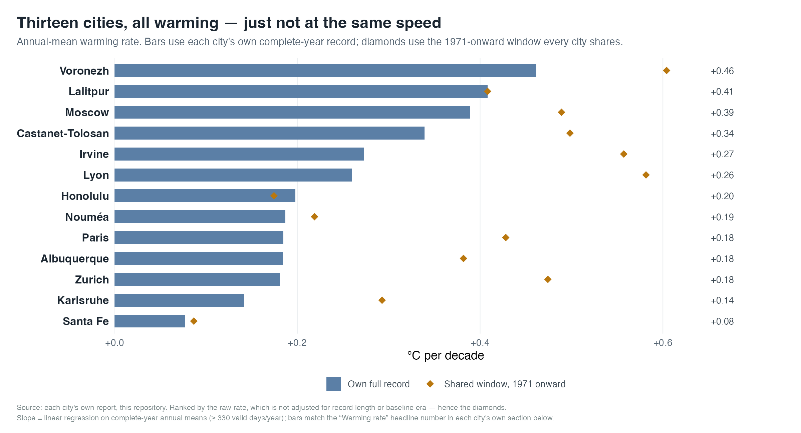

<sub>Ranked by the raw rate. Santa Fe’s record runs 77 years longer than Nouméa’s, so two similar-looking rates can rest on very different
amounts of evidence — the record span and the count of complete years are in the table below.</sub>

| City | Country | Record | °C/decade | 1951→ | Standing | Window ranked | Data current through |
|---|---|---:|---:|---:|---|---|---|
| [Voronezh](#a-warming-climate-seen-from-voronezh) | Russia | 1940→2025 (86 yr, 82 complete) | **+0.46** | +0.49 | #55 of 84 | 2026, Jan 1 – Feb 28 · 59 d | Feb 28, 2026 † |
| [Moscow](#a-warming-climate-seen-from-moscow) | Russia | 1949→2025 (77 yr, 77 complete) | **+0.39** | +0.41 | #1 of 77 — record | 2025, full year | Dec 31, 2025 † |
| [Castanet-Tolosan](#a-warming-climate-seen-from-castanet-tolosan) | France | 1947→2025 (79 yr, 79 complete) | **+0.34** | +0.39 | #1 of 80 — record | 2026, Jan 1 – Aug 13 · 225 d | Aug 13, 2026 |
| [Irvine](#a-warming-climate-seen-from-irvine) | USA | 1915→2025 (111 yr, 95 complete) | **+0.27** | +0.43 | #2 of 101 | 2026, Jan 1 – May 31 · 151 d | May 31, 2026 |
| [Lyon](#a-warming-climate-seen-from-lyon) | France | 1921→2025 (105 yr, 105 complete) | **+0.26** | +0.42 | #1 of 106 — record | 2026, Jan 1 – Aug 13 · 225 d | Aug 13, 2026 |
| [Honolulu](#a-warming-climate-seen-from-honolulu) | USA | 1950→2025 (76 yr, 76 complete) | **+0.20** | +0.20 | #18 of 84 | 2026, Jan 1 – Aug 11 · 223 d | Aug 11, 2026 |
| [Nouméa](#a-warming-climate-seen-from-nouméa) | France | 1951→2025 (75 yr, 75 complete) | **+0.19** | +0.19 | #5 of 76 | 2026, Jan 1 – Aug 14 · 226 d | Aug 14, 2026 |
| [Albuquerque](#a-warming-climate-seen-from-albuquerque) | USA | 1932→2025 (94 yr, 94 complete) | **+0.18** | +0.22 | #1 of 95 — record | 2026, Jan 1 – Aug 11 · 223 d | Aug 11, 2026 |
| [Zurich](#a-warming-climate-seen-from-zurich) | Switzerland | 1882→2025 (144 yr, 143 complete) | **+0.18** | +0.37 | #1 of 144 — record | 2026, Jan 1 – Aug 13 · 225 d | Aug 13, 2026 |
| [Karlsruhe](#a-warming-climate-seen-from-karlsruhe) | Germany | 1876→2025 (150 yr, 148 complete) | **+0.14** | +0.27 | #2 of 150 | 2026, Jan 1 – Aug 13 · 225 d | Aug 13, 2026 |
| [Santa Fe](#a-warming-climate-seen-from-santa-fe) | USA | 1874→2025 (152 yr, 138 complete) | **+0.08** | +0.13 | #1 of 147 — record | 2026, Jan 1 – Jun 30 · 181 d | Jun 30, 2026 |

† Moscow and Voronezh are manually exported from Roshydromet’s AISORI-M (login-gated, no automated
refresh), so their "current through" date lags the other nine sites’ automated feeds by
however long it has been since the last hand export. See each city’s own "Why only one station?"
note below.

Each row names the window its standing is measured over, because the rows do not all make the same
claim. The windows run from Voronezh’s 59 midwinter days through Irvine’s five months to the eight
months most sites reach, and Moscow’s row ranks a complete, already-finished 2025.
A rank is comparable **within** a city — the same calendar window against that city’s own history —
but not across cities. Standardising every site to the shortest window they share reorders the
standings substantially, and several cities holding a "record" badge here do not hold one there:
a January-to-May mean and a January-to-August mean are different statistics. A "#55 of 84" over two
months of winter is not the same kind of statement as an eight-month "#5 of 76".

The two New Mexico rows deserve a note, because they look like a contradiction. Santa Fe and Albuquerque sit about 90 km apart in the same high-desert climate, yet Santa Fe warms at +0.08 °C/decade against Albuquerque's +0.18. Record length is not the explanation — over the shared 1951-onward window they are still +0.13 and +0.22. The difference is in the stations: Santa Fe's daily minima have *fallen* while its maxima rose, widening the gap between day and night, which is the opposite of the greenhouse signature and a known symptom of station history (a site move, a change in reading time) in a record that has not been homogenised. GHCN-Daily is raw. Read the slowest bar on this chart as a measurement result, not as evidence that Santa Fe is barely warming; its own airport station, and its neighbour here, both give roughly +0.2. See Santa Fe's chapter for the numbers.

## How every chapter is built

The comparison above is only meaningful because every city is measured the same way. That
method is stated here once, rather than repeated in all eleven chapters; each chapter adds only
its own source, stations and rebuild command.

- **Variables.** Minimum = `TN`, maximum = `TX`, mean = `(TN+TX)/2`, in °C;
  rainfall = `RR` (daily precipitation, in mm).
- **Annual aggregation.** Arithmetic mean of daily values over each calendar year. The
  long-term trend uses only complete years (≥ 330 valid days). Where the current
  year is still in progress, the pipeline shows it separately — as a hollow “to date” marker
  on the trend chart, and (for a fair record comparison) against the same calendar window
  (Jan 1 → cutoff) of every prior year. A year enters that comparison only if it has
  ≥ 150 valid days in the window *and* covers every month of it: a year holding
  enough days bunched into part of the window is measuring a different season, not a
  different year.
- **Daily climatology.** Each year’s daily mean is smoothed with a centred
  3-day rolling mean (unweighted, computed per year so December never bleeds
  into January) for legibility; leap days are aligned across years. The normal is the
  per-day average over all prior years.
- **Threshold days.** Frost = `TN < 0`, hot day = `TX ≥ 30`, very hot =
  `TX ≥ 35`, tropical night = `TN ≥ 20`, counted per complete year and
  averaged over the first and last complete decade. A fixed threshold means different
  things in different climates: where it falls near the middle of a city’s distribution,
  that chapter says so, because the count then amplifies a modest shift in the mean.
- **Rainfall.** Annual total of daily `RR` over complete years; the trend is a
  least-squares slope with its two-sided p-value. Monthly climatology keeps only months
  with ≥ 27 valid days.
- **Trend.** Slope by linear regression (least squares); the curves on the line charts are
  LOESS smoothings (span = 0.7). Rates are reported per decade.
- **Reproducibility.** A 4-stage R pipeline (`R/00_prepare_data.R` → `R/01_plot.R` →
  `R/02_report.R` → `R/03_readme.R`), driven by `SITE=<site> make all`. See
  [How to run](#how-to-run).

<sub>Figures and numbers above are generated — edit `R/04_compare.R`, not this block.</sub>

<!-- END COMPARE -->

Each chapter below is generated — see [How to run](#how-to-run) to rebuild any of
them, or to get the same report as a self-contained HTML file.

<!-- BEGIN REPORT:castanet -->

## A warming climate, seen from Castanet-Tolosan

*Météo-France daily temperature records, 1947 to 2025 — plus 2026 so far.*

Météo-France’s daily records for the Castanet-Tolosan area are unambiguous: since
the mid-20th century, daily minimum, maximum and mean temperatures have all risen.

| Headline number | Value |
|---|---:|
| Warming rate, mean temperature (Toulouse-Blagnac) | **+0.34 °C / decade** |
| Total rise over 78 years (1947 → 2025) | **+2.6 °C** |
| Mean of the last decade (vs 12.9 °C in 1947–1956) | **15.2 °C** |
| Frost days per year, 1947–1956 → 2016–2025 | **46 → 18** |
| Hot days (≥ 30 °C) per year, 1947–1956 → 2016–2025 | **24 → 47** |
| Complete station-years analysed | **101** |
| 2026 year-to-date (Jan 1 – Aug 13), against 79 prior years | **#1 of 80 — record** |

### The long view: annual means


<sub>Annual means of daily temperatures. The thick curves are LOESS smoothings that
highlight the climate trend; the points are annual means. The green series (Auzeville-Tolosane-INRAE) is the station on the edge of Castanet-Tolosan.</sub>

At Toulouse-Blagnac — the station with the longest record (1947→2025) — the annual
mean temperature rises by **+0.34 °C per decade**, about **+2.6 °C** over the
whole period. The local Auzeville-Tolosane-INRAE station only covers 2004→2025. Its slope over that shorter, more recent window is steeper (+0.83 °C/decade), and so is Toulouse-Blagnac’s over the same years (+0.91 °C/decade): recent decades warm faster, and the two differ by 0.08 °C/decade over these years — the same trend, read off a different site.


### This year, against every year before it


<sub>Each bar is a year’s mean over the <em>same window</em> — <strong>Jan 1 – Aug 13</strong> —
shown as its departure from the 1947–2025 mean (13.6 °C): red above, blue
below. Holding the part-of-year identical is what makes one year comparable with another. The bars swing from blue to red over
the decades — and 2026 is the tallest of all.</sub>

Measured like-for-like, **2026 is the warmest Jan 1 – Aug 13 in 80 years** at Toulouse-Blagnac: **16.9 °C** — +0.8 °C above the previous record (2025, 16.1 °C) and **+3.3 °C above the 1947–2025 mean** (13.6 °C).

> [!NOTE]
> A part-year mean cannot be compared with other years' full-year means. That is why 2026 appears on the long-view chart above only as a marked, hollow "to date" point — a part-year mean on an axis of full-year means — while its like-for-like standing is the chart here.

### Every year, day by day


<sub>Each thin line is a single year’s daily mean temperature from January to December
(1947–2025, 79 years), smoothed with a centred
<strong>3-day rolling mean</strong> (each day = the average of itself
±1 day) to tame day-to-day jitter while keeping the shape. The dark line
is the long-term daily normal; the bold red line is <strong>2026 so far</strong>.
Years whose smoothed daily mean ever rose above <strong>+30 °C</strong> are
highlighted in red and labelled; years that ever fell below
<strong>-5 °C</strong> in blue.</sub>

> [!NOTE]
> **Hottest and coldest years.** Measured on the smoothed daily-mean curve,
> **5** years pushed above +30 °C (2003, 2019, 2022, 2023, 2025)
> while **10** years dropped below -5 °C (1947, 1954, 1956, 1960, 1962, 1963, 1971, 1985, 1987, 2012), all but one before 2000.
> No year hit both extremes. The hot extremes and the cold extremes fall in different eras, which is itself a fingerprint of the warming trend. <sub>(If the threshold is applied instead to the raw, unsmoothed daily mean, 1947 and 1987 each touch both extremes.)</sub>

### The record days

The single most extreme days in each station’s record. “Hottest” is the highest daily
maximum (TX), “coldest” the lowest daily minimum (TN).

| Station (record span) | Extreme | Date | Min (TN) | Max (TX) |
|---|---|---|---:|---:|
| Auzeville-Tolosane-INRAE <sub>2002–2026</sub> | Hottest 🔥 | 2023-08-23 | 21.9 | **42.1** |
| Auzeville-Tolosane-INRAE <sub>2002–2026</sub> | Coldest ❄️ | 2012-02-09 | **-12.1** | -1.4 |
| Toulouse-Blagnac <sub>1947–2026</sub> | Hottest 🔥 | 2023-08-23 | 24.1 | **42.4** |
| Toulouse-Blagnac <sub>1947–2026</sub> | Coldest ❄️ | 1956-02-15 | **-19.2** | -4.1 |

At Toulouse-Blagnac, the all-time heat (2023-08-23) postdates the all-time cold (1956-02-15) by 67 years.

> [!NOTE]
> **Why Auzeville-Tolosane-INRAE?** The Météo-France dataset for department 31 contains no station literally named “Castanet-Tolosan”. The Auzeville-Tolosane-INRAE station (no. 31035001), on the INRAE/ENSAT campus, sits right on the Castanet-Tolosan boundary — the most representative local record. Toulouse-Blagnac (no. 31069001) provides the historical depth needed to see the underlying trend and to draw the day-by-day climatology.

### The last decade (Toulouse-Blagnac)

| Year | Min (TN) | Max (TX) | Mean |
|---|---:|---:|---:|
| 2016 | 10.0 | 19.3 | **14.6** |
| 2017 | 9.7 | 19.5 | **14.6** |
| 2018 | 10.7 | 19.5 | **15.1** |
| 2019 | 10.0 | 19.9 | **15.0** |
| 2020 | 10.6 | 20.2 | **15.4** |
| 2021 | 9.7 | 19.1 | **14.4** |
| 2022 | 11.2 | 21.3 | **16.3** |
| 2023 | 10.7 | 20.8 | **15.7** |
| 2024 | 10.5 | 19.6 | **15.1** |
| 2025 | 10.7 | 20.6 | **15.6** |
| 2026 *(to date)* | 11.6 | 22.2 | **16.9** |

### Frost days down, hot days up

A degree of warming is abstract; a count of days is not. Toulouse-Blagnac’s first
complete decade (1947–1956) against its last (2016–2025):

| Threshold days per year | 1947–1956 | 2016–2025 |
|---|---:|---:|
| Frost days (min < 0 °C) | 46 | **18** |
| Hot days (max ≥ 30 °C) | 24 | **47** |
| Very hot days (max ≥ 35 °C) | 2 | **10** |
| Tropical nights (min ≥ 20 °C) | 4 | **21** |

<sub>Counts of days per year crossing each threshold, averaged over the first and last
complete decades of the record.</sub>

### What about the rain?

Temperature is only half of a climate. Over 1947–2025 (79 years),
annual precipitation at Toulouse-Blagnac shows **no statistically significant trend**.


<sub>Annual total precipitation. The dashed line is Toulouse-Blagnac’s long-term mean
(633 mm/yr); the thick curves are LOESS smoothings. The year-to-year swings are
large — from 378 mm (1967) to 915 mm (1993) —
but the long-run slope (-8 mm/decade) is flat and not significant (p = 0.16).</sub>

The same daily records that carry a strong warming signal carry *no* comparable signal in how much it rains: annual totals swing widely from year to year around a flat long-run mean.


<sub>Rain through the year: each grey line is one year’s monthly totals, the dark line the
long-term monthly normal, the bold blue line 2026 so far. May is the
wettest month on average (72 mm), July the driest
(41 mm) — but the spread between years dwarfs the seasonal cycle, which is exactly why no annual trend emerges.</sub>

### Methodology

Only what is specific to this city is listed here. The variables, completeness rule,
smoothing, thresholds and trend method are the same for every city and are stated once, in
[How every chapter is built](#how-every-chapter-is-built) — which is also what makes the
comparison at the top of this page legitimate.

- **Source.** Météo-France — Données climatologiques de base – quotidiennes, Haute-Garonne, France. Full citation
  in [Data sources](#data-sources) below.
- **Stations.** Auzeville-Tolosane-INRAE (31035001) and Toulouse-Blagnac (31069001).
- **Rebuild this chapter.** `SITE=castanet make all` — every figure and number above is
  regenerated from the source data on each run.

<sub>Figures and numbers above are generated — edit `R/03_readme.R`, not this block.</sub>

<!-- END REPORT:castanet -->

<!-- BEGIN REPORT:lyon -->

## A warming climate, seen from Lyon

*Météo-France daily temperature records, 1921 to 2025 — plus 2026 so far.*

Météo-France’s daily records for the Lyon area are unambiguous: since
the early 20th century, daily minimum, maximum and mean temperatures have all risen.

| Headline number | Value |
|---|---:|
| Warming rate, mean temperature (Lyon-Bron) | **+0.26 °C / decade** |
| Total rise over 104 years (1921 → 2025) | **+2.7 °C** |
| Mean of the last decade (vs 11.3 °C in 1921–1930) | **14.0 °C** |
| Frost days per year, 1921–1930 → 2016–2025 | **64 → 33** |
| Hot days (≥ 30 °C) per year, 1921–1930 → 2016–2025 | **19 → 48** |
| Complete station-years analysed | **155** |
| 2026 year-to-date (Jan 1 – Aug 13), against 105 prior years | **#1 of 106 — record** |

### The long view: annual means

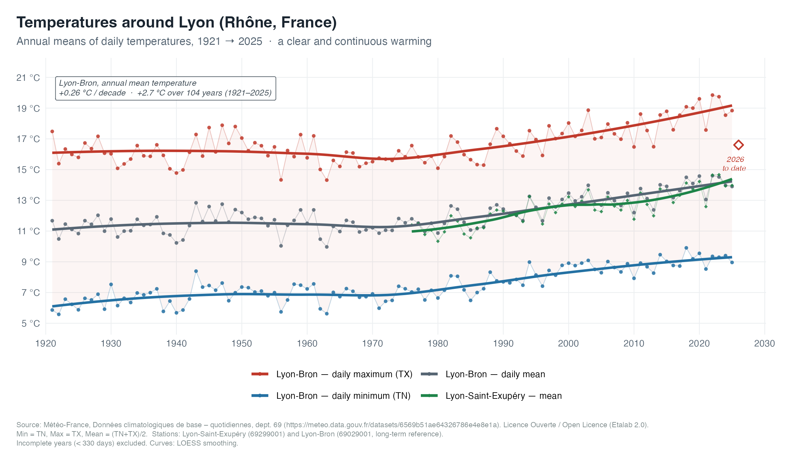

<sub>Annual means of daily temperatures. The thick curves are LOESS smoothings that
highlight the climate trend; the points are annual means. The green series (Lyon-Saint-Exupéry) is Lyon's current international airport, about 25 km east of the city. It tracks the long Lyon-Bron reference mean closely.</sub>

At Lyon-Bron — the station with the longest record (1921→2025) — the annual
mean temperature rises by **+0.26 °C per decade**, about **+2.7 °C** over the
whole period. The local Lyon-Saint-Exupéry station only covers 1976→2025. Its slope over that shorter, more recent window is steeper (+0.63 °C/decade), and so is Lyon-Bron’s over the same years (+0.59 °C/decade): recent decades warm faster, and over these years the two stations agree to within 0.04 °C/decade.


### This year, against every year before it

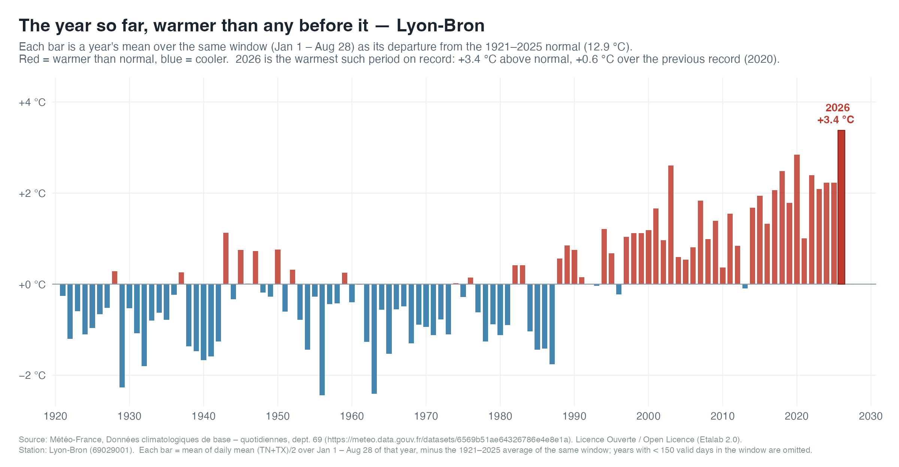

<sub>Each bar is a year’s mean over the <em>same window</em> — <strong>Jan 1 – Aug 13</strong> —
shown as its departure from the 1921–2025 mean (12.4 °C): red above, blue
below. Holding the part-of-year identical is what makes one year comparable with another. The bars swing from blue to red over
the decades — and 2026 is the tallest of all.</sub>

Measured like-for-like, **2026 is the warmest Jan 1 – Aug 13 in 106 years** at Lyon-Bron: **15.6 °C** — +0.4 °C above the previous record (2020, 15.2 °C) and **+3.3 °C above the 1921–2025 mean** (12.4 °C).

> [!NOTE]
> A part-year mean cannot be compared with other years' full-year means. That is why 2026 appears on the long-view chart above only as a marked, hollow "to date" point — a part-year mean on an axis of full-year means — while its like-for-like standing is the chart here.

### Every year, day by day

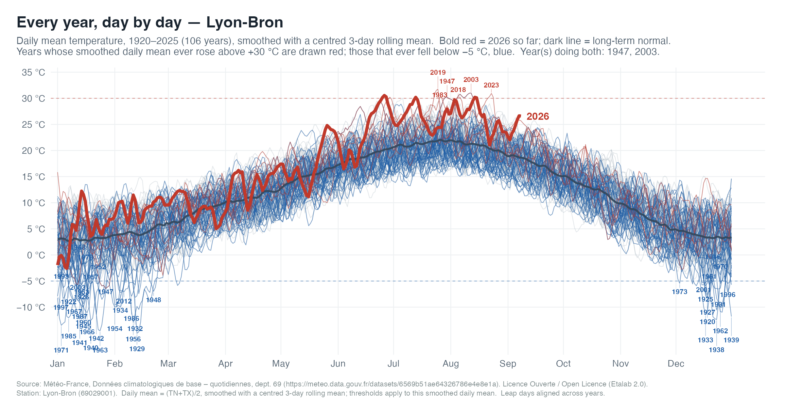

<sub>Each thin line is a single year’s daily mean temperature from January to December
(1920–2025, 106 years), smoothed with a centred
<strong>3-day rolling mean</strong> (each day = the average of itself
±1 day) to tame day-to-day jitter while keeping the shape. The dark line
is the long-term daily normal; the bold red line is <strong>2026 so far</strong>.
Years whose smoothed daily mean ever rose above <strong>+30 °C</strong> are
highlighted in red and labelled; years that ever fell below
<strong>-5 °C</strong> in blue.</sub>

> [!NOTE]
> **Hottest and coldest years.** Measured on the smoothed daily-mean curve,
> **6** years pushed above +30 °C (1947, 1983, 2003, 2018, 2019, 2023)
> while **44** years dropped below -5 °C (first in 1920, most recently 2003 and 2012).
> Years hitting both extremes: 1947 and 2003.  <sub>(If the threshold is applied instead to the raw, unsmoothed daily mean, 1947 and 2003 each touch both extremes.)</sub>

### The record days

The single most extreme days in each station’s record. “Hottest” is the highest daily
maximum (TX), “coldest” the lowest daily minimum (TN).

| Station (record span) | Extreme | Date | Min (TN) | Max (TX) |
|---|---|---|---:|---:|
| Lyon-Bron <sub>1920–2026</sub> | Hottest 🔥 | 2023-08-24 | 21.6 | **41.4** |
| Lyon-Bron <sub>1920–2026</sub> | Coldest ❄️ | 1938-12-22 | **-24.6** | -7.2 |
| Lyon-Saint-Exupéry <sub>1975–2026</sub> | Hottest 🔥 | 2003-08-13 | 22.8 | **39.9** |
| Lyon-Saint-Exupéry <sub>1975–2026</sub> | Coldest ❄️ | 1985-01-07 | **-20.3** | -8.4 |

At Lyon-Bron, the all-time heat (2023-08-24) postdates the all-time cold (1938-12-22) by 85 years.

> [!NOTE]
> **Why Lyon-Saint-Exupéry?** Lyon-Saint-Exupéry (station 69299001), the city's international airport about 25 km east, has recorded temperature since 1976 with no missing years and provides the local comparison. Lyon-Bron (station 69029001), the historic airport 7 km east of the centre, provides the trend: 1921 onward with 105 complete years and no incomplete year in between. Saint-Genis-Laval, in the southern suburbs, reaches back further — to 1881 — but 1920–1939 is almost entirely missing from it, so a gap-free century at Bron is the sounder basis for a slope than a longer record with a hole through its middle.

### The last decade (Lyon-Bron)

| Year | Min (TN) | Max (TX) | Mean |
|---|---:|---:|---:|
| 2016 | 8.8 | 17.6 | **13.2** |
| 2017 | 8.7 | 18.5 | **13.6** |
| 2018 | 9.9 | 19.1 | **14.5** |
| 2019 | 9.2 | 19.0 | **14.1** |
| 2020 | 9.6 | 19.6 | **14.6** |
| 2021 | 8.5 | 17.6 | **13.1** |
| 2022 | 9.4 | 19.8 | **14.6** |
| 2023 | 9.3 | 19.7 | **14.5** |
| 2024 | 9.4 | 18.5 | **14.0** |
| 2025 | 9.0 | 18.8 | **13.9** |
| 2026 *(to date)* | 9.6 | 21.6 | **15.6** |

### Frost days down, hot days up

A degree of warming is abstract; a count of days is not. Lyon-Bron’s first
complete decade (1921–1930) against its last (2016–2025):

| Threshold days per year | 1921–1930 | 2016–2025 |
|---|---:|---:|
| Frost days (min < 0 °C) | 64 | **33** |
| Hot days (max ≥ 30 °C) | 19 | **48** |
| Very hot days (max ≥ 35 °C) | 3 | **10** |
| Tropical nights (min ≥ 20 °C) | 2 | **16** |

<sub>Counts of days per year crossing each threshold, averaged over the first and last
complete decades of the record.</sub>

### What about the rain?

Temperature is only half of a climate. Over 1888–2025 (109 years),
annual precipitation at Lyon-Bron shows **no statistically significant trend**.

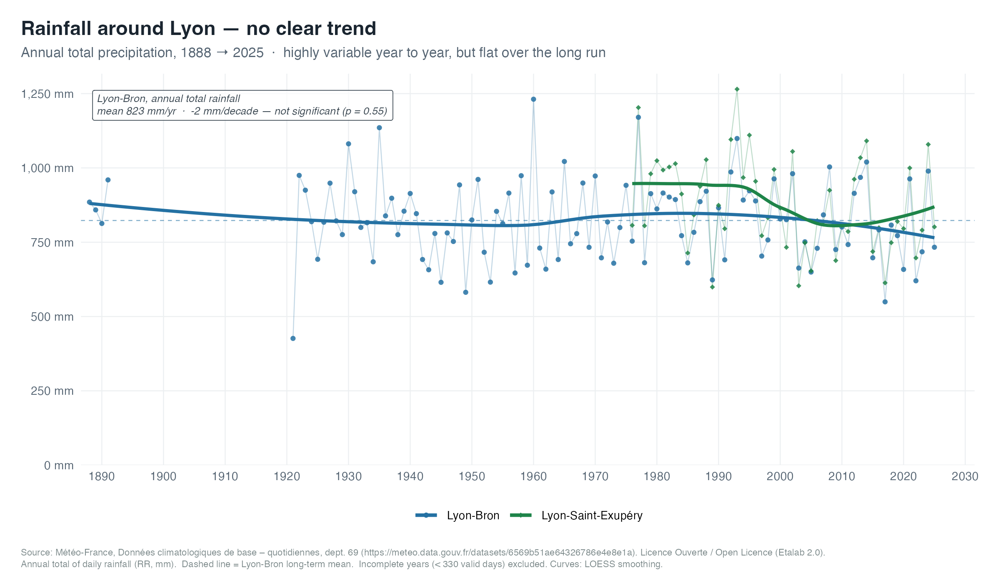

<sub>Annual total precipitation. The dashed line is Lyon-Bron’s long-term mean
(823 mm/yr); the thick curves are LOESS smoothings. The year-to-year swings are
large — from 426 mm (1921) to 1231 mm (1960) —
but the long-run slope (-2 mm/decade) is flat and not significant (p = 0.55).</sub>

The same daily records that carry a strong warming signal carry *no* comparable signal in how much it rains: annual totals swing widely from year to year around a flat long-run mean.

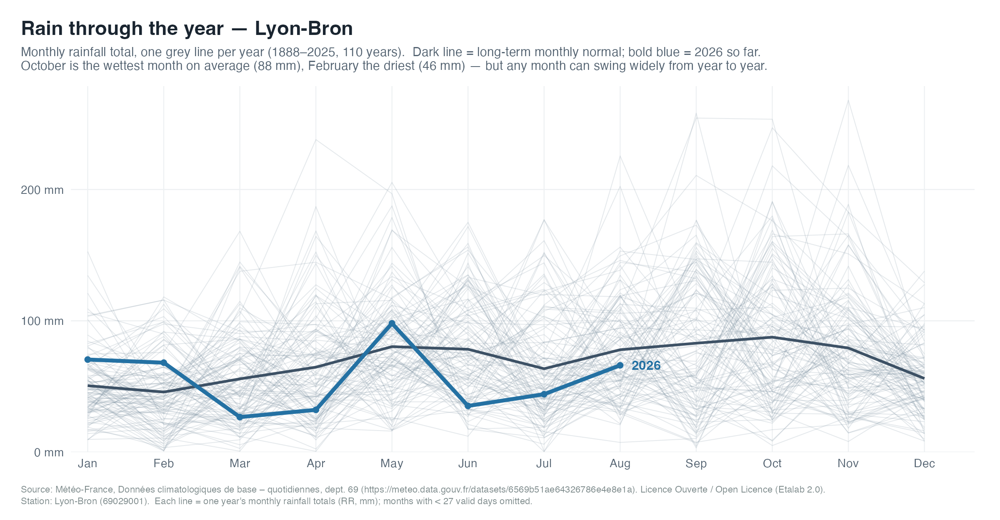

<sub>Rain through the year: each grey line is one year’s monthly totals, the dark line the
long-term monthly normal, the bold blue line 2026 so far. October is the
wettest month on average (88 mm), February the driest
(46 mm) — but the spread between years dwarfs the seasonal cycle, which is exactly why no annual trend emerges.</sub>

### Methodology

Only what is specific to this city is listed here. The variables, completeness rule,
smoothing, thresholds and trend method are the same for every city and are stated once, in
[How every chapter is built](#how-every-chapter-is-built) — which is also what makes the
comparison at the top of this page legitimate.

- **Source.** Météo-France — Données climatologiques de base – quotidiennes, Rhône, France. Full citation
  in [Data sources](#data-sources) below.
- **Stations.** Lyon-Saint-Exupéry (69299001) and Lyon-Bron (69029001).
- **Rebuild this chapter.** `SITE=lyon make all` — every figure and number above is
  regenerated from the source data on each run.

<sub>Figures and numbers above are generated — edit `R/03_readme.R`, not this block.</sub>

<!-- END REPORT:lyon -->

<!-- BEGIN REPORT:zurich -->

## A warming climate, seen from Zurich

*MeteoSwiss daily temperature records, 1882 to 2025 — plus 2026 so far.*

MeteoSwiss’s daily records for the Zurich area are unambiguous: since
the late 19th century, daily minimum, maximum and mean temperatures have all risen.

| Headline number | Value |
|---|---:|
| Warming rate, mean temperature (Zürich-Fluntern) | **+0.18 °C / decade** |
| Total rise over 143 years (1882 → 2025) | **+2.6 °C** |
| Mean of the last decade (vs 7.9 °C in 1882–1891) | **11.0 °C** |
| Frost days per year, 1882–1891 → 2016–2025 | **111 → 61** |
| Hot days (≥ 30 °C) per year, 1882–1891 → 2016–2025 | **4 → 12** |
| Complete station-years analysed | **190** |
| 2026 year-to-date (Jan 1 – Aug 13), against 143 prior years | **#1 of 144 — record** |

### The long view: annual means


<sub>Annual means of daily temperatures. The thick curves are LOESS smoothings that
highlight the climate trend; the points are annual means. The green series (Zürich-Affoltern) is MeteoSwiss’s automatic station in Zurich’s Affoltern district. It tracks the long Zürich-Fluntern reference mean closely.</sub>

At Zürich-Fluntern — the station with the longest record (1882→2025) — the annual
mean temperature rises by **+0.18 °C per decade**, about **+2.6 °C** over the
whole period. The local Zürich-Affoltern station only covers 1979→2025. Its slope over that shorter, more recent window is steeper (+0.49 °C/decade), and so is Zürich-Fluntern’s over the same years (+0.50 °C/decade): recent decades warm faster, and over these years the two stations agree to within 0.01 °C/decade.


### This year, against every year before it


<sub>Each bar is a year’s mean over the <em>same window</em> — <strong>Jan 1 – Aug 13</strong> —
shown as its departure from the 1882–2025 mean (9.4 °C): red above, blue
below. Holding the part-of-year identical is what makes one year comparable with another. The bars swing from blue to red over
the decades — and 2026 is the tallest of all.</sub>

Measured like-for-like, **2026 is the warmest Jan 1 – Aug 13 in 144 years** at Zürich-Fluntern: **12.8 °C** — +0.5 °C above the previous record (2022, 12.3 °C) and **+3.5 °C above the 1882–2025 mean** (9.4 °C).

> [!NOTE]
> A part-year mean cannot be compared with other years' full-year means. That is why 2026 appears on the long-view chart above only as a marked, hollow "to date" point — a part-year mean on an axis of full-year means — while its like-for-like standing is the chart here.

### Every year, day by day


<sub>Each thin line is a single year’s daily mean temperature from January to December
(1881–2025, 145 years), smoothed with a centred
<strong>3-day rolling mean</strong> (each day = the average of itself
±1 day) to tame day-to-day jitter while keeping the shape. The dark line
is the long-term daily normal; the bold red line is <strong>2026 so far</strong>.
Years whose smoothed daily mean ever rose above <strong>+30 °C</strong> are
highlighted in red and labelled; years that ever fell below
<strong>-5 °C</strong> in blue.</sub>

> [!NOTE]
> **Hottest and coldest years.** Measured on the smoothed daily-mean curve,
> **0** years pushed above +30 °C
> while **118** years dropped below -5 °C (first in 1882, most recently 2021 and 2022).
>   <sub>(On the raw, unsmoothed daily mean, no year touches both extremes.)</sub>

### The record days

The single most extreme days in each station’s record. “Hottest” is the highest daily
maximum (TX), “coldest” the lowest daily minimum (TN).

| Station (record span) | Extreme | Date | Min (TN) | Max (TX) |
|---|---|---|---:|---:|
| Zürich-Fluntern <sub>1881–2026</sub> | Hottest 🔥 | 2026-06-27 | 21.6 | **37.1** |
| Zürich-Fluntern <sub>1881–2026</sub> | Coldest ❄️ | 1929-02-12 | **-24.7** | -16.3 |
| Zürich-Affoltern <sub>1978–2026</sub> | Hottest 🔥 | 2026-07-30 | 15.4 | **37.5** |
| Zürich-Affoltern <sub>1978–2026</sub> | Coldest ❄️ | 1985-01-09 | **-26.6** | -12.9 |

At Zürich-Fluntern, the all-time heat (2026-06-27) postdates the all-time cold (1929-02-12) by 97 years.

> [!NOTE]
> **Why Zürich-Affoltern?** MeteoSwiss’s homogeneous long-term series (Swiss NBCN) covers only about thirty stations nationwide; Affoltern — a district in the north of Zurich — isn’t one of them. REH, MeteoSwiss’s automatic station there, is the closest full station to that neighbourhood and has carried temperature since 1978. Zürich-Fluntern (station SMA), in the hills above the city centre, provides the historical depth — a homogeneous record back to 1881 — needed to see the underlying trend and to draw the day-by-day climatology.

### The last decade (Zürich-Fluntern)

| Year | Min (TN) | Max (TX) | Mean |
|---|---:|---:|---:|
| 2016 | 6.5 | 14.1 | **10.3** |
| 2017 | 6.5 | 14.6 | **10.6** |
| 2018 | 7.4 | 15.6 | **11.5** |
| 2019 | 6.8 | 14.9 | **10.9** |
| 2020 | 6.9 | 15.4 | **11.2** |
| 2021 | 6.1 | 13.8 | **9.9** |
| 2022 | 7.6 | 16.1 | **11.8** |
| 2023 | 7.8 | 15.8 | **11.8** |
| 2024 | 7.7 | 15.0 | **11.4** |
| 2025 | 7.0 | 14.9 | **11.0** |
| 2026 *(to date)* | 7.9 | 17.8 | **12.8** |

### Frost days down, hot days up

A degree of warming is abstract; a count of days is not. Zürich-Fluntern’s first
complete decade (1882–1891) against its last (2016–2025):

| Threshold days per year | 1882–1891 | 2016–2025 |
|---|---:|---:|
| Frost days (min < 0 °C) | 111 | **61** |
| Hot days (max ≥ 30 °C) | 4 | **12** |
| Very hot days (max ≥ 35 °C) | 0 | **0** |
| Tropical nights (min ≥ 20 °C) | 0 | **2** |

<sub>Counts of days per year crossing each threshold, averaged over the first and last
complete decades of the record.</sub>

### What about the rain?

Temperature is only half of a climate. Over 1864–2025 (162 years),
annual precipitation at Zürich-Fluntern shows **no statistically significant trend**.


<sub>Annual total precipitation. The dashed line is Zürich-Fluntern’s long-term mean
(1104 mm/yr); the thick curves are LOESS smoothings. The year-to-year swings are
large — from 674 mm (1949) to 1988 mm (1876) —
but the long-run slope (-1 mm/decade) is flat and not significant (p = 0.77).</sub>

The same daily records that carry a strong warming signal carry *no* comparable signal in how much it rains: annual totals swing widely from year to year around a flat long-run mean.


<sub>Rain through the year: each grey line is one year’s monthly totals, the dark line the
long-term monthly normal, the bold blue line 2026 so far. June is the
wettest month on average (128 mm), February the driest
(61 mm) — but the spread between years dwarfs the seasonal cycle, which is exactly why no annual trend emerges.</sub>

### Methodology

Only what is specific to this city is listed here. The variables, completeness rule,
smoothing, thresholds and trend method are the same for every city and are stated once, in
[How every chapter is built](#how-every-chapter-is-built) — which is also what makes the
comparison at the top of this page legitimate.

- **Source.** MeteoSwiss — Open Government Data — climate stations (NBCN) & automatic weather stations (SMN), Kanton Zürich, Switzerland. Full citation
  in [Data sources](#data-sources) below.
- **Stations.** Zürich-Affoltern (REH) and Zürich-Fluntern (SMA).
- **Rebuild this chapter.** `SITE=zurich make all` — every figure and number above is
  regenerated from the source data on each run.

<sub>Figures and numbers above are generated — edit `R/03_readme.R`, not this block.</sub>

<!-- END REPORT:zurich -->

<!-- BEGIN REPORT:karlsruhe -->

## A warming climate, seen from Karlsruhe

*DWD (Deutscher Wetterdienst) daily temperature records, 1876 to 2025 — plus 2026 so far.*

DWD (Deutscher Wetterdienst)’s daily records for the Karlsruhe area are unambiguous: since
the late 19th century, daily minimum, maximum and mean temperatures have all risen.

| Headline number | Value |
|---|---:|
| Warming rate, mean temperature (Rheinstetten) | **+0.14 °C / decade** |
| Total rise over 149 years (1876 → 2025) | **+2.1 °C** |
| Mean of the last decade (vs 9.8 °C in 1876–1885) | **11.9 °C** |
| Frost days per year, 1876–1885 → 2016–2025 | **67 → 59** |
| Hot days (≥ 30 °C) per year, 1876–1885 → 2016–2025 | **7 → 26** |
| Complete station-years analysed | **148** |
| 2026 year-to-date (Jan 1 – Aug 13), against 149 prior years | **#2 of 150** |

### The long view: annual means


<sub>Annual means of daily temperatures. The thick curves are LOESS smoothings that
highlight the climate trend; the points are annual means.</sub>

At Rheinstetten — the station with the longest record (1876→2025) — the annual
mean temperature rises by **+0.14 °C per decade**, about **+2.1 °C** over the
whole period. Karlsruhe-Wolfartsweier carries no temperature record; Rheinstetten alone provides the temperature trend for this area. The local comparison here uses rainfall instead — see below.


### This year, against every year before it


<sub>Each bar is a year’s mean over the <em>same window</em> — <strong>Jan 1 – Aug 13</strong> —
shown as its departure from the 1876–2025 mean (11.0 °C): red above, blue
below. Holding the part-of-year identical is what makes one year comparable with another. The bars swing from blue to red over
the decades.</sub>

Measured like-for-like over Jan 1 – Aug 13, 2026 ranks **#2 of 150** at Rheinstetten (13.3 °C). The warmest such window on record remains 2007 (13.6 °C).

> [!NOTE]
> A part-year mean cannot be compared with other years' full-year means. That is why 2026 appears on the long-view chart above only as a marked, hollow "to date" point — a part-year mean on an axis of full-year means — while its like-for-like standing is the chart here.

### Every year, day by day


<sub>Each thin line is a single year’s daily mean temperature from January to December
(1876–2025, 150 years), smoothed with a centred
<strong>3-day rolling mean</strong> (each day = the average of itself
±1 day) to tame day-to-day jitter while keeping the shape. The dark line
is the long-term daily normal; the bold red line is <strong>2026 so far</strong>.
Years whose smoothed daily mean ever rose above <strong>+30 °C</strong> are
highlighted in red and labelled; years that ever fell below
<strong>-5 °C</strong> in blue.</sub>

> [!NOTE]
> **Hottest and coldest years.** Measured on the smoothed daily-mean curve,
> **0** years pushed above +30 °C
> while **107** years dropped below -5 °C (first in 1876, most recently 2021 and 2022).
>   <sub>(If the threshold is applied instead to the raw, unsmoothed daily mean, 1952 and 2003 each touch both extremes.)</sub>

### The record days

The single most extreme days in each station’s record. “Hottest” is the highest daily
maximum (TX), “coldest” the lowest daily minimum (TN).

| Station (record span) | Extreme | Date | Min (TN) | Max (TX) |
|---|---|---|---:|---:|
| Rheinstetten <sub>1876–2026</sub> | Hottest 🔥 | 2026-06-27 | 20.7 | **40.5** |
| Rheinstetten <sub>1876–2026</sub> | Coldest ❄️ | 1940-01-18 | **-25.4** | -12.5 |

At Rheinstetten, the all-time heat (2026-06-27) postdates the all-time cold (1940-01-18) by 86 years.

> [!NOTE]
> **Why Karlsruhe-Wolfartsweier?** No active DWD station near Grötzingen — a district on Karlsruhe’s eastern edge — carries a temperature record; the nearest that once did (Augustenberg, under 1 km away) closed in 1985. Karlsruhe-Wolfartsweier (station 02523), 5.4 km away and active since 1931, is the nearest active rain gauge and stands in for local rainfall. Rheinstetten (station 04177) provides the temperature trend, spliced with its in-city predecessor (02522, 1876–2008) for the historical depth needed to see the underlying trend.

### The last decade (Rheinstetten)

| Year | Min (TN) | Max (TX) | Mean |
|---|---:|---:|---:|
| 2016 | 6.6 | 15.8 | **11.2** |
| 2017 | 6.6 | 16.5 | **11.5** |
| 2018 | 7.1 | 17.7 | **12.4** |
| 2019 | 6.5 | 17.0 | **11.8** |
| 2020 | 6.7 | 17.6 | **12.1** |
| 2021 | 5.9 | 15.5 | **10.7** |
| 2022 | 7.1 | 17.9 | **12.5** |
| 2023 | 7.9 | 17.6 | **12.8** |
| 2024 | 7.7 | 16.9 | **12.3** |
| 2025 | 6.3 | 17.0 | **11.6** |
| 2026 *(to date)* | 7.1 | 19.5 | **13.3** |

### Frost days down, hot days up

A degree of warming is abstract; a count of days is not. Rheinstetten’s first
complete decade (1876–1885) against its last (2016–2025):

| Threshold days per year | 1876–1885 | 2016–2025 |
|---|---:|---:|
| Frost days (min < 0 °C) | 67 | **59** |
| Hot days (max ≥ 30 °C) | 7 | **26** |
| Very hot days (max ≥ 35 °C) | 0 | **3** |
| Tropical nights (min ≥ 20 °C) | 1 | **1** |

<sub>Counts of days per year crossing each threshold, averaged over the first and last
complete decades of the record.</sub>

### What about the rain?

Temperature is only half of a climate. Over 1876–2025 (148 years),
annual precipitation at Rheinstetten shows **a statistically significant trend (-11 mm/decade, p = 0.00)**.


<sub>Annual total precipitation. The dashed line is Rheinstetten’s long-term mean
(793 mm/yr); the thick curves are LOESS smoothings. The year-to-year swings are
large — from 456 mm (1959) to 1452 mm (1882) —
but the long-run slope (-11 mm/decade) is measurable and statistically significant (p = 0.00).</sub>

Rainfall here is not flat: the long run tilts drier. The tilt is small against the year-to-year spread above, which is why it is easy to miss in any single decade.


<sub>Rain through the year: each grey line is one year’s monthly totals, the dark line the
long-term monthly normal, the bold blue line 2026 so far. June is the
wettest month on average (82 mm), February the driest
(52 mm) — but the spread between years is why that slow trend is easy to miss from the monthly shape alone.</sub>

### Methodology

Only what is specific to this city is listed here. The variables, completeness rule,
smoothing, thresholds and trend method are the same for every city and are stated once, in
[How every chapter is built](#how-every-chapter-is-built) — which is also what makes the
comparison at the top of this page legitimate.

- **Source.** DWD (Deutscher Wetterdienst) — Climate Data Center — daily station observations (KL) & precipitation (RR), Baden-Württemberg, Germany. Full citation
  in [Data sources](#data-sources) below.
- **Stations.** Karlsruhe-Wolfartsweier (02523) and Rheinstetten (04177).
- **Rebuild this chapter.** `SITE=karlsruhe make all` — every figure and number above is
  regenerated from the source data on each run.

<sub>Figures and numbers above are generated — edit `R/03_readme.R`, not this block.</sub>

<!-- END REPORT:karlsruhe -->

<!-- BEGIN REPORT:moscow -->

## A warming climate, seen from Moscow

*Roshydromet / RIHMI-WDC — AISORI-M daily temperature records, 1949 to 2025.*

Roshydromet / RIHMI-WDC — AISORI-M’s daily records for the Moscow area are unambiguous: since
the mid-20th century, daily minimum, maximum and mean temperatures have all risen.

| Headline number | Value |
|---|---:|
| Warming rate, mean temperature (Moscow) | **+0.39 °C / decade** |
| Total rise over 76 years (1949 → 2025) | **+3.0 °C** |
| Mean of the last decade (vs 4.7 °C in 1949–1958) | **7.4 °C** |
| Frost days per year, 1949–1958 → 2016–2025 | **160 → 130** |
| Hot days (≥ 30 °C) per year, 1949–1958 → 2016–2025 | **4 → 8** |
| Complete station-years analysed | **77** |
| 2025, full calendar year, against 76 prior years | **#1 of 77 — record** |

### The long view: annual means

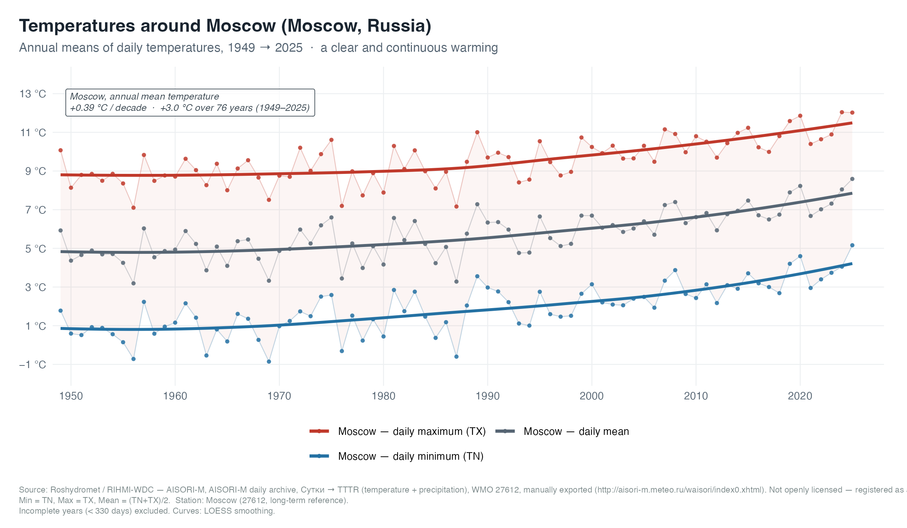

<sub>Annual means of daily temperatures. The thick curves are LOESS smoothings that
highlight the climate trend; the points are annual means.</sub>

At Moscow — the station with the longest record (1949→2025) — the annual
mean temperature rises by **+0.39 °C per decade**, about **+3.0 °C** over the
whole period. This site has no second station — Moscow alone provides the temperature trend and the daily climatology.


### 2025, against every year before it

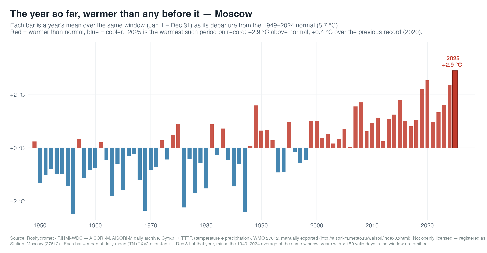

<sub>Each bar is a year’s mean over the <em>same window</em> — <strong>Jan 1 – Dec 31</strong> —
shown as its departure from the 1949–2024 mean (5.7 °C): red above, blue
below. Every bar covers a full calendar year, so the years compare directly. The bars swing from blue to red over
the decades — and 2025 is the tallest of all.</sub>

Measured like-for-like, **2025 is the warmest year in 77 years** at Moscow: **8.6 °C** — +0.4 °C above the previous record (2020, 8.2 °C) and **+2.9 °C above the 1949–2024 mean** (5.7 °C).

> [!NOTE]
> 2025 is Moscow's most recent complete year — this export has no 2026 data yet, so it is plotted as a solid point like every other complete year, not as a hollow "to date" marker.

### Every year, day by day

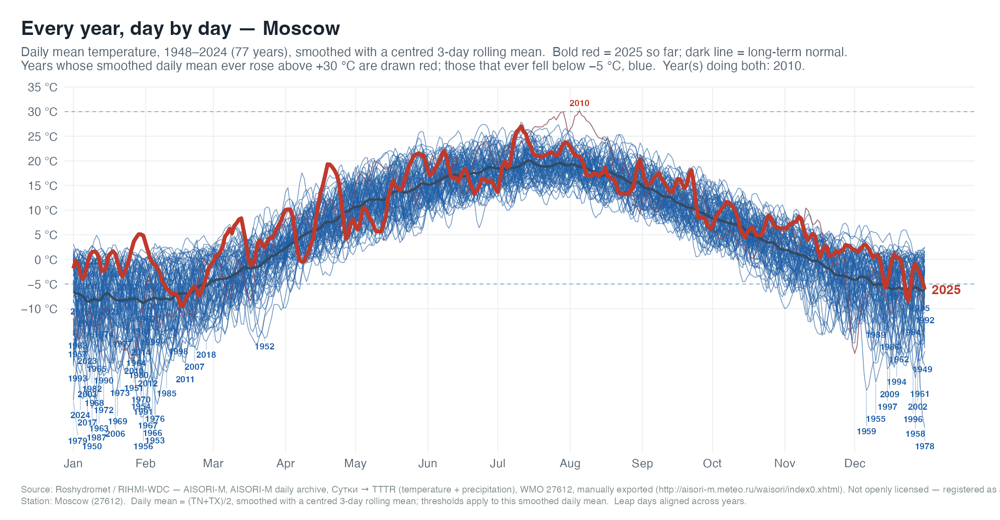

<sub>Each thin line is a single year’s daily mean temperature from January to December
(1948–2025, 78 years), smoothed with a centred
<strong>3-day rolling mean</strong> (each day = the average of itself
±1 day) to tame day-to-day jitter while keeping the shape. The dark line
is the long-term daily normal; the bold red line is <strong>2025</strong>.
Years whose smoothed daily mean ever rose above <strong>+30 °C</strong> are
highlighted in red and labelled; years that ever fell below
<strong>-5 °C</strong> in blue.</sub>

> [!NOTE]
> **Hottest and coldest years.** Measured on the smoothed daily-mean curve,
> **1** year pushed above +30 °C (2010)
> while **78** years dropped below -5 °C — every year in the record.
> Years hitting both extremes: 2010.  <sub>(If the threshold is applied instead to the raw, unsmoothed daily mean, 2010 alone touches both extremes.)</sub>

### The record days

The single most extreme days in each station’s record. “Hottest” is the highest daily
maximum (TX), “coldest” the lowest daily minimum (TN).

| Station (record span) | Extreme | Date | Min (TN) | Max (TX) |
|---|---|---|---:|---:|
| Moscow <sub>1948–2025</sub> | Hottest 🔥 | 2010-07-29 | 26.0 | **38.2** |
| Moscow <sub>1948–2025</sub> | Coldest ❄️ | 1956-01-31 | **-38.1** | -32.3 |

At Moscow, the all-time heat (2010-07-29) postdates the all-time cold (1956-01-31) by 54 years.

> [!NOTE]
> **Why only one station?** This export from Roshydromet's AISORI-M portal (aisori-m.meteo.ru) includes only WMO index 27612 (Moscow, VDNKh) — the manual, login-gated query wasn't run for a second nearby station. Every other site in this project pairs a long regional reference with a shorter local one; re-querying AISORI-M with an additional station selected would let a future update add that pairing here too.

### The last decade (Moscow)

| Year | Min (TN) | Max (TX) | Mean |
|---|---:|---:|---:|
| 2016 | 3.2 | 10.2 | **6.7** |
| 2017 | 3.0 | 10.0 | **6.5** |
| 2018 | 2.7 | 10.8 | **6.7** |
| 2019 | 4.2 | 11.6 | **7.9** |
| 2020 | 4.6 | 11.9 | **8.2** |
| 2021 | 3.0 | 10.4 | **6.7** |
| 2022 | 3.4 | 10.6 | **7.0** |
| 2023 | 3.7 | 10.9 | **7.3** |
| 2024 | 4.1 | 12.0 | **8.0** |
| 2025 | 5.2 | 12.0 | **8.6** |

### Frost days down, hot days up

A degree of warming is abstract; a count of days is not. Moscow’s first
complete decade (1949–1958) against its last (2016–2025):

| Threshold days per year | 1949–1958 | 2016–2025 |
|---|---:|---:|
| Frost days (min < 0 °C) | 160 | **130** |
| Hot days (max ≥ 30 °C) | 4 | **8** |
| Very hot days (max ≥ 35 °C) | 0 | **0** |
| Tropical nights (min ≥ 20 °C) | 0 | **2** |

<sub>Counts of days per year crossing each threshold, averaged over the first and last
complete decades of the record.</sub>

### What about the rain?

Temperature is only half of a climate. Over 1949–2025 (77 years),
annual precipitation at Moscow shows **a statistically significant trend (+19 mm/decade, p = 0.00)**.

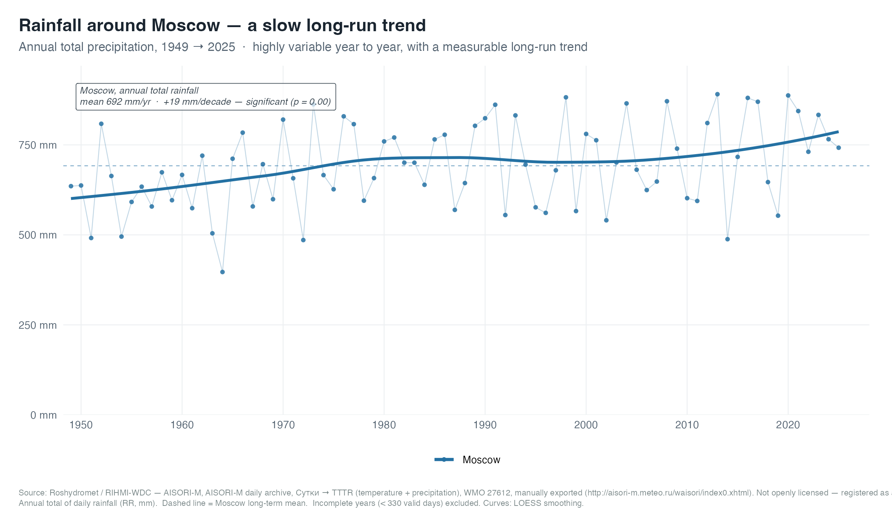

<sub>Annual total precipitation. The dashed line is Moscow’s long-term mean
(692 mm/yr); the thick curves are LOESS smoothings. The year-to-year swings are
large — from 397 mm (1964) to 891 mm (2013) —
but the long-run slope (+19 mm/decade) is measurable and statistically significant (p = 0.00).</sub>

Rainfall here is not flat: the long run tilts wetter. The tilt is small against the year-to-year spread above, which is why it is easy to miss in any single decade.

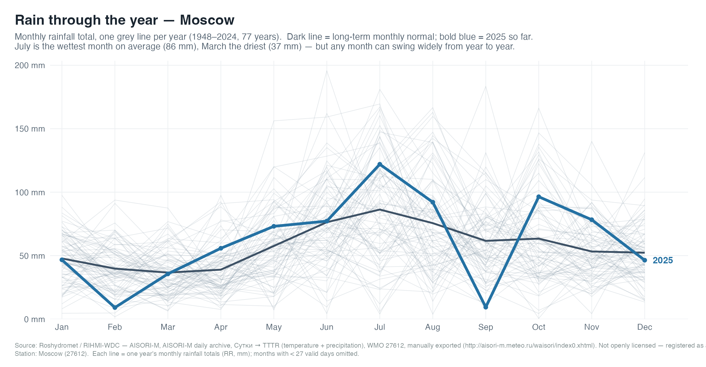

<sub>Rain through the year: each grey line is one year’s monthly totals, the dark line the
long-term monthly normal, the bold blue line 2025. July is the
wettest month on average (86 mm), March the driest
(37 mm) — but the spread between years is why that slow trend is easy to miss from the monthly shape alone.</sub>

### Methodology

Only what is specific to this city is listed here. The variables, completeness rule,
smoothing, thresholds and trend method are the same for every city and are stated once, in
[How every chapter is built](#how-every-chapter-is-built) — which is also what makes the
comparison at the top of this page legitimate.

- **Source.** Roshydromet / RIHMI-WDC — AISORI-M — AISORI-M daily archive, Сутки → TTTR (temperature + precipitation), Moscow, Russia. Full citation
  in [Data sources](#data-sources) below.
- **Stations.** Moscow (27612).
- **Rebuild this chapter.** `SITE=moscow make all` — every figure and number above is
  regenerated from the source data on each run.

<sub>Figures and numbers above are generated — edit `R/03_readme.R`, not this block.</sub>

<!-- END REPORT:moscow -->

<!-- BEGIN REPORT:voronezh -->

## A warming climate, seen from Voronezh

*Roshydromet / RIHMI-WDC — AISORI-M daily temperature records, 1940 to 2025 — plus 2026 so far.*

Roshydromet / RIHMI-WDC — AISORI-M’s daily records for the Voronezh area are unambiguous: since
the mid-20th century, daily minimum, maximum and mean temperatures have all risen.

| Headline number | Value |
|---|---:|
| Warming rate, mean temperature (Voronezh) | **+0.46 °C / decade** |
| Total rise over 85 years (1940 → 2025) | **+3.9 °C** |
| Mean of the last decade (vs 5.5 °C in 1940–1949) | **9.0 °C** |
| Frost days per year, 1940–1949 → 2016–2025 | **162 → 116** |
| Hot days (≥ 30 °C) per year, 1940–1949 → 2016–2025 | **18 → 28** |
| Complete station-years analysed | **82** |
| 2026 year-to-date (Jan 1 – Feb 28), against 83 prior years | **#55 of 84** |

### The long view: annual means

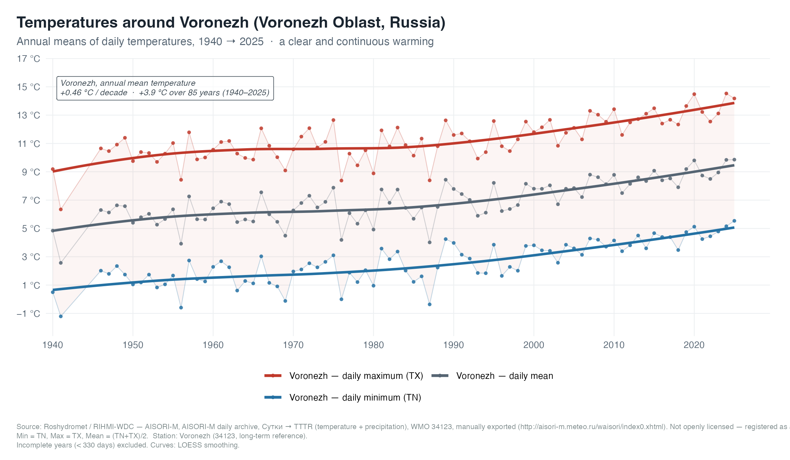

<sub>Annual means of daily temperatures. The thick curves are LOESS smoothings that
highlight the climate trend; the points are annual means.</sub>

At Voronezh — the station with the longest record (1940→2025) — the annual
mean temperature rises by **+0.46 °C per decade**, about **+3.9 °C** over the
whole period. This site has no second station — Voronezh alone provides the temperature trend and the daily climatology.


### This year, against every year before it

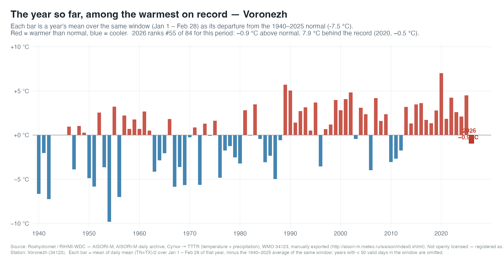

<sub>Each bar is a year’s mean over the <em>same window</em> — <strong>Jan 1 – Feb 28</strong> —
shown as its departure from the 1940–2025 mean (-7.5 °C): red above, blue
below. Holding the part-of-year identical is what makes one year comparable with another. The bars swing from blue to red over
the decades.</sub>

Measured like-for-like over Jan 1 – Feb 28, 2026 ranks **#55 of 84** at Voronezh (-8.4 °C). The warmest such window on record remains 2020 (-0.5 °C).

> [!NOTE]
> A part-year mean cannot be compared with other years' full-year means. That is why 2026 appears on the long-view chart above only as a marked, hollow "to date" point — a part-year mean on an axis of full-year means — while its like-for-like standing is the chart here.

### Every year, day by day

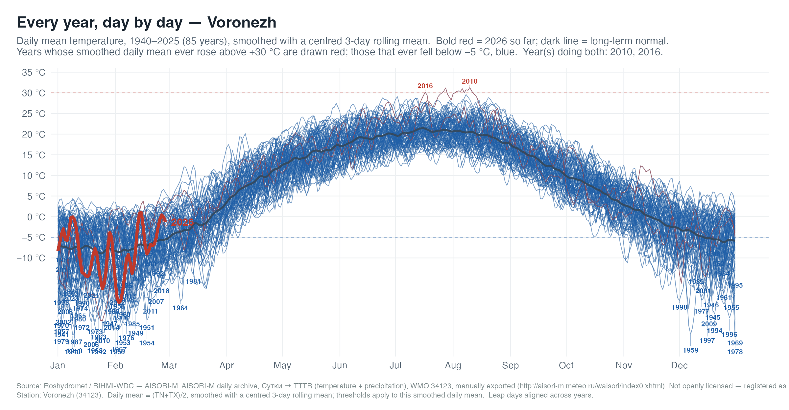

<sub>Each thin line is a single year’s daily mean temperature from January to December
(1940–2025, 85 years), smoothed with a centred
<strong>3-day rolling mean</strong> (each day = the average of itself
±1 day) to tame day-to-day jitter while keeping the shape. The dark line
is the long-term daily normal; the bold red line is <strong>2026 so far</strong>.
Years whose smoothed daily mean ever rose above <strong>+30 °C</strong> are
highlighted in red and labelled; years that ever fell below
<strong>-5 °C</strong> in blue.</sub>

> [!NOTE]
> **Hottest and coldest years.** Measured on the smoothed daily-mean curve,
> **2** years pushed above +30 °C (2010, 2016)
> while **85** years dropped below -5 °C — every year in the record.
> Years hitting both extremes: 2010 and 2016.  <sub>(If the threshold is applied instead to the raw, unsmoothed daily mean, 1972, 1991, 1996, 2010, 2016 and 2020 each touch both extremes.)</sub>

### The record days

The single most extreme days in each station’s record. “Hottest” is the highest daily
maximum (TX), “coldest” the lowest daily minimum (TN).

| Station (record span) | Extreme | Date | Min (TN) | Max (TX) |
|---|---|---|---:|---:|
| Voronezh <sub>1940–2026</sub> | Hottest 🔥 | 2010-08-02 | 21.8 | **40.5** |
| Voronezh <sub>1940–2026</sub> | Coldest ❄️ | 1942-01-22 | **-36.5** | -26.3 |

At Voronezh, the all-time heat (2010-08-02) postdates the all-time cold (1942-01-22) by 68 years.

> [!NOTE]
> **Why only one station?** This export from Roshydromet's AISORI-M portal (aisori-m.meteo.ru) includes only WMO index 34123 (Voronezh) — the manual, login-gated query wasn't run for a second nearby station. Every other site in this project pairs a long regional reference with a shorter local one; re-querying AISORI-M with an additional station selected would let a future update add that pairing here too.

### The last decade (Voronezh)

| Year | Min (TN) | Max (TX) | Mean |
|---|---:|---:|---:|
| 2016 | 4.4 | 12.4 | **8.4** |
| 2017 | 4.4 | 12.7 | **8.5** |
| 2018 | 3.5 | 12.3 | **7.9** |
| 2019 | 4.7 | 13.6 | **9.2** |
| 2020 | 5.1 | 14.5 | **9.8** |
| 2021 | 4.2 | 13.2 | **8.7** |
| 2022 | 4.4 | 12.5 | **8.5** |
| 2023 | 4.8 | 13.1 | **9.0** |
| 2024 | 5.2 | 14.5 | **9.8** |
| 2025 | 5.5 | 14.2 | **9.9** |
| 2026 *(to date)* | -11.6 | -5.2 | **-8.4** |

### Frost days down, hot days up

A degree of warming is abstract; a count of days is not. Voronezh’s first
complete decade (1940–1949) against its last (2016–2025):

| Threshold days per year | 1940–1949 | 2016–2025 |
|---|---:|---:|
| Frost days (min < 0 °C) | 162 | **116** |
| Hot days (max ≥ 30 °C) | 18 | **28** |
| Very hot days (max ≥ 35 °C) | 1 | **2** |
| Tropical nights (min ≥ 20 °C) | 4 | **8** |

<sub>Counts of days per year crossing each threshold, averaged over the first and last
complete decades of the record.</sub>

### What about the rain?

Temperature is only half of a climate. Over 1940–2025 (84 years),
annual precipitation at Voronezh shows **a statistically significant trend (+16 mm/decade, p = 0.00)**.

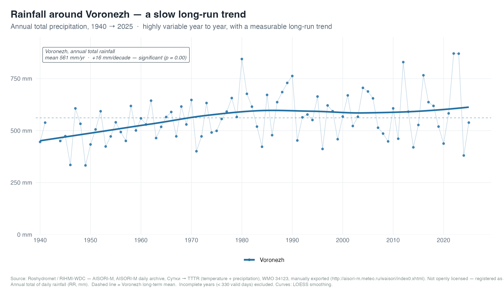

<sub>Annual total precipitation. The dashed line is Voronezh’s long-term mean
(561 mm/yr); the thick curves are LOESS smoothings. The year-to-year swings are
large — from 333 mm (1949) to 871 mm (2022) —
but the long-run slope (+16 mm/decade) is measurable and statistically significant (p = 0.00).</sub>

Rainfall here is not flat: the long run tilts wetter. The tilt is small against the year-to-year spread above, which is why it is easy to miss in any single decade.

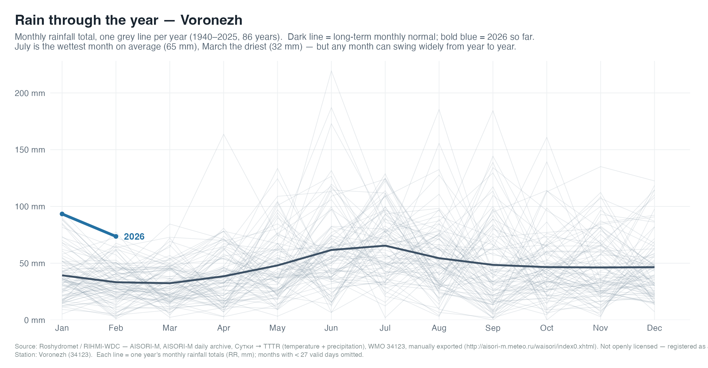

<sub>Rain through the year: each grey line is one year’s monthly totals, the dark line the
long-term monthly normal, the bold blue line 2026 so far. July is the
wettest month on average (65 mm), March the driest
(32 mm) — but the spread between years is why that slow trend is easy to miss from the monthly shape alone.</sub>

### Methodology

Only what is specific to this city is listed here. The variables, completeness rule,
smoothing, thresholds and trend method are the same for every city and are stated once, in
[How every chapter is built](#how-every-chapter-is-built) — which is also what makes the
comparison at the top of this page legitimate.

- **Source.** Roshydromet / RIHMI-WDC — AISORI-M — AISORI-M daily archive, Сутки → TTTR (temperature + precipitation), Voronezh Oblast, Russia. Full citation
  in [Data sources](#data-sources) below.
- **Stations.** Voronezh (34123).
- **Rebuild this chapter.** `SITE=voronezh make all` — every figure and number above is
  regenerated from the source data on each run.

<sub>Figures and numbers above are generated — edit `R/03_readme.R`, not this block.</sub>

<!-- END REPORT:voronezh -->

<!-- BEGIN REPORT:irvine -->

## A warming climate, seen from Irvine

*NOAA (National Centers for Environmental Information) daily temperature records, 1915 to 2025 — plus 2026 so far.*

NOAA (National Centers for Environmental Information)’s daily records for the Irvine area are unambiguous: since
the early 20th century, daily minimum, maximum and mean temperatures have all risen.

| Headline number | Value |
|---|---:|
| Warming rate, mean temperature (Irvine) | **+0.27 °C / decade** |
| Total rise over 110 years (1915 → 2025) | **+3.0 °C** |
| Mean of the last decade (vs 15.8 °C in 1915–1924) | **19.3 °C** |
| Frost days per year, 1915–1924 → 2016–2025 | **12 → 0** |
| Hot days (≥ 30 °C) per year, 1915–1924 → 2016–2025 | **40 → 92** |
| Complete station-years analysed | **121** |
| 2026 year-to-date (Jan 1 – May 31), against 100 prior years | **#2 of 101** |

### The long view: annual means

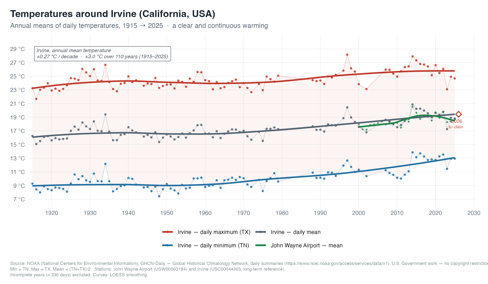

<sub>Annual means of daily temperatures. The thick curves are LOESS smoothings that
highlight the climate trend; the points are annual means. The green series (John Wayne Airport) is Orange County's regional airport, a few miles southwest on Irvine's border.</sub>

At Irvine — the station with the longest record (1915→2025) — the annual
mean temperature rises by **+0.27 °C per decade**, about **+3.0 °C** over the
whole period. The local John Wayne Airport station only covers 2000→2025. Its slope over that shorter, more recent window is steeper (+0.62 °C/decade), and so is Irvine’s over the same years (+0.75 °C/decade): recent decades warm faster, and the two differ by 0.13 °C/decade over these years — the same trend, read off a different site.


### This year, against every year before it

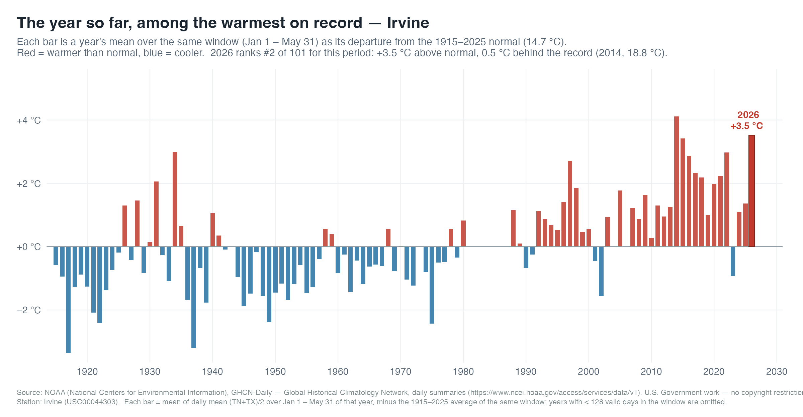

<sub>Each bar is a year’s mean over the <em>same window</em> — <strong>Jan 1 – May 31</strong> —
shown as its departure from the 1915–2025 mean (14.7 °C): red above, blue
below. Holding the part-of-year identical is what makes one year comparable with another. The bars swing from blue to red over
the decades.</sub>

Measured like-for-like over Jan 1 – May 31, 2026 ranks **#2 of 101** at Irvine (18.3 °C). The warmest such window on record remains 2014 (18.8 °C).

> [!NOTE]
> A part-year mean cannot be compared with other years' full-year means. That is why 2026 appears on the long-view chart above only as a marked, hollow "to date" point — a part-year mean on an axis of full-year means — while its like-for-like standing is the chart here.

### Every year, day by day

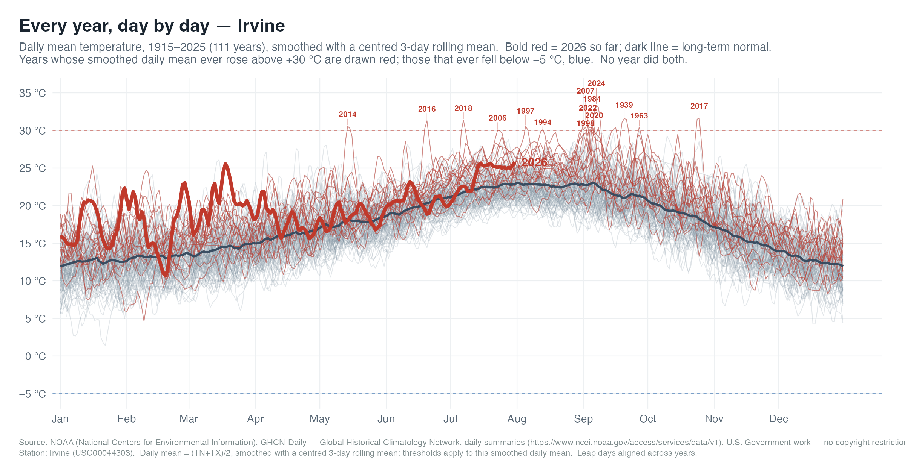

<sub>Each thin line is a single year’s daily mean temperature from January to December
(1915–2025, 111 years), smoothed with a centred
<strong>3-day rolling mean</strong> (each day = the average of itself
±1 day) to tame day-to-day jitter while keeping the shape. The dark line
is the long-term daily normal; the bold red line is <strong>2026 so far</strong>.
Years whose smoothed daily mean ever rose above <strong>+30 °C</strong> are
highlighted in red and labelled; years that ever fell below
<strong>-5 °C</strong> in blue.</sub>

> [!NOTE]
> **Hottest and coldest years.** Measured on the smoothed daily-mean curve,
> **15** years pushed above +30 °C (first in 1939, most recently 2022 and 2024)
> while **0** years dropped below -5 °C.
>   <sub>(On the raw, unsmoothed daily mean, no year touches both extremes.)</sub>

### The record days

The single most extreme days in each station’s record. “Hottest” is the highest daily
maximum (TX), “coldest” the lowest daily minimum (TN).

| Station (record span) | Extreme | Date | Min (TN) | Max (TX) |
|---|---|---|---:|---:|
| Irvine <sub>1915–2026</sub> | Hottest 🔥 | 2018-07-06 | 17.8 | **46.1** |
| Irvine <sub>1915–2026</sub> | Coldest ❄️ | 1937-01-21 | **-7.8** | 6.1 |
| John Wayne Airport <sub>1999–2026</sub> | Hottest 🔥 | 2010-09-27 | 21.1 | **43.3** |
| John Wayne Airport <sub>1999–2026</sub> | Coldest ❄️ | 2007-01-14 | **0.6** | 12.8 |

At Irvine, the all-time heat (2018-07-06) postdates the all-time cold (1937-01-21) by 81 years.

> [!NOTE]
> **Why John Wayne Airport?** John Wayne Airport (station USW00093184), a few miles southwest on Irvine's border, is the nearest continuously-sited station and provides the local comparison — but only since 1999. The reference series, labelled “Irvine”, splices the Irvine Ranch COOP station's original site (049087, “Tustin Irvine Ranch”, 1915–2003) with its direct successor a few miles away (044303, 2003–2026) for one continuous record back to 1915. The handoff is not seamless — 049087 ends June 2003, 044303 begins August 2003 — which costs 2003 its “complete year” status.

### The last decade (Irvine)

| Year | Min (TN) | Max (TX) | Mean |
|---|---:|---:|---:|
| 2016 | 13.7 | 26.8 | **20.3** |
| 2017 | 13.3 | 26.7 | **20.0** |
| 2018 | 12.7 | 26.4 | **19.6** |
| 2019 | 12.8 | 25.2 | **19.0** |
| 2020 | 12.7 | 26.6 | **19.7** |
| 2021 | 13.3 | 25.5 | **19.4** |
| 2022 | 13.5 | 26.1 | **19.8** |
| 2023 | 11.4 | 23.1 | **17.3** |
| 2024 | 12.9 | 24.9 | **18.9** |
| 2025 | 12.9 | 24.7 | **18.8** |
| 2026 *(to date)* | 12.1 | 24.4 | **18.3** |

### Frost days down, hot days up

A degree of warming is abstract; a count of days is not. Irvine’s first
complete decade (1915–1924) against its last (2016–2025):

| Threshold days per year | 1915–1924 | 2016–2025 |
|---|---:|---:|
| Frost days (min < 0 °C) | 12 | **0** |
| Hot days (max ≥ 30 °C) | 40 | **92** |
| Very hot days (max ≥ 35 °C) | 4 | **18** |
| Tropical nights (min ≥ 20 °C) | 1 | **13** |

<sub>Counts of days per year crossing each threshold, averaged over the first and last
complete decades of the record.</sub>

### What about the rain?

Temperature is only half of a climate. Over 1918–2025 (96 years),
annual precipitation at Irvine shows **no statistically significant trend**.

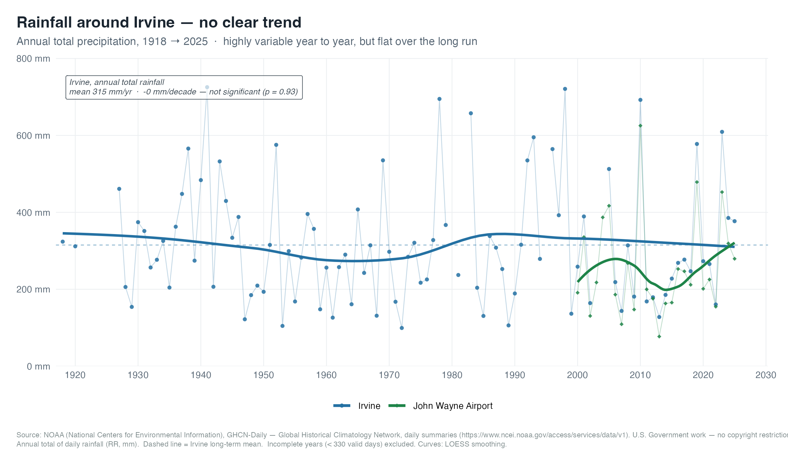

<sub>Annual total precipitation. The dashed line is Irvine’s long-term mean
(315 mm/yr); the thick curves are LOESS smoothings. The year-to-year swings are
large — from 99 mm (1972) to 725 mm (1941) —
but the long-run slope (-0 mm/decade) is flat and not significant (p = 0.93).</sub>

The same daily records that carry a strong warming signal carry *no* comparable signal in how much it rains: annual totals swing widely from year to year around a flat long-run mean.

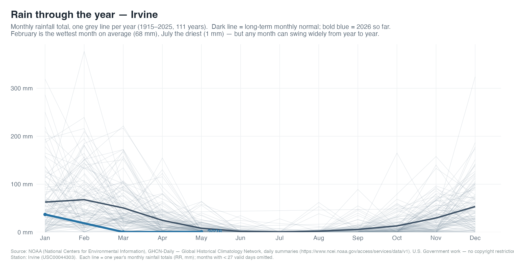

<sub>Rain through the year: each grey line is one year’s monthly totals, the dark line the
long-term monthly normal, the bold blue line 2026 so far. February is the
wettest month on average (68 mm), July the driest
(1 mm) — but the spread between years dwarfs the seasonal cycle, which is exactly why no annual trend emerges.</sub>

### Methodology

Only what is specific to this city is listed here. The variables, completeness rule,
smoothing, thresholds and trend method are the same for every city and are stated once, in
[How every chapter is built](#how-every-chapter-is-built) — which is also what makes the
comparison at the top of this page legitimate.

- **Source.** NOAA (National Centers for Environmental Information) — GHCN-Daily — Global Historical Climatology Network, daily summaries, California, USA. Full citation
  in [Data sources](#data-sources) below.
- **Stations.** John Wayne Airport (USW00093184) and Irvine (USC00044303).
- **Rebuild this chapter.** `SITE=irvine make all` — every figure and number above is
  regenerated from the source data on each run.

<sub>Figures and numbers above are generated — edit `R/03_readme.R`, not this block.</sub>

<!-- END REPORT:irvine -->

<!-- BEGIN REPORT:albuquerque -->

## A warming climate, seen from Albuquerque

*NOAA (National Centers for Environmental Information) daily temperature records, 1932 to 2025 — plus 2026 so far.*

NOAA (National Centers for Environmental Information)’s daily records for the Albuquerque area are unambiguous: since
the mid-20th century, daily minimum, maximum and mean temperatures have all risen.

| Headline number | Value |
|---|---:|
| Warming rate, mean temperature (Albuquerque Airport) | **+0.18 °C / decade** |
| Total rise over 93 years (1932 → 2025) | **+1.7 °C** |
| Mean of the last decade (vs 13.1 °C in 1932–1941) | **15.1 °C** |
| Frost days per year, 1932–1941 → 2016–2025 | **120 → 79** |
| Hot days (≥ 30 °C) per year, 1932–1941 → 2016–2025 | **92 → 106** |
| Complete station-years analysed | **124** |
| 2026 year-to-date (Jan 1 – Aug 11), against 94 prior years | **#1 of 95 — record** |

### The long view: annual means

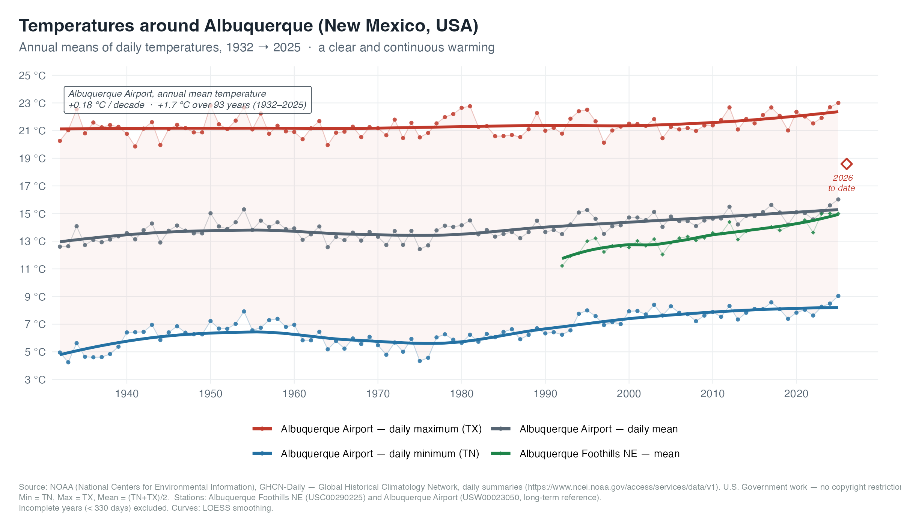

<sub>Annual means of daily temperatures. The thick curves are LOESS smoothings that
highlight the climate trend; the points are annual means. The green series (Albuquerque Foothills NE) sits in the foothills district in the northeast of the city, well above the valley-floor airport.</sub>

At Albuquerque Airport — the station with the longest record (1932→2025) — the annual
mean temperature rises by **+0.18 °C per decade**, about **+1.7 °C** over the
whole period. The local Albuquerque Foothills NE station only covers 1992→2025. Its slope over that shorter, more recent window is steeper (+0.82 °C/decade), and so is Albuquerque Airport’s over the same years (+0.31 °C/decade): recent decades warm faster, and the gap between the two — 0.51 °C/decade — is wide enough that this short local window should not be read as the area's trend.


### This year, against every year before it

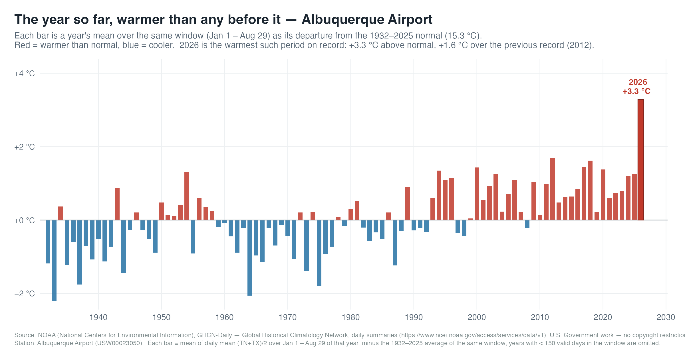

<sub>Each bar is a year’s mean over the <em>same window</em> — <strong>Jan 1 – Aug 11</strong> —
shown as its departure from the 1932–2025 mean (14.6 °C): red above, blue
below. Holding the part-of-year identical is what makes one year comparable with another. The bars swing from blue to red over
the decades — and 2026 is the tallest of all.</sub>

Measured like-for-like, **2026 is the warmest Jan 1 – Aug 11 in 95 years** at Albuquerque Airport: **17.9 °C** — +1.6 °C above the previous record (2012, 16.3 °C) and **+3.3 °C above the 1932–2025 mean** (14.6 °C).

> [!NOTE]
> A part-year mean cannot be compared with other years' full-year means. That is why 2026 appears on the long-view chart above only as a marked, hollow "to date" point — a part-year mean on an axis of full-year means — while its like-for-like standing is the chart here.

### Every year, day by day

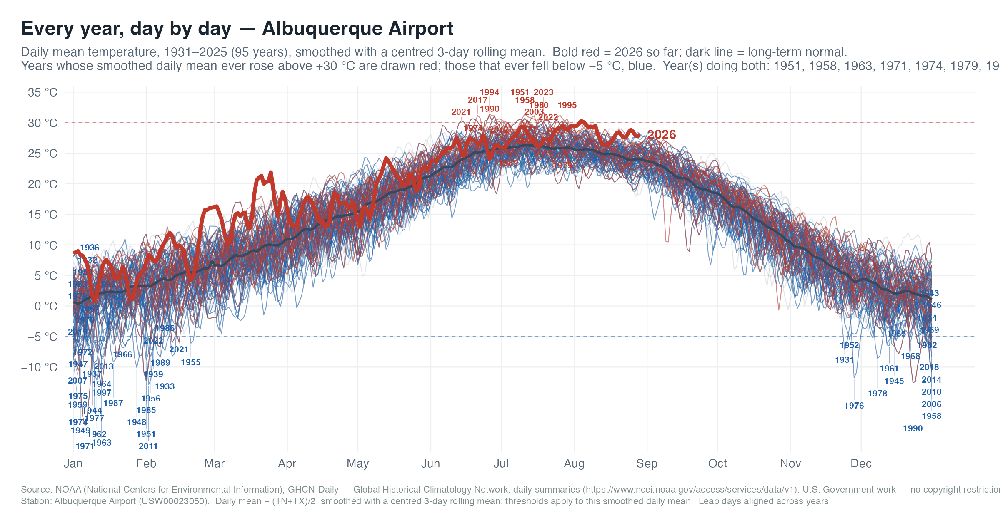

<sub>Each thin line is a single year’s daily mean temperature from January to December
(1931–2025, 95 years), smoothed with a centred
<strong>3-day rolling mean</strong> (each day = the average of itself
±1 day) to tame day-to-day jitter while keeping the shape. The dark line
is the long-term daily normal; the bold red line is <strong>2026 so far</strong>.
Years whose smoothed daily mean ever rose above <strong>+30 °C</strong> are
highlighted in red and labelled; years that ever fell below
<strong>-5 °C</strong> in blue.</sub>

> [!NOTE]
> **Hottest and coldest years.** Measured on the smoothed daily-mean curve,
> **20** years pushed above +30 °C (first in 1951, most recently 2022 and 2023)
> while **59** years dropped below -5 °C (first in 1931, most recently 2021 and 2022).
> Years hitting both extremes: 1951, 1958, 1963, 1971, 1974, 1979, 1989, 1990, 2010, 2021 and 2022.  <sub>(If the threshold is applied instead to the raw, unsmoothed daily mean, 1951, 1953, 1958, 1960, 1963, 1971, 1972, 1974, 1978, 1979, 1989, 1990, 2010, 2013, 2019, 2020, 2021, 2022 and 2025 each touch both extremes.)</sub>

### The record days

The single most extreme days in each station’s record. “Hottest” is the highest daily
maximum (TX), “coldest” the lowest daily minimum (TN).

| Station (record span) | Extreme | Date | Min (TN) | Max (TX) |
|---|---|---|---:|---:|
| Albuquerque Airport <sub>1931–2026</sub> | Hottest 🔥 | 1994-06-26 | 20.6 | **41.7** |
| Albuquerque Airport <sub>1931–2026</sub> | Coldest ❄️ | 1971-01-07 | **-27.2** | -12.2 |
| Albuquerque Foothills NE <sub>1991–2026</sub> | Hottest 🔥 | 2023-07-19 | 22.2 | **40.0** |
| Albuquerque Foothills NE <sub>1991–2026</sub> | Coldest ❄️ | 2011-02-03 | **-24.4** | -7.8 |

At Albuquerque Airport, the all-time heat (1994-06-26) postdates the all-time cold (1971-01-07) by 23 years.

> [!NOTE]
> **Why Albuquerque Foothills NE?** Albuquerque Foothills NE (station USC00290225), in the northeast of the city, is a genuinely different microclimate from the valley-floor airport and provides the local comparison — though its temperature reporting stops in late June 2026 (rainfall continues, TMAX/TMIN go blank), a real gap in the upstream feed, not a fetch issue here. Albuquerque Airport (station USW00023050) provides the temperature trend: one continuous record back to 1931, no splice needed, and one of NOAA's long-term global climate reference stations.

### The last decade (Albuquerque Airport)

| Year | Min (TN) | Max (TX) | Mean |
|---|---:|---:|---:|
| 2016 | 8.1 | 22.1 | **15.1** |
| 2017 | 8.6 | 22.7 | **15.6** |
| 2018 | 8.1 | 22.1 | **15.1** |
| 2019 | 7.4 | 21.0 | **14.2** |
| 2020 | 7.8 | 22.4 | **15.1** |
| 2021 | 8.0 | 22.0 | **15.0** |
| 2022 | 7.6 | 21.5 | **14.6** |
| 2023 | 8.3 | 21.9 | **15.1** |
| 2024 | 8.5 | 22.7 | **15.6** |
| 2025 | 9.0 | 23.0 | **16.0** |
| 2026 *(to date)* | 10.4 | 25.3 | **17.9** |

### Frost days down, hot days up

A degree of warming is abstract; a count of days is not. Albuquerque Airport’s first
complete decade (1932–1941) against its last (2016–2025):

| Threshold days per year | 1932–1941 | 2016–2025 |
|---|---:|---:|
| Frost days (min < 0 °C) | 120 | **79** |
| Hot days (max ≥ 30 °C) | 92 | **106** |
| Very hot days (max ≥ 35 °C) | 18 | **30** |
| Tropical nights (min ≥ 20 °C) | 4 | **34** |

<sub>Counts of days per year crossing each threshold, averaged over the first and last
complete decades of the record.</sub>

### What about the rain?

Temperature is only half of a climate. Over 1932–2025 (94 years),
annual precipitation at Albuquerque Airport shows **no statistically significant trend**.

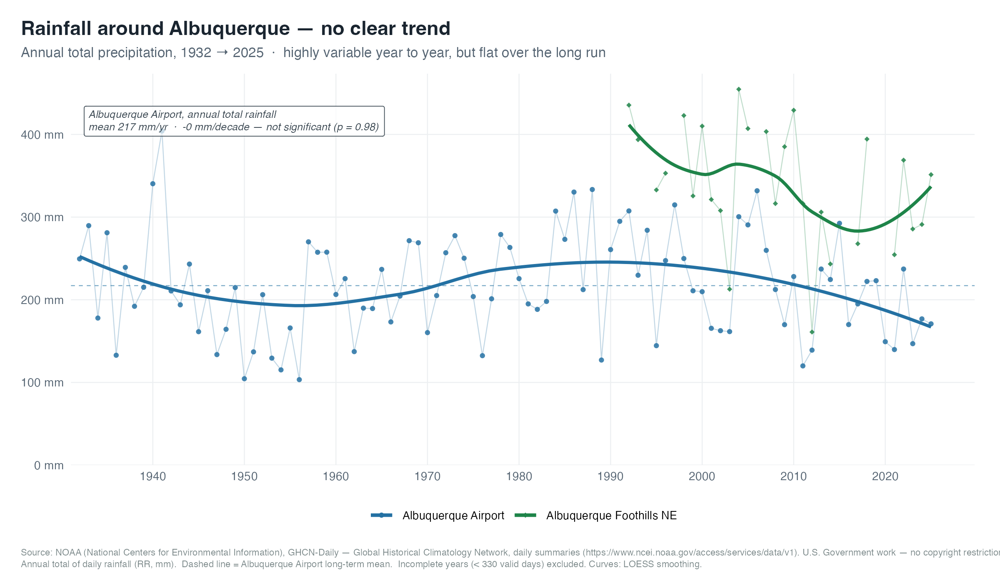

<sub>Annual total precipitation. The dashed line is Albuquerque Airport’s long-term mean
(217 mm/yr); the thick curves are LOESS smoothings. The year-to-year swings are
large — from 103 mm (1956) to 404 mm (1941) —
but the long-run slope (-0 mm/decade) is flat and not significant (p = 0.98).</sub>

The same daily records that carry a strong warming signal carry *no* comparable signal in how much it rains: annual totals swing widely from year to year around a flat long-run mean.

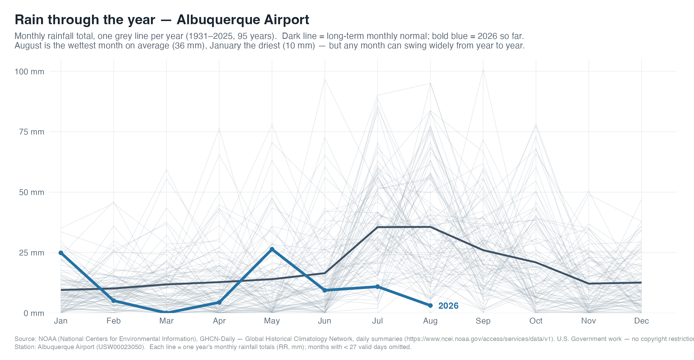

<sub>Rain through the year: each grey line is one year’s monthly totals, the dark line the
long-term monthly normal, the bold blue line 2026 so far. August is the
wettest month on average (36 mm), January the driest
(10 mm) — but the spread between years dwarfs the seasonal cycle, which is exactly why no annual trend emerges.</sub>

### Methodology

Only what is specific to this city is listed here. The variables, completeness rule,
smoothing, thresholds and trend method are the same for every city and are stated once, in
[How every chapter is built](#how-every-chapter-is-built) — which is also what makes the
comparison at the top of this page legitimate.

- **Source.** NOAA (National Centers for Environmental Information) — GHCN-Daily — Global Historical Climatology Network, daily summaries, New Mexico, USA. Full citation
  in [Data sources](#data-sources) below.
- **Stations.** Albuquerque Foothills NE (USC00290225) and Albuquerque Airport (USW00023050).
- **Rebuild this chapter.** `SITE=albuquerque make all` — every figure and number above is
  regenerated from the source data on each run.

<sub>Figures and numbers above are generated — edit `R/03_readme.R`, not this block.</sub>

<!-- END REPORT:albuquerque -->

<!-- BEGIN REPORT:santafe -->

## A warming climate, seen from Santa Fe

*NOAA (National Centers for Environmental Information) daily temperature records, 1874 to 2025 — plus 2026 so far.*

NOAA (National Centers for Environmental Information)’s daily records for the Santa Fe area are unambiguous: since
the late 19th century, daily minimum, maximum and mean temperatures have all risen.

| Headline number | Value |
|---|---:|
| Warming rate, mean temperature (Santa Fe) | **+0.08 °C / decade** |
| Total rise over 151 years (1874 → 2025) | **+1.2 °C** |
| Mean of the last decade (vs 9.5 °C in 1874–1883) | **10.7 °C** |
| Frost days per year, 1874–1883 → 2016–2025 | **150 → 157** |
| Hot days (≥ 30 °C) per year, 1874–1883 → 2016–2025 | **25 → 59** |
| Complete station-years analysed | **182** |
| 2026 year-to-date (Jan 1 – Jun 30), against 146 prior years | **#1 of 147 — record** |

### The long view: annual means

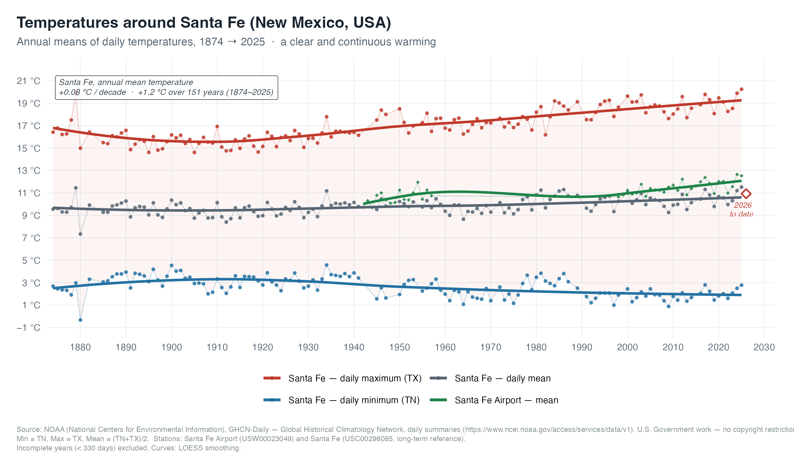

<sub>Annual means of daily temperatures. The thick curves are LOESS smoothings that
highlight the climate trend; the points are annual means. The green series (Santa Fe Airport) is Santa Fe County Municipal Airport, a few miles southwest of downtown. It tracks the long Santa Fe reference mean closely.</sub>

At Santa Fe — the station with the longest record (1874→2025) — the annual
mean temperature rises by **+0.08 °C per decade**, about **+1.2 °C** over the
whole period. The local Santa Fe Airport station only covers 1942→2025. Its slope over that shorter, more recent window is steeper (+0.16 °C/decade), and so is Santa Fe’s over the same years (+0.11 °C/decade): recent decades warm faster, and over these years the two stations agree to within 0.05 °C/decade.

One caveat specific to this station: its daily minima have *fallen* (-0.10 °C/decade) while its maxima rose (+0.26 °C/decade), widening the average gap between day and night by 2.4 °C over the record. Greenhouse warming narrows that gap, minima rising fastest; a widening gap usually means something about the station changed — a move, or a shift in reading time — and these are raw observations, not a homogenised series. Treat this city's headline rate with more caution than the others here, and see the note below on which station this series is.

### This year, against every year before it

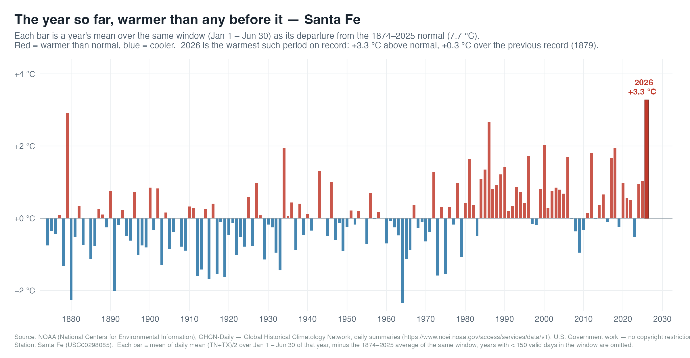

<sub>Each bar is a year’s mean over the <em>same window</em> — <strong>Jan 1 – Jun 30</strong> —
shown as its departure from the 1874–2025 mean (7.7 °C): red above, blue
below. Holding the part-of-year identical is what makes one year comparable with another. The bars swing from blue to red over
the decades — and 2026 is the tallest of all.</sub>

Measured like-for-like, **2026 is the warmest Jan 1 – Jun 30 in 147 years** at Santa Fe: **10.9 °C** — +0.3 °C above the previous record (1879, 10.6 °C) and **+3.3 °C above the 1874–2025 mean** (7.7 °C).

> [!NOTE]
> A part-year mean cannot be compared with other years' full-year means. That is why 2026 appears on the long-view chart above only as a marked, hollow "to date" point — a part-year mean on an axis of full-year means — while its like-for-like standing is the chart here.

### Every year, day by day

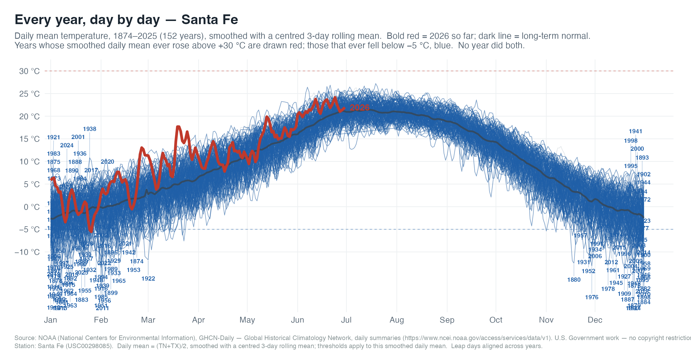

<sub>Each thin line is a single year’s daily mean temperature from January to December
(1874–2025, 152 years), smoothed with a centred
<strong>3-day rolling mean</strong> (each day = the average of itself
±1 day) to tame day-to-day jitter while keeping the shape. The dark line
is the long-term daily normal; the bold red line is <strong>2026 so far</strong>.
Years whose smoothed daily mean ever rose above <strong>+30 °C</strong> are
highlighted in red and labelled; years that ever fell below
<strong>-5 °C</strong> in blue.</sub>

> [!NOTE]
> **Hottest and coldest years.** Measured on the smoothed daily-mean curve,
> **0** years pushed above +30 °C
> while **148** years dropped below -5 °C — every year in the record.
>   <sub>(On the raw, unsmoothed daily mean, no year touches both extremes.)</sub>

### The record days

The single most extreme days in each station’s record. “Hottest” is the highest daily
maximum (TX), “coldest” the lowest daily minimum (TN).

| Station (record span) | Extreme | Date | Min (TN) | Max (TX) |
|---|---|---|---:|---:|
| Santa Fe <sub>1874–2026</sub> | Hottest 🔥 | 1994-06-26 | 13.9 | **37.2** |
| Santa Fe <sub>1874–2026</sub> | Coldest ❄️ | 2011-02-03 | **-31.1** | -11.1 |
| Santa Fe Airport <sub>1941–2026</sub> | Hottest 🔥 | 2013-06-27 | 18.3 | **38.9** |
| Santa Fe Airport <sub>1941–2026</sub> | Coldest ❄️ | 2011-02-03 | **-27.7** | -8.8 |

At Santa Fe the all-time cold (2011-02-03) postdates the all-time heat (1994-06-26) by 17 years: a single record day is noisy, and the mean trend above is the more reliable measure.

> [!NOTE]
> **Why Santa Fe Airport?** Santa Fe Airport (station USW00023049), a few miles southwest of downtown, is the nearest continuously-sited station and provides the local comparison. NOAA's own GHCN-Daily archive has no digitized daily temperature for it between 1959 and 1996 — a real gap in the upstream record, not a fetch issue here — so its trend uses only the complete years on either side. The reference series, labelled “Santa Fe”, splices the city's original in-town COOP station (298072, 1874–1972) with its direct successor a few miles south (298085, 1972–2026) for one gap-free record back to 1874.

### The last decade (Santa Fe)

| Year | Min (TN) | Max (TX) | Mean |
|---|---:|---:|---:|
| 2016 | 2.0 | 18.9 | **10.5** |
| 2017 | 2.8 | 19.8 | **11.3** |
| 2018 | 2.2 | 19.3 | **10.8** |
| 2019 | 1.4 | 18.1 | **9.8** |
| 2020 | 1.8 | 19.5 | **10.7** |
| 2021 | 2.0 | 19.1 | **10.6** |
| 2022 | 1.6 | 18.3 | **10.0** |
| 2023 | 2.1 | 18.5 | **10.3** |
| 2024 | 2.5 | 19.9 | **11.2** |
| 2025 | 2.8 | 20.2 | **11.5** |
| 2026 *(to date)* | 1.7 | 20.2 | **10.9** |

### Frost days up, hot days up

A degree of warming is abstract; a count of days is not. Santa Fe’s first
complete decade (1874–1883) against its last (2016–2025):

| Threshold days per year | 1874–1883 | 2016–2025 |
|---|---:|---:|
| Frost days (min < 0 °C) | 150 | **157** |
| Hot days (max ≥ 30 °C) | 25 | **59** |
| Very hot days (max ≥ 35 °C) | 1 | **6** |
| Tropical nights (min ≥ 20 °C) | 0 | **0** |

<sub>Counts of days per year crossing each threshold, averaged over the first and last
complete decades of the record. Both counts have risen here — a reminder that year-to-year extreme-day counts are noisy even where the underlying mean trend, shown above, is unambiguous.</sub>

### What about the rain?

Temperature is only half of a climate. Over 1874–2025 (144 years),
annual precipitation at Santa Fe shows **a statistically significant trend (-3 mm/decade, p = 0.04)**.

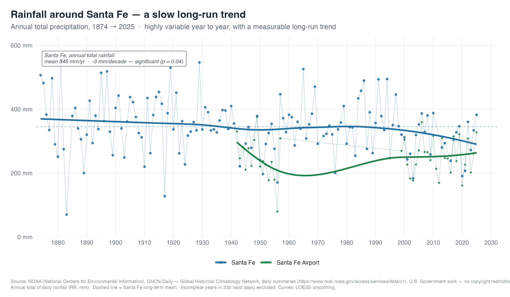

<sub>Annual total precipitation. The dashed line is Santa Fe’s long-term mean
(346 mm/yr); the thick curves are LOESS smoothings. The year-to-year swings are
large — from 70 mm (1883) to 553 mm (1881) —
but the long-run slope (-3 mm/decade) is measurable and statistically significant (p = 0.04).</sub>

Rainfall here is not flat: the long run tilts drier. The tilt is small against the year-to-year spread above, which is why it is easy to miss in any single decade.

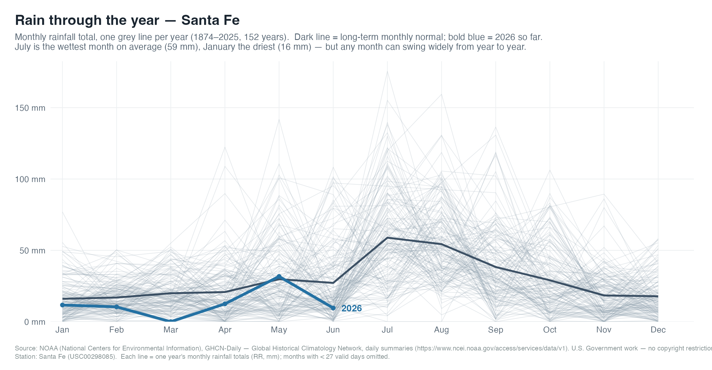

<sub>Rain through the year: each grey line is one year’s monthly totals, the dark line the
long-term monthly normal, the bold blue line 2026 so far. July is the
wettest month on average (59 mm), January the driest
(16 mm) — but the spread between years is why that slow trend is easy to miss from the monthly shape alone.</sub>

### Methodology

Only what is specific to this city is listed here. The variables, completeness rule,
smoothing, thresholds and trend method are the same for every city and are stated once, in
[How every chapter is built](#how-every-chapter-is-built) — which is also what makes the
comparison at the top of this page legitimate.

- **Source.** NOAA (National Centers for Environmental Information) — GHCN-Daily — Global Historical Climatology Network, daily summaries, New Mexico, USA. Full citation
  in [Data sources](#data-sources) below.
- **Stations.** Santa Fe Airport (USW00023049) and Santa Fe (USC00298085).
- **Rebuild this chapter.** `SITE=santafe make all` — every figure and number above is
  regenerated from the source data on each run.

<sub>Figures and numbers above are generated — edit `R/03_readme.R`, not this block.</sub>

<!-- END REPORT:santafe -->

<!-- BEGIN REPORT:honolulu -->

## A warming climate, seen from Honolulu

*NOAA (National Centers for Environmental Information) daily temperature records, 1950 to 2025 — plus 2026 so far.*

NOAA (National Centers for Environmental Information)’s daily records for the Honolulu area are unambiguous: since
the mid-20th century, daily minimum, maximum and mean temperatures have all risen.

| Headline number | Value |
|---|---:|
| Warming rate, mean temperature (Honolulu Airport) | **+0.20 °C / decade** |
| Total rise over 75 years (1950 → 2025) | **+1.5 °C** |
| Mean of the last decade (vs 24.3 °C in 1950–1959) | **25.9 °C** |
| Frost days per year, 1950–1959 → 2016–2025 | **0 → 0** |
| Hot days (≥ 30 °C) per year, 1950–1959 → 2016–2025 | **42 → 175** |
| Complete station-years analysed | **76** |
| 2026 year-to-date (Jan 1 – Aug 11), against 83 prior years | **#18 of 84** |

### The long view: annual means

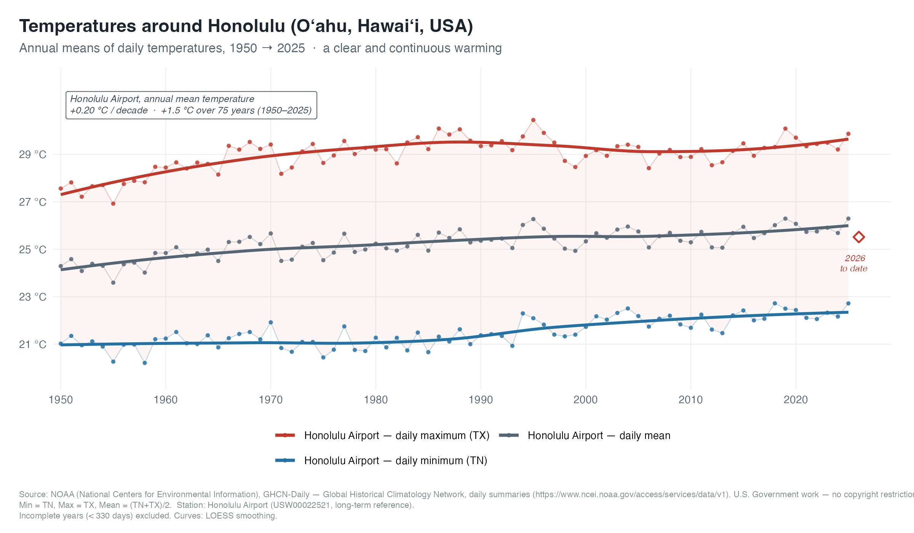

<sub>Annual means of daily temperatures. The thick curves are LOESS smoothings that
highlight the climate trend; the points are annual means.</sub>

At Honolulu Airport — the station with the longest record (1950→2025) — the annual
mean temperature rises by **+0.20 °C per decade**, about **+1.5 °C** over the
whole period. Honolulu-Moanalua carries no temperature record; Honolulu Airport alone provides the temperature trend for this area. The local comparison here uses rainfall instead — see below.


### This year, against every year before it

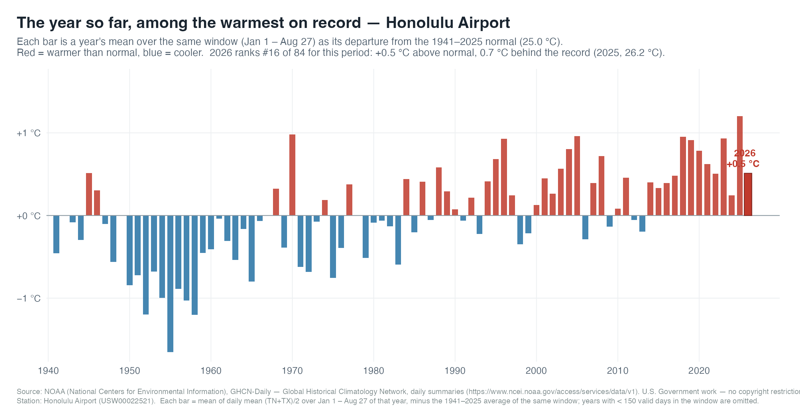

<sub>Each bar is a year’s mean over the <em>same window</em> — <strong>Jan 1 – Aug 11</strong> —
shown as its departure from the 1941–2025 mean (24.8 °C): red above, blue
below. Holding the part-of-year identical is what makes one year comparable with another. The bars swing from blue to red over
the decades.</sub>

Measured like-for-like over Jan 1 – Aug 11, 2026 ranks **#18 of 84** at Honolulu Airport (25.3 °C). The warmest such window on record remains 2025 (26.0 °C).

> [!NOTE]
> A part-year mean cannot be compared with other years' full-year means. That is why 2026 appears on the long-view chart above only as a marked, hollow "to date" point — a part-year mean on an axis of full-year means — while its like-for-like standing is the chart here.

### Every year, day by day

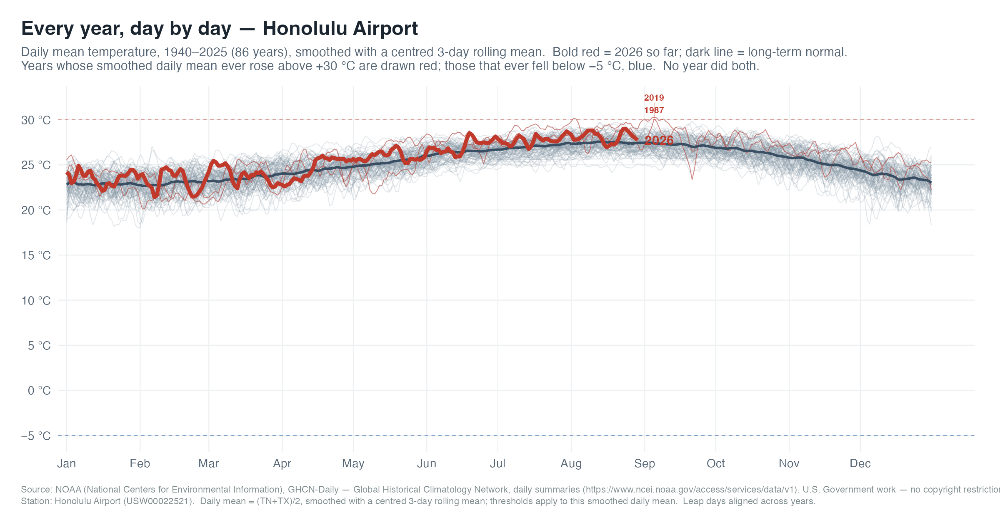

<sub>Each thin line is a single year’s daily mean temperature from January to December
(1940–2025, 86 years), smoothed with a centred
<strong>3-day rolling mean</strong> (each day = the average of itself
±1 day) to tame day-to-day jitter while keeping the shape. The dark line
is the long-term daily normal; the bold red line is <strong>2026 so far</strong>.
Years whose smoothed daily mean ever rose above <strong>+30 °C</strong> are
highlighted in red and labelled; years that ever fell below
<strong>-5 °C</strong> in blue.</sub>

> [!NOTE]
> **Hottest and coldest years.** Measured on the smoothed daily-mean curve,
> **2** years pushed above +30 °C (1987, 2019)
> while **0** years dropped below -5 °C.
>   <sub>(On the raw, unsmoothed daily mean, no year touches both extremes.)</sub>

### The record days

The single most extreme days in each station’s record. “Hottest” is the highest daily
maximum (TX), “coldest” the lowest daily minimum (TN).

| Station (record span) | Extreme | Date | Min (TN) | Max (TX) |
|---|---|---|---:|---:|
| Honolulu Airport <sub>1940–2026</sub> | Hottest 🔥 | 1994-09-19 | 25.6 | **35.0** |
| Honolulu Airport <sub>1940–2026</sub> | Coldest ❄️ | 1969-01-20 | **11.1** | 23.9 |

At Honolulu Airport, the all-time heat (1994-09-19) postdates the all-time cold (1969-01-20) by 25 years.

> [!NOTE]
> **Why Honolulu-Moanalua?** No other digitized GHCN-Daily station near Honolulu carries a temperature record independent of the airport. Moanalua (station USC00516395), a valley neighbourhood between the airport and downtown, has recorded rainfall since 1906 — 80 complete years of the 81 it reports — and stands in for local rainfall. Honolulu International Airport (station USW00022521) provides the temperature trend: its readings begin in 1940, but the 1940s years all fall short of the completeness rule used here, so the trend starts at its first complete year, 1950, and runs unbroken from there.

### The last decade (Honolulu Airport)

| Year | Min (TN) | Max (TX) | Mean |
|---|---:|---:|---:|
| 2016 | 22.0 | 28.9 | **25.5** |
| 2017 | 22.1 | 29.3 | **25.7** |
| 2018 | 22.7 | 29.3 | **26.0** |
| 2019 | 22.5 | 30.1 | **26.3** |
| 2020 | 22.4 | 29.7 | **26.1** |
| 2021 | 22.1 | 29.3 | **25.7** |
| 2022 | 22.1 | 29.4 | **25.7** |
| 2023 | 22.3 | 29.5 | **25.9** |
| 2024 | 22.2 | 29.2 | **25.7** |
| 2025 | 22.7 | 29.9 | **26.3** |
| 2026 *(to date)* | 22.0 | 28.6 | **25.3** |

### Frost days at zero, hot days up

A degree of warming is abstract; a count of days is not. Honolulu Airport’s first
complete decade (1950–1959) against its last (2016–2025):

| Threshold days per year | 1950–1959 | 2016–2025 |
|---|---:|---:|
| Frost days (min < 0 °C) | 0 | **0** |
| Hot days (max ≥ 30 °C) | 42 | **175** |
| Very hot days (max ≥ 35 °C) | 0 | **0** |
| Tropical nights (min ≥ 20 °C) | 272 | **317** |

<sub>Counts of days per year crossing each threshold, averaged over the first and last
complete decades of the record. There was never a frost season here to retreat; the change shows up entirely on the hot side of the ledger. Read the hot-day jump with care here: 29% of recent days come within 1 °C of the 30 °C line, so the count amplifies what is really a +1.7 °C shift in the average daily maximum.</sub>

### What about the rain?

Temperature is only half of a climate. Over 1941–2025 (83 years),
annual precipitation at Honolulu Airport shows **a statistically significant trend (-24 mm/decade, p = 0.02)**.

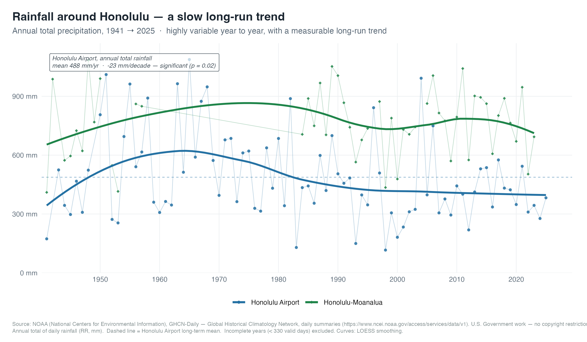

<sub>Annual total precipitation. The dashed line is Honolulu Airport’s long-term mean
(488 mm/yr); the thick curves are LOESS smoothings. The year-to-year swings are
large — from 116 mm (1998) to 1087 mm (1965) —
but the long-run slope (-24 mm/decade) is measurable and statistically significant (p = 0.02).</sub>

Rainfall here is not flat: the long run tilts drier. The tilt is small against the year-to-year spread above, which is why it is easy to miss in any single decade.

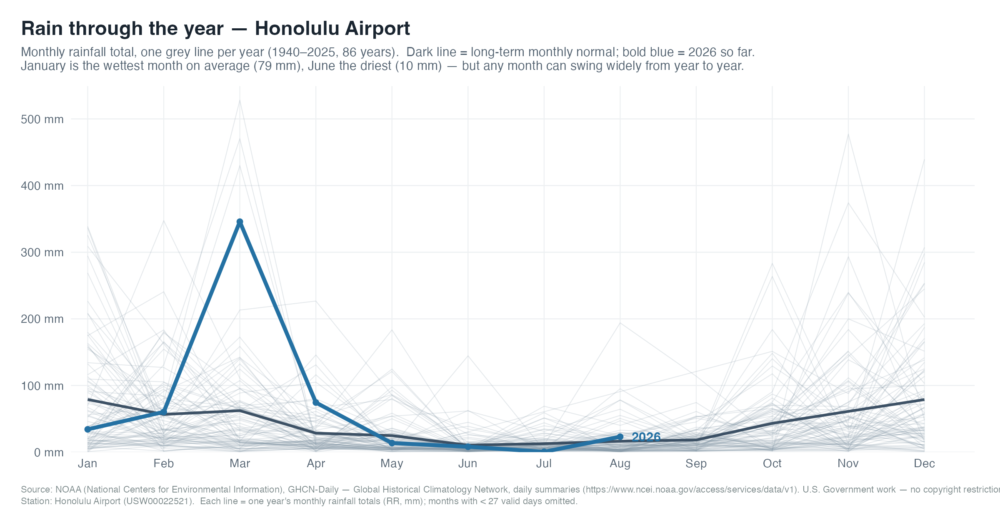

<sub>Rain through the year: each grey line is one year’s monthly totals, the dark line the
long-term monthly normal, the bold blue line 2026 so far. January is the
wettest month on average (79 mm), June the driest
(10 mm) — but the spread between years is why that slow trend is easy to miss from the monthly shape alone.</sub>

### Methodology

Only what is specific to this city is listed here. The variables, completeness rule,
smoothing, thresholds and trend method are the same for every city and are stated once, in
[How every chapter is built](#how-every-chapter-is-built) — which is also what makes the
comparison at the top of this page legitimate.

- **Source.** NOAA (National Centers for Environmental Information) — GHCN-Daily — Global Historical Climatology Network, daily summaries, Oʻahu, Hawaiʻi, USA. Full citation
  in [Data sources](#data-sources) below.
- **Stations.** Honolulu-Moanalua (USC00516395) and Honolulu Airport (USW00022521).
- **Rebuild this chapter.** `SITE=honolulu make all` — every figure and number above is
  regenerated from the source data on each run.

<sub>Figures and numbers above are generated — edit `R/03_readme.R`, not this block.</sub>

<!-- END REPORT:honolulu -->

<!-- BEGIN REPORT:noumea -->

## A warming climate, seen from Nouméa

*Météo-France daily temperature records, 1951 to 2025 — plus 2026 so far.*

Météo-France’s daily records for the Nouméa area are unambiguous: since
the mid-20th century, daily minimum, maximum and mean temperatures have all risen.

| Headline number | Value |
|---|---:|
| Warming rate, mean temperature (Nouméa) | **+0.19 °C / decade** |
| Total rise over 74 years (1951 → 2025) | **+1.4 °C** |
| Mean of the last decade (vs 23.0 °C in 1951–1960) | **24.2 °C** |
| Frost days per year, 1951–1960 → 2016–2025 | **0 → 0** |
| Hot days (≥ 30 °C) per year, 1951–1960 → 2016–2025 | **32 → 74** |
| Complete station-years analysed | **137** |
| 2026 year-to-date (Jan 1 – Aug 14), against 75 prior years | **#5 of 76** |

### The long view: annual means

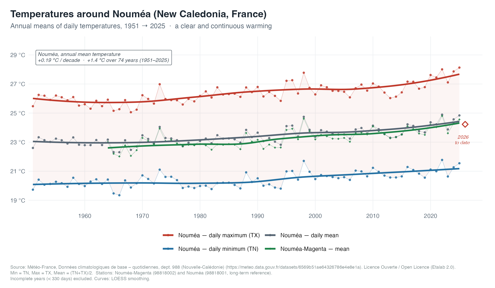

<sub>Annual means of daily temperatures. The thick curves are LOESS smoothings that
highlight the climate trend; the points are annual means. The green series (Nouméa-Magenta) is Nouméa's in-town domestic airfield, Magenta. It tracks the long Nouméa reference mean closely.</sub>

At Nouméa — the station with the longest record (1951→2025) — the annual
mean temperature rises by **+0.19 °C per decade**, about **+1.4 °C** over the
whole period. The local Nouméa-Magenta station only covers 1964→2025. Its slope over that shorter, more recent window is steeper (+0.25 °C/decade), and so is Nouméa’s over the same years (+0.23 °C/decade): recent decades warm faster, and over these years the two stations agree to within 0.02 °C/decade.


### This year, against every year before it

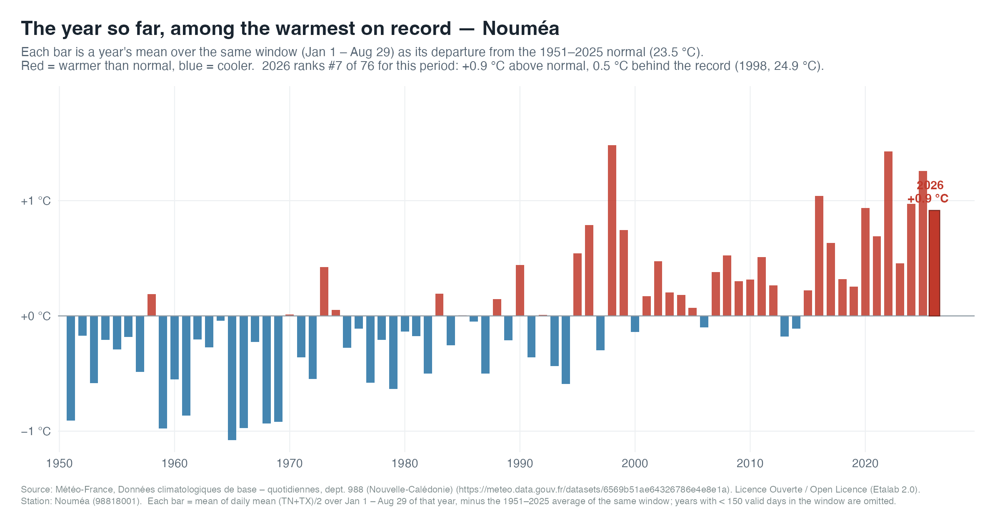

<sub>Each bar is a year’s mean over the <em>same window</em> — <strong>Jan 1 – Aug 14</strong> —
shown as its departure from the 1951–2025 mean (23.7 °C): red above, blue
below. Holding the part-of-year identical is what makes one year comparable with another. The bars swing from blue to red over
the decades.</sub>

Measured like-for-like over Jan 1 – Aug 14, 2026 ranks **#5 of 76** at Nouméa (24.6 °C). The warmest such window on record remains 2022 (25.1 °C).

> [!NOTE]
> A part-year mean cannot be compared with other years' full-year means. That is why 2026 appears on the long-view chart above only as a marked, hollow "to date" point — a part-year mean on an axis of full-year means — while its like-for-like standing is the chart here.

### Every year, day by day

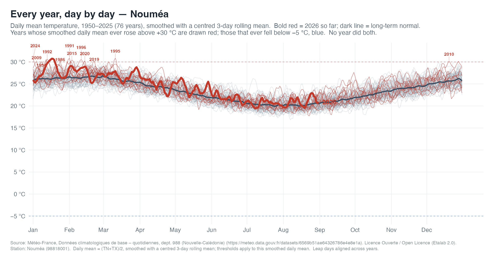

<sub>Each thin line is a single year’s daily mean temperature from January to December
(1950–2025, 76 years), smoothed with a centred
<strong>3-day rolling mean</strong> (each day = the average of itself
±1 day) to tame day-to-day jitter while keeping the shape. The dark line
is the long-term daily normal; the bold red line is <strong>2026 so far</strong>.
Years whose smoothed daily mean ever rose above <strong>+30 °C</strong> are
highlighted in red and labelled; years that ever fell below
<strong>-5 °C</strong> in blue.</sub>

> [!NOTE]
> **Hottest and coldest years.** Measured on the smoothed daily-mean curve,
> **12** years pushed above +30 °C (1954, 1986, 1991, 1992, 1995, 1996, 2009, 2010, 2015, 2019, 2020, 2024)
> while **0** years dropped below -5 °C.
>   <sub>(On the raw, unsmoothed daily mean, no year touches both extremes.)</sub>

### The record days

The single most extreme days in each station’s record. “Hottest” is the highest daily
maximum (TX), “coldest” the lowest daily minimum (TN).

| Station (record span) | Extreme | Date | Min (TN) | Max (TX) |
|---|---|---|---:|---:|
| Nouméa <sub>1950–2026</sub> | Hottest 🔥 | 1986-01-25 | 26.4 | **36.8** |
| Nouméa <sub>1950–2026</sub> | Coldest ❄️ | 1961-08-10 | **13.2** | 20.8 |
| Nouméa-Magenta <sub>1964–2026</sub> | Hottest 🔥 | 1986-01-25 | 24.8 | **36.8** |
| Nouméa-Magenta <sub>1964–2026</sub> | Coldest ❄️ | 1968-07-28 | **8.9** | 21.2 |

At Nouméa, the all-time heat (1986-01-25) postdates the all-time cold (1961-08-10) by 25 years.

> [!NOTE]
> **Why Nouméa-Magenta?** Nouméa-Magenta (station 98818002), the in-town domestic airfield, has carried a complete, gap-free temperature record since 1964 and provides the local comparison. Nouméa (station 98818001) provides the historical depth needed to see the underlying trend, back to 1950.

### The last decade (Nouméa)

| Year | Min (TN) | Max (TX) | Mean |
|---|---:|---:|---:|
| 2016 | 21.3 | 27.2 | **24.2** |
| 2017 | 21.1 | 27.2 | **24.1** |
| 2018 | 20.8 | 26.7 | **23.8** |
| 2019 | 20.6 | 26.8 | **23.7** |
| 2020 | 21.1 | 27.6 | **24.4** |
| 2021 | 21.0 | 27.5 | **24.2** |
| 2022 | 21.8 | 28.0 | **24.9** |
| 2023 | 20.6 | 27.1 | **23.9** |
| 2024 | 21.3 | 27.9 | **24.6** |
| 2025 | 21.5 | 28.1 | **24.8** |
| 2026 *(to date)* | 21.4 | 27.8 | **24.6** |

### Frost days at zero, hot days up

A degree of warming is abstract; a count of days is not. Nouméa’s first
complete decade (1951–1960) against its last (2016–2025):

| Threshold days per year | 1951–1960 | 2016–2025 |
|---|---:|---:|
| Frost days (min < 0 °C) | 0 | **0** |
| Hot days (max ≥ 30 °C) | 32 | **74** |
| Very hot days (max ≥ 35 °C) | 0 | **1** |
| Tropical nights (min ≥ 20 °C) | 194 | **237** |

<sub>Counts of days per year crossing each threshold, averaged over the first and last
complete decades of the record. There was never a frost season here to retreat; the change shows up entirely on the hot side of the ledger. Read the hot-day jump with care here: 21% of recent days come within 1 °C of the 30 °C line, so the count amplifies what is really a +1.5 °C shift in the average daily maximum.</sub>

### What about the rain?

Temperature is only half of a climate. Over 1951–2025 (75 years),
annual precipitation at Nouméa shows **no statistically significant trend**.

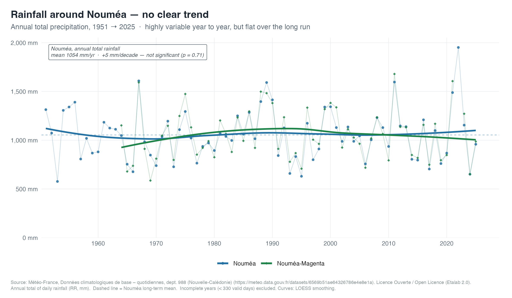

<sub>Annual total precipitation. The dashed line is Nouméa’s long-term mean
(1054 mm/yr); the thick curves are LOESS smoothings. The year-to-year swings are
large — from 577 mm (1953) to 1951 mm (2022) —
but the long-run slope (+5 mm/decade) is flat and not significant (p = 0.71).</sub>

The same daily records that carry a strong warming signal carry *no* comparable signal in how much it rains: annual totals swing widely from year to year around a flat long-run mean.

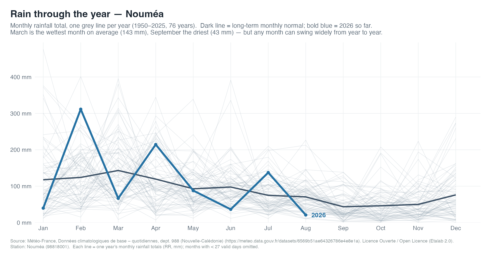

<sub>Rain through the year: each grey line is one year’s monthly totals, the dark line the
long-term monthly normal, the bold blue line 2026 so far. March is the
wettest month on average (143 mm), September the driest
(43 mm) — but the spread between years dwarfs the seasonal cycle, which is exactly why no annual trend emerges.</sub>

### Methodology

Only what is specific to this city is listed here. The variables, completeness rule,
smoothing, thresholds and trend method are the same for every city and are stated once, in
[How every chapter is built](#how-every-chapter-is-built) — which is also what makes the
comparison at the top of this page legitimate.

- **Source.** Météo-France — Données climatologiques de base – quotidiennes, New Caledonia, France. Full citation
  in [Data sources](#data-sources) below.
- **Stations.** Nouméa-Magenta (98818002) and Nouméa (98818001).
- **Rebuild this chapter.** `SITE=noumea make all` — every figure and number above is
  regenerated from the source data on each run.

<sub>Figures and numbers above are generated — edit `R/03_readme.R`, not this block.</sub>

<!-- END REPORT:noumea -->

## Data sources

Each site pulls from its own national weather service. Eight are open data under
attribution-only licences. Moscow and Voronezh are **not** — Roshydromet's
AISORI-M is a registered reference publication, personal and non-commercial use
only, which is why their raw exports are never committed to this repository:

| Site | Source | Scope | Licence |
|---|---|---|---|
| Castanet-Tolosan | Météo-France — *Données climatologiques de base – quotidiennes* | dept. 31 (Haute-Garonne), `RR-T-Vent` daily files, three eras (`avant-1949`, `previous-1950-2024`, `latest-2025-2026`) | Licence Ouverte / Open Licence (Etalab 2.0) |
| Lyon | Météo-France — *Données climatologiques de base – quotidiennes* | dept. 69 (Rhône), `RR-T-Vent` daily files, same three eras | Licence Ouverte / Open Licence (Etalab 2.0) |
| Zurich | MeteoSwiss — Open Government Data | `ogd-nbcn` (homogeneous climate stations) + `ogd-smn` (automatic weather stations) | MeteoSwiss Open Data (attribution: "Source: MeteoSwiss") |
| Karlsruhe | DWD (Deutscher Wetterdienst) — Climate Data Center | `kl` (daily station observations) + `more_precip` (precipitation only) | Creative Commons BY 4.0 |
| Moscow | Roshydromet / RIHMI-WDC — AISORI-M | Сутки → TTTR (temp. + precip.), WMO 27612, manually exported (login-gated, no stable URL) | Not openly licensed — Rospatent 2019621537; personal, non-commercial use only |
| Voronezh | Roshydromet / RIHMI-WDC — AISORI-M | Сутки → TTTR (temp. + precip.), WMO 34123, manually exported (login-gated, no stable URL) | Not openly licensed — Rospatent 2019621537; personal, non-commercial use only |
| Irvine | NOAA — GHCN-Daily, Access Data Service v1 | `daily-summaries` (TMAX/TMIN/PRCP), stations USC00049087/044303 (spliced) + USW00093184 | U.S. Government work — no copyright restriction |
| Albuquerque | NOAA — GHCN-Daily, Access Data Service v1 | `daily-summaries` (TMAX/TMIN/PRCP), stations USW00023050 (GSN) + USC00290225 | U.S. Government work — no copyright restriction |
| Santa Fe | NOAA — GHCN-Daily, Access Data Service v1 | `daily-summaries` (TMAX/TMIN/PRCP), stations USC00298072/298085 (spliced) + USW00023049 | U.S. Government work — no copyright restriction |
| Honolulu | NOAA — GHCN-Daily, Access Data Service v1 | `daily-summaries` (TMAX/TMIN/PRCP), stations USW00022521 + USC00516395 | U.S. Government work — no copyright restriction |
| Nouméa | Météo-France — *Données climatologiques de base – quotidiennes* | dept. 988 (Nouvelle-Calédonie), `RR-T-Vent` daily files, same three eras | Licence Ouverte / Open Licence (Etalab 2.0) |

Full dataset URLs and citation text are in each site's report above and in
`R/sites/<site>.R`. Météo-France field definitions land in
`data/raw/Q_descriptif_champs_*.txt` after the first `make prepare`.

### Stations

| Site | Code | Name | Record | Role |
|---|------|------|--------|------|
| Castanet-Tolosan | `31035001` | Auzeville-Tolosane-INRAE | 2002→ | Local station, on the edge of Castanet-Tolosan (INRAE/ENSAT campus) |
| Castanet-Tolosan | `31069001` | Toulouse-Blagnac | 1947→ | Long regional reference; used for the trend and the daily climatology |
| Lyon | `69299001` | Lyon-Saint-Exupéry | 1976→ | Local station, the current international airport ~25 km east; 50 complete years, no gaps |
| Lyon | `69029001` | Lyon-Bron | 1921→ | Long reference, the historic airport 7 km east — 105 complete years and no incomplete year in between |
| Zurich | `REH` | Zürich-Affoltern | 1961→ (temp. 1978→) | Local station, in Zurich's Affoltern district (MeteoSwiss automatic network) |
| Zurich | `SMA` | Zürich-Fluntern | 1864→ (TN/TX 1881→) | Long regional reference; MeteoSwiss's homogeneous series for the trend and climatology |
| Karlsruhe | `02523` | Karlsruhe-Wolfartsweier | 1931→ | Local station — **rainfall only**, no temperature record near Grötzingen (see below) |
| Karlsruhe | `04177` | Rheinstetten | 1876→ | Long regional reference — spliced with predecessor 02522 (city-centre, 1876→2008) at its 2008-11-01 handoff to Rheinstetten, closing what would otherwise be a 1985–2008 gap in 04177's own record |
| Moscow | `27612` | Moscow | 1948→2025 | Single station — no local pairing; this export has no second WMO index |
| Voronezh | `34123` | Voronezh | 1940→2026 | Single station — no local pairing; this export has no second WMO index |
| Irvine | `USW00093184` | John Wayne Airport | 1999→ | Local station, on Irvine's border — no splice needed, but the shortest record of the pair |
| Irvine | `USC00044303` | Irvine | 1915→ | Long reference — spliced with predecessor 049087 (Tustin Irvine Ranch, 1915→2003) at its 2003 handoff to 044303, a few miles away |
| Albuquerque | `USC00290225` | Albuquerque Foothills NE | 1991→ | Local station, a different microclimate in the city's northeast foothills — its own temperature reporting has a real gap from June 2026 |
| Albuquerque | `USW00023050` | Albuquerque Airport | 1931→ | Long reference — one continuous record, no splice needed; flagged by NOAA as a GSN station |
| Santa Fe | `USW00023049` | Santa Fe Airport | 1941→ | Local station — NOAA's own GHCN-Daily archive has no digitized daily temperature for it between 1959 and 1996 |
| Santa Fe | `USC00298085` | Santa Fe | 1874→ | Long reference — spliced with predecessor 298072 (in-town, 1874→1972) at its 1972-04-01 handoff to 298085, a few miles south |
| Honolulu | `USC00516395` | Honolulu-Moanalua | 1906→ | Local station — **rainfall only**; a valley neighbourhood between the airport and downtown, 80 complete years of the 81 it reports |
| Honolulu | `USW00022521` | Honolulu Airport | 1940→ | Long regional reference; no splice needed, but the 1940s years fall short of the completeness rule, so the trend starts at 1950 |
| Nouméa | `98818002` | Nouméa-Magenta | 1964→ | Local station, the in-town domestic airfield; complete, no gaps |
| Nouméa | `98818001` | Nouméa | 1950→ | Long regional reference; used for the trend and the daily climatology |

> The "Record" column is each station's raw first→last year; the trend prose and
> "last decade" tables instead start from each station's first *complete* year
> (≥ 330 valid days) — a station can legitimately appear with three different
> start years across the report depending on whether the completeness filter
> applies.

**Why these local stations?** Each site pairs a long regional reference with a
shorter, closer local one. No national dataset here has a station named for its
target town, so every pairing is a compromise. The compromises:

| Site | Local station | Compromise |
|---|---|---|
| Castanet-Tolosan | Auzeville-Tolosane-INRAE | None to speak of — it sits on the town boundary. |
| Lyon | Lyon-Saint-Exupéry | None — gap-free since 1976, though much shorter than the reference. Saint-Genis-Laval reaches back to 1881 but is missing 1920–1939. |
| Zurich | Zürich-Affoltern | Affoltern is outside MeteoSwiss's homogeneous long-term network, so this is the closest full station. |
| Karlsruhe | Karlsruhe-Wolfartsweier | Rainfall only. The nearest station that also measured temperature (Augustenberg, under 1 km from Grötzingen) closed in 1985. |
| Moscow, Voronezh | *none* | Exported from AISORI-M with one WMO index each; there is no second station to pair. |
| Irvine | John Wayne Airport | Gap-free, but only from 1999, against the reference series' 1915. |
| Albuquerque | Albuquerque Foothills NE | A genuinely different microclimate, but its temperature reporting stops in June 2026. |
| Santa Fe | Santa Fe Airport | NOAA's archive holds no digitized daily temperature for it between 1959 and 1996. |
| Honolulu | Honolulu-Moanalua | Rainfall only. No in-town station measures temperature independently of the airport. |
| Nouméa | Nouméa-Magenta | None — a complete, gap-free local record. |

Each chapter's own "Why…?" note gives the detail.

## Project layout

Sites appear in the same order everywhere on this page — chapters, the tables
above, the tree below, and `SITE_ORDER` in `R/04_compare.R`: **Europe, then North
America, then the Pacific, west to east within each.** Adding a city means
inserting it geographically in all of them, not appending. (The comparison chart
and table are the exception: they sort themselves by warming rate.)

```
climatudes/
├── README.md                  this file — each site's report block is generated
├── Makefile                   reproducible pipeline (make all SITE=<site>)
├── R/
│   ├── lib/
│   │   ├── common.R           shared constants, palette, deg_label(), fetch/verify/write helpers
│   │   └── narrative.R        shared report prose/number logic (build_common_fills())
│   ├── sites/
│   │   ├── castanet.R         Castanet-Tolosan: stations, paths, citation, narrative facts
│   │   ├── lyon.R             Lyon: same, for Météo-France dept. 69
│   │   ├── zurich.R           Zurich: same, for MeteoSwiss
│   │   ├── karlsruhe.R        Karlsruhe: same, for DWD
│   │   ├── moscow.R           Moscow: same, for Roshydromet/AISORI-M (manual export)
│   │   ├── voronezh.R         Voronezh: same, for Roshydromet/AISORI-M (manual export)
│   │   ├── irvine.R           Irvine: same, for NOAA GHCN-Daily
│   │   ├── albuquerque.R      Albuquerque: same, for NOAA GHCN-Daily
│   │   ├── santafe.R          Santa Fe: same, for NOAA GHCN-Daily
│   │   ├── honolulu.R         Honolulu: same, for NOAA GHCN-Daily
│   │   └── noumea.R           Nouméa: same, for Météo-France dept. 988
│   ├── sources/
│   │   ├── meteofrance.R      fetch + normalize Météo-France's format (Castanet-Tolosan, Nouméa)
│   │   ├── meteoswiss.R       fetch + normalize MeteoSwiss's format
│   │   ├── dwd.R              fetch + normalize DWD's format
│   │   ├── noaa.R             fetch + normalize NOAA GHCN-Daily's format (Santa Fe, Honolulu)
│   │   └── meteoru.R          read (not fetch) a manual AISORI-M export (Moscow, Voronezh)
│   ├── 00_prepare_data.R      generic: dispatches to R/sources/<site's source>.R
│   ├── 01_plot.R              generic: build the five figures + annual tables + stats
│   ├── 02_report.R            generic: assemble the self-contained HTML report
│   └── 03_readme.R            generic: render the same report into this site's README block
├── data/                      (created on first run, git-ignored)
│   ├── raw/                   Castanet-Tolosan's raw files (legacy root location)
│   ├── raw/<site>/            every other site's raw files
│   └── processed/[<site>/]    small gzipped station extract + intermediates, per site
└── outputs/                   (created on first run, mostly git-ignored)
    ├── figures/               Castanet-Tolosan's five PNGs (legacy root location)  ← tracked
    ├── <site>/figures/        every other site's five PNGs                        ← tracked
    ├── [<site>/]annual_temperatures.csv
    ├── [<site>/]annual_rainfall.csv
    └── [<site>/]temperature_report.html   ← the shareable deliverable (fully self-contained)
```

Every source module normalizes its site's raw data to the same six columns
(`NUM_POSTE`, `AAAAMMJJ`, `TN`, `TX`, `TNTXM`, `RR`) before writing the gzipped
extract, so stages 01–03 never need to know which upstream provider a site
uses — they only read `R/sites/<site>.R` for names, roles, thresholds and
citation text.

**Version-controlled: the R scripts, the Makefile, this README and every
site's PNG figures.** The figures are the one generated artifact that is
committed — GitHub can only render them in the README if they are in the
repository. The base64 HTML reports (~3–4 MB each) are *not* committed.
Everything else — including `data/raw/` — is downloaded or regenerated by
`make all`, so a fresh clone rebuilds any site in a few seconds.

**Everything stays compressed.** Raw archives are never decompressed to disk
— they are read directly via a streaming pipe (`gzip -dc`, or a per-call temp
dir for DWD's zips). Stage 00 slices them down to just the stations in use and
caches that as a single small gzipped extract per site (`stations_daily.csv.gz`,
well under 1 MB — vs. tens to well over a hundred MB of raw upstream data).

### Fetching the data

Stage 00 downloads any raw file missing from the site's raw directory, so
there is nothing to fetch by hand. Each source has its own quirks, documented
where the fetch logic lives (`R/sources/<source>.R`) rather than repeated here:

- **Météo-France** (Castanet-Tolosan) — three era-named files that rotate every
  January; when 2027 opens, `latest-2025-2026` starts 404ing and `MF_ERAS`-
  equivalent (`R/sites/castanet.R`'s `meteofrance$eras`) needs bumping. Stage
  00's error message says so if you hit it. `make refresh` re-downloads the
  current era.
- **MeteoSwiss** (Zurich) — fixed, non-rotating URLs (a `historical` file plus a
  rolling `recent` file per station/dataset); Zürich-Fluntern needs two
  datasets merged (temperature from the homogeneous `ogd-nbcn`, rainfall from
  `ogd-smn`, since the homogeneous series carries no daily precipitation).
- **DWD** (Karlsruhe) — one zip per station/period; the historical zip's
  filename embeds its own date range and shifts over time, so it is discovered
  from a live directory listing rather than hardcoded.
- **NOAA GHCN-Daily** (Santa Fe, Honolulu) — the tokenless Access Data Service
  v1 (`ncei.noaa.gov/access/services/data/v1`), one CSV request per station
  covering its whole history; no historical/recent split needed, since a
  station's full record is a few hundred KB either way.
- **Météo-France** (Nouméa) — same module and file layout as Castanet-Tolosan,
  just a different `dept` (`988`, New Caledonia's pseudo-département code in
  this dataset — it has no mainland département number of its own).
- **Roshydromet / AISORI-M** (Moscow, Voronezh) — the one source that is
  genuinely manual: `aisori-m.meteo.ru` is a login/session-gated web app with
  no stable, scriptable URL. `R/sources/meteoru.R` does not fetch anything —
  it reads whichever `.zip` export already sits in `data/raw/<site>/` (most
  recently modified wins) and errors with the exact query steps if none is
  found. Re-running the export by hand and dropping the new `.zip` in is how
  these two sites get fresher data; there is no `make refresh` for them.

`make refresh SITE=<site>` re-downloads that site's rolling/current data and
rebuilds everything (except Moscow/Voronezh — see above).

## How to run

Requirements: **R ≥ 4** with `data.table`, `ggplot2`, `scales`, `ragg`,
`ggrepel`, `base64enc`. No pandoc needed — every HTML report is built directly.

```sh
make all                  # castanet (default): fetch -> prepare -> plots -> report -> README
make all SITE=zurich      # same, for Zurich
make all SITE=karlsruhe   # same, for Karlsruhe
make all SITE=santafe     # same, for Santa Fe
make all SITE=honolulu    # same, for Honolulu
make all SITE=noumea      # same, for Nouméa
make all SITE=moscow      # same, for Moscow (reads data/raw/moscow/*.zip — see Fetching the data)
make all SITE=voronezh    # same, for Voronezh
make all-sites            # run every site in R/sites/
make refresh SITE=zurich  # re-download that site's rolling/current data, then rebuild it
make open SITE=zurich     # open that site's HTML report (macOS)
```

Or run the stages directly from the project root (`SITE` defaults to `castanet`):

```sh
SITE=zurich Rscript R/00_prepare_data.R
SITE=zurich Rscript R/01_plot.R
SITE=zurich Rscript R/02_report.R
SITE=zurich Rscript R/03_readme.R
```

`make clean` (optionally with `SITE=<site>`) removes everything regenerable for
that site (processed data + outputs), leaving the downloaded raw files and the
README in place.

## Two ways to read the same report

Both draw their **numbers** from one file per site
(`[data/processed/<site>/]trend_stats.rds`), so no figure in one can contradict
a figure in the other for that site. (The two templates share their prose
logic — `R/lib/narrative.R` — so wording can still differ in formatting but not
in substance; the clauses that depend on the data — "all of them recent", the
both-extremes footnote — are generated in R rather than hand-written precisely
so they can't drift.)

- **This README** — stage 03 rewrites the block between each site's
  `BEGIN REPORT:<site>` / `END REPORT:<site>` markers and links the committed
  PNGs, so every site's analysis renders straight away on the repository page.
  Edit `R/03_readme.R` or `R/lib/narrative.R`, never the blocks themselves.
- **`<outputs>/temperature_report.html`** — stage 02 embeds that site's figures
  as base64 in a single styled file that needs nothing else to display. Email
  it, copy it to a USB stick, or open it offline.

## Licence

Source data:

Grouped by provider, since the licence follows the source rather than the city:

- Castanet-Tolosan, Lyon and Nouméa © Météo-France, *Licence Ouverte / Open
  Licence (Etalab 2.0)*.
- Zurich © MeteoSwiss Open Data — attribution required: "Source: MeteoSwiss".
- Karlsruhe © DWD (Deutscher Wetterdienst), *Creative Commons BY 4.0*.
- Irvine, Albuquerque, Santa Fe and Honolulu — NOAA / NCEI GHCN-Daily, U.S.
  Government work, no copyright restriction.
- Moscow and Voronezh © Roshydromet / RIHMI-WDC (AISORI-M) — **not openly
  licensed** (registered as an official reference publication, Rospatent
  2019621537); used here for personal, non-commercial analysis only, which is
  why their raw exports are not committed to this repository.

Please retain the attribution above when reusing the figures or data.
